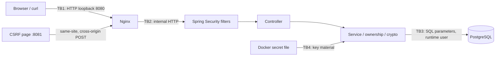

# Архитектура и security contract

Само контролирана локална учебна среда. Trust boundary е граница, при която се променят нивото на доверие и правилата за проверка на входа.

## Данни и потоци

Login: form → CSRF filter → UsernamePasswordAuthenticationFilter → AuthenticationProvider → UserDetailsService → PasswordEncoder → SecurityContext → session. Spring управлява persistence и session fixation protection. Не пишем собствен session login controller.

Document read: session principal → endpoint authentication → service-level authentication → ownership/admin policy → JSON. Непозволен и несъществуващ документ връщат 404; anonymous получава 401, user към admin endpoint — 403.

JWT: session + CSRF → POST /token → RS256 token → Authorization: Bearer → отделна stateless filter chain → signature/claims → scope. Cookie session не е fallback за `/token-api/**`. Подписването не криптира claims.

Sensitive field: form + CSRF → AES-256-GCM, random 96-bit nonce, owner като AAD → `v1:Base64(nonce || ciphertext || tag)` → DB. AAD е допълнително удостоверен контекст, който не се криптира. Текущият envelope има version, но няма key ID/rotation implementation.

## Endpoint inventory

| Метод / path | Достъп | State change / CSRF | Данни |
|---|---|---|---|
| GET /, /health, /login, /csrf | public | не | banner, readiness, login, CSRF |
| POST /register | public | да / да | само USER, 201 или 400 |
| POST /login | public | да / да | success 204, failure 401 |
| POST /logout | session | да / да | invalidates session |
| GET /api/me | session | не | principal |
| GET /api/documents/{id} | owner или ADMIN | не | документ |
| GET /api/search?q= | session | не | само собствени документи, включително за admin |
| GET /search?q= | session | не | reflected HTML output |
| GET /comments | session | не | всички учебни comments |
| POST /api/comments | session | да / да | body до 1000 chars |
| GET /profile | session | не | собствен display name |
| POST /api/profile | session | да / да | displayName до 200 chars |
| GET, POST /api/sensitive | session owner | POST / да | synthetic field |
| GET /admin/status | ADMIN | не | admin marker |
| POST /token | session | да / да | token с 5 минути живот |
| GET /token-api/documents | Bearer + documents.read | не | учебен protected marker |

## Security decisions и граници

DB runtime user има само DML върху учебните таблици; credential от Compose е публичен fixture. AES secret се генерира отделно, не влиза в Git. Nginx access log е изключен, Java audit записва само генериран correlation ID, method и status. Този минимален audit не е пълен incident-response log: разширяването със стабилен event type и безопасен actor ID е задача в lab10.

Сървърът приема само изрично описани параметри; client-side validation не е security boundary. `anyRequest().denyAll()` забранява неизвестни routes. CSP е вторична защита и се изключва само за lab06/lab10 възпроизводимост. HTML encoding се прилага при output; DB пази оригиналния comment.

Известни учебни ограничения: временни RSA keys, single-instance limiter, без TLS по подразбиране, без account recovery/refresh tokens/MFA, без production secret manager. Документирайте ги като residual risk, а не като автоматично „затворени“ findings.
