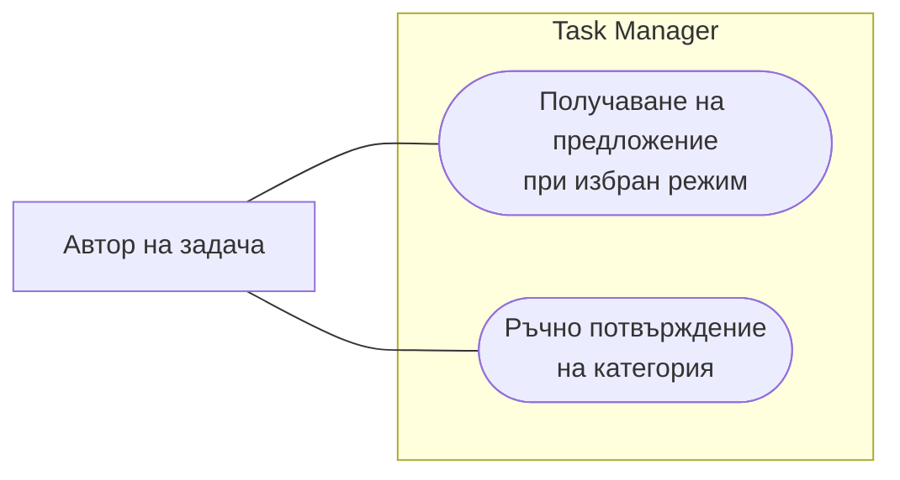
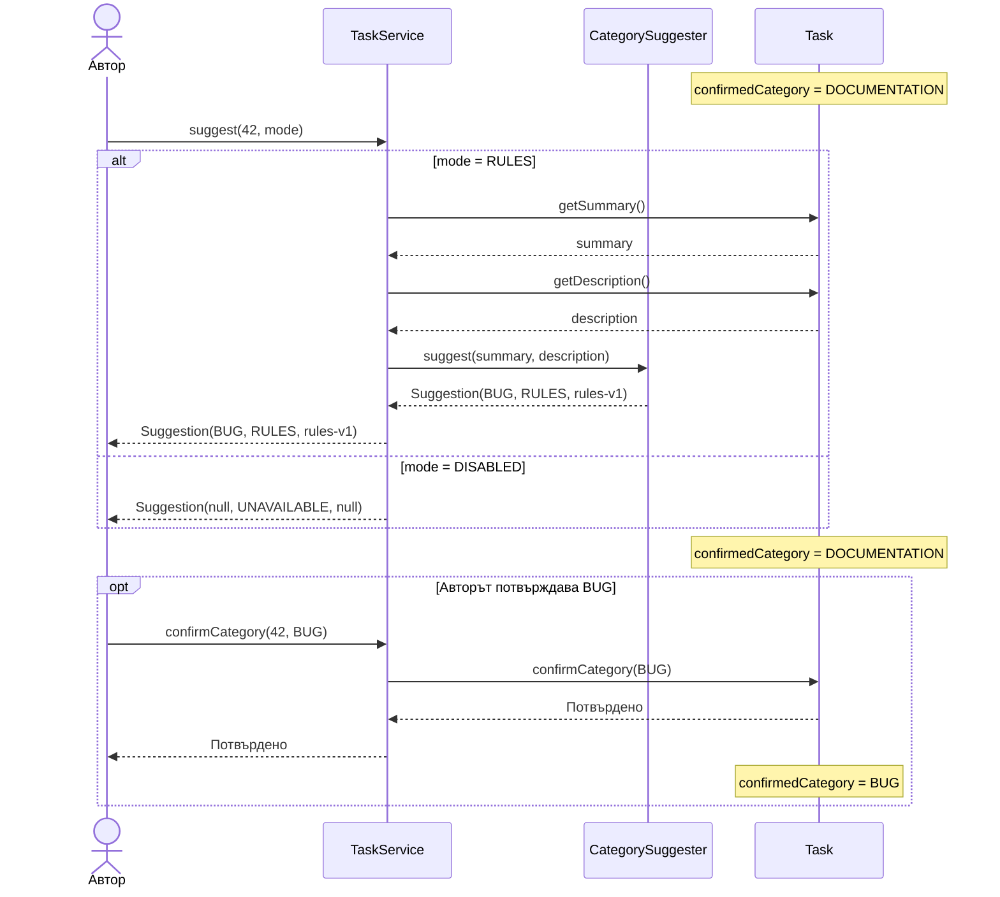
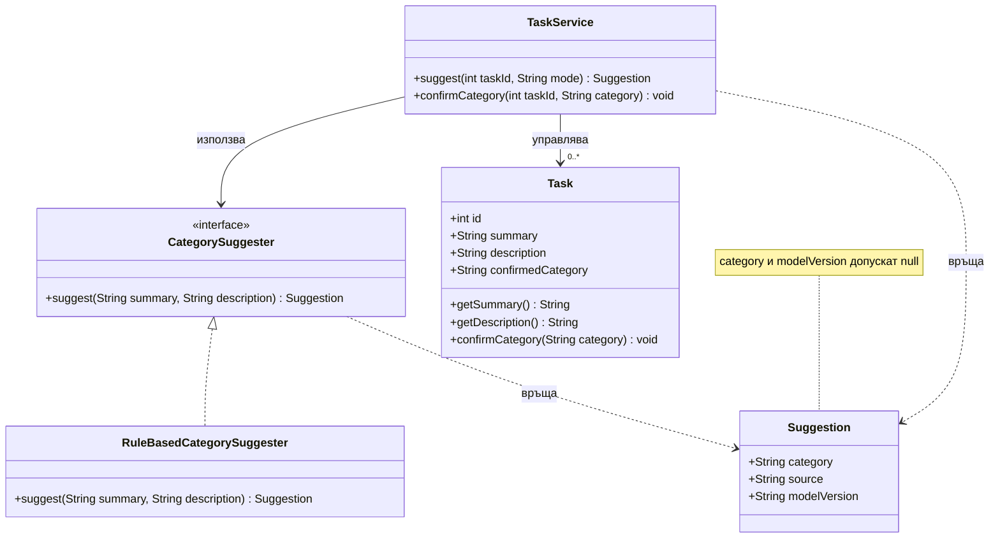

# Насоки за преподавателя — контролно 1, 90 минути

## Текущ формат и подготовка

Основният акцент е UML: три съгласувани диаграми за един казус. Код не се изисква. Предварително осигурете редактор с работещ Mermaid preview и достъп до нотацията от упражнение 3. За Use Case се приема означеното условно представяне чрез flowchart. Експорт в SVG, CI и стартиране на Task Manager са извън оценяването. Примерът с Python в учебната страница е допълнителна подготовка, не задача от контролното.

## Времеви план — общо 90 минути

| Дейност | Минути |
| --- | ---: |
| Прочитане на казуса | 5 |
| Задача 1 — кратки изисквания и Use Case | 20 |
| Задача 2 — Sequence и проследяване на сценарии | 30 |
| Задача 3 — Class и съгласуваност | 25 |
| Проверка и предаване | 10 |

Разчетът предполага познаване на Mermaid и преговорени видове диаграми; не добавяйте нови задачи по време на контролното.

## Вътрешна рубрика — 100 точки

| Задача | Критерии | Точки |
| --- | --- | ---: |
| 1 | User Story, FR/NFR и Sprint Goal — 10; актьор, граница и самостоятелни действия в Use Case — 15 | 25 |
| 2 | Участници и съобщения — 10; правилни alt клонове и нула AI извиквания при DISABLED — 15; отделно потвърждение и вярна таблица — 15 | 40 |
| 3 | Полета и операции — 10; интерфейс, реализация и зависимости — 15; съгласуваност със Sequence — 5; обосновка на AI приноса — 5 | 35 |

UML и съгласуваността на моделите носят 85 точки. Приемайте семантично равностойни имена и модели. Не наказвайте два пъти една и съща техническа грешка, последователно пренесена между диаграмите, но отбелязвайте отделните противоречия. Визуално изрядна диаграма с автоматично записване при предложение има съществена семантична грешка.

## Примерно решение на задача 1

User Story: „Като автор искам да избирам дали да получа предложение, за да запазя контрол върху категоризирането“. FR-1: при DISABLED няма AI извикване и се връща UNAVAILABLE. FR-2: само отделно потвърждение променя категорията, независимо от режима. NFR: всяко предложение по правила съдържа непразна версия, позволяваща проследяване до реализацията; проверка на всички изходи от правилата. Sprint Goal: „Авторът управлява предложенията и потвърждава категорията независимо“. Други измерими NFR са допустими с последователна проверка.

Легенда: правоъгълникът извън системата представя актьора, заоблените възли — случаи на употреба, линиите — участие. Това е условно Mermaid представяне, не пълна UML нотация. Потвърждението не се моделира като задължително include към предложението. Вътрешният категоризатор не е отделен потребителски актьор за този обхват.

## Примерно решение на задача 2

| Сценарий | AI извиквания | Крайна категория |
| --- | ---: | --- |
| RULES без потвърждение | 1 | DOCUMENTATION |
| RULES с потвърждение | 1 | BUG |
| DISABLED с ръчно потвърждение | 0 | BUG |

Ръчното потвърждение може да е показано и в отделна последователност в същия файл, ако независимостта му е ясна. Ключово е съхранението да не се задейства от получаване на предложение.

## Примерно решение на задача 3

AI инженерът добавя нова реализация на CategorySuggester със същите вход и изход. TaskService продължава да избира режима и да координира потвърждението. Обучението не е операция от интерфейса за предсказване. Приемайте enum вместо String и други обосновани видимости; не изисквайте поле за нов модел или база данни.

Архивни насоки преди формата за 90 минути — не са текущата рубрика

### Предишна организация

## Организация

Не въвежда нов материал.

Точният вариант и времето се задават от преподавателя.

Общо: 100 точки. Преобразуването в оценка следва обявените правила на дисциплината.

## Вътрешна рубрика

### Задача 1. Спецификация — 30 точки

Оценяване: яснота 10 т., измерими критерии 10 т., последователност и обхват 10 т.

### Задача 2. UML и архитектура — 40 точки

Оценяване: нотация 15 т., съгласуваност 15 т., аргументация 10 т.

### Задача 3. Код и проверка — 30 точки

Оценяване: реализация 15 т., проверки 10 т., проследимост 5 т.

## Актуален AI и Scrum фокус

Публичната страница съдържа конкретното студентско задание и отделен решен пример за подготовка. Запазената рубрика се прилага към анализа, собствения AI принос, съгласуваните договори и действителните доказателства. Не изисквайте възпроизвеждане на текста от примера като самостоятелно решение. Scrum протоколите описват състояние и адаптация; броят на проведените срещи не е доказателство за завършен прираст.

