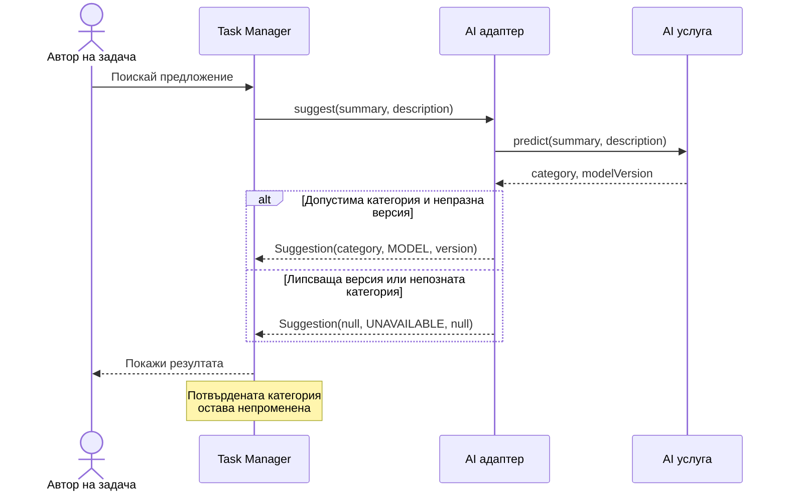

# Упражнение 5 — Контролно 1 — UML и проектиране на AI компонент

## Обхват на контролното

Контролното обхваща материала до [упражнение 4](../week04-design/lab04.md), с акцент върху UML и проектирането на заменяем AI компонент. Ще създадете Use Case, Sequence и Class диаграми за един общ казус, подкрепени с кратки изисквания и Sprint Goal. Използвайте нотацията и Mermaid от [упражнение 3](../week03-architecture/lab03.md). Предавате модели и обосновка; програмиране, стартиране на Task Manager и обучение на модел не се изискват.

## Примерен проблем за подготовка

Категоризаторът връща отговор без версия. Валидният JSON не е достатъчен: Task Manager не трябва да показва непроверим резултат като MODEL. Ще моделираме проверката на отговора, след което ще я свържем с изпълним пример.

### Решен UML модел



Проверете модела с два входа: `{"category":"BUG","modelVersion":"v1"}` преминава през първия клон, а `{"category":"BUG"}` — през втория. В нито един клон няма операция за запис на категорията. Това е проверка на модела; поведението на реалната система се доказва отделно.

### Решение

Запишете `contract_demo.py`:

```python
def adapt(response):
    unavailable = {"category": None, "source": "UNAVAILABLE", "modelVersion": None}
    if not isinstance(response, dict):
        return unavailable
    category, version = response.get("category"), response.get("modelVersion")
    if category not in ("BUG", "FEATURE", "DOCUMENTATION", "OTHER"):
        return unavailable
    if not isinstance(version, str) or not version.strip():
        return unavailable
    return {"category": category, "source": "MODEL", "modelVersion": version}

assert adapt({"category": "BUG"})["source"] == "UNAVAILABLE"
assert adapt({"category": "BUG", "modelVersion": "v1"})["modelVersion"] == "v1"
assert adapt({"category": "UNKNOWN", "modelVersion": "v1"})["category"] is None
print("PASS: contract validation")
```

### Проверка на резултата

При `python contract_demo.py` очаквайте `PASS: contract validation`. Функцията проверява формата на отговора; не удостоверява произхода на самия модел. В Sequence модела невалидният отговор отива към UNAVAILABLE, а Task остава непроменена. Следващата работа в backlog е интегриране на тази проверка в адаптера.

## Самостоятелни задачи

### Начални условия и договор

**Казус:** автор на задача избира дали да получи предложение за категория и може отделно да потвърди категория. Режимът се подава с текущото искане; съхранението на настройката е извън обхвата. Задачата вече съществува и входът е валиден. Допустимите режими са `RULES` и `DISABLED`.

| Режим | Очакван резултат |
| --- | --- |
| `RULES` | Едно извикване на категоризатора и връщане на неговото предложение |
| `DISABLED` | Без извикване на категоризатора; `{"category": null, "source": "UNAVAILABLE", "modelVersion": null}` |

Предложението запазва всички полета на задачата. Само отделното действие `confirmCategory` може да промени `confirmedCategory`; ръчният избор е достъпен и при `DISABLED`. За проследяване използвайте задача с `id=42`, `summary="Fix login error"`, `description="Show a clear message"` и `confirmedCategory=DOCUMENTATION`. В режим `RULES` категоризаторът предлага `BUG`, `source=RULES`, `modelVersion=rules-v1`. В режима `DISABLED` отговорът е от таблицата.

Проектирайте пет типа: `Task`, `Suggestion`, `TaskService`, интерфейс `CategorySuggester` и реализация `RuleBasedCategorySuggester`. Категоризаторът приема заглавие и описание и връща предложение. Изборът на режим и отделното потвърждение се координират от `TaskService`. Интерфейсът позволява бъдеща замяна на правилата с обучен модел.

### Задача 1. Use Case и кратки изисквания

В `answer.md` формулирайте една User Story, две FR и едно измеримо NFR с проверими критерии. Добавете Sprint Goal в едно изречение. Изискванията описват бъдещото поведение; не ги отчитайте като реализирани.

В `use-case.mmd` покажете автора, границата на Task Manager и случаите на употреба за предложение и ръчно потвърждение. Отразете, че потвърждението е самостоятелно действие, достъпно и без предложение. Използвайте условното представяне с Mermaid `flowchart` от упражнение 3 и кратка легенда. Режимът може да бъде условие към случая на употреба; не е необходимо да го превръщате в отделен актьор или случай.

### Задача 2. Sequence — два режима и отделно потвърждение

В `sequence.mmd` покажете автора, `TaskService`, `CategorySuggester` и обекта `Task`. Използвайте `alt` за `RULES` и `DISABLED`, с правилните извиквания и отговори. След предложението покажете отделно, незадължително потвърждение чрез `opt`. Отбележете стойността на `confirmedCategory` преди предложението, след него и след потвърждаване на BUG.

В `answer.md` проследете трите сценария: `RULES` без потвърждение; `RULES` с потвърждение; `DISABLED` с ръчно потвърждение. За всеки посочете броя извиквания на категоризатора и крайната потвърдена категория. Проверете таблицата срещу диаграмата.

### Задача 3. Class — отговорности и заменяем компонент

В `classes.mmd` моделирайте петте дадени типа. Добавете съществените полета на `Task` и `Suggestion`, операции за предложение и потвърждение с параметри и резултат, реализацията на интерфейса и зависимостите между типовете. Разграничете зависимост, асоциация и реализация; използвайте само връзки, които можете да обосновете.

В `answer.md` обяснете с до четири изречения как AI инженерът би добавил обучен категоризатор зад същия интерфейс и кои отговорности остават при `TaskService`. Проверете съгласуваността: имената на операциите от Sequence трябва да съществуват в Class, а потребителските действия да съответстват на Use Case.

Предайте `use-case.mmd`, `sequence.mmd`, `classes.mmd` и `answer.md`. Проверете визуализирането на трите диаграми в Mermaid. Отделни SVG експорти, код и стартиране на системата не се изискват.
