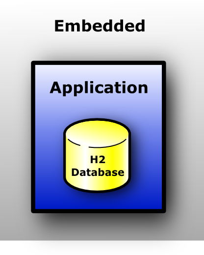
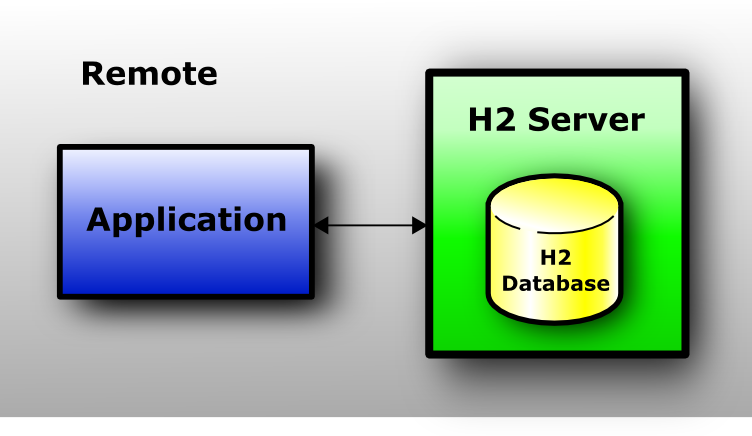
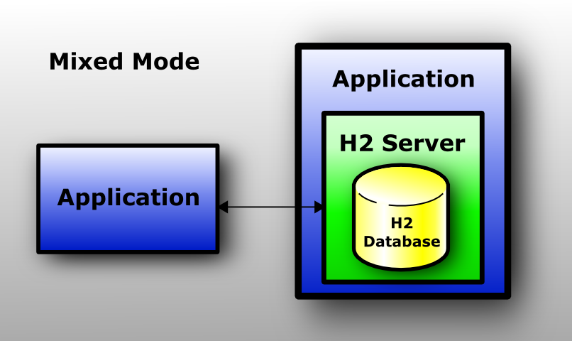
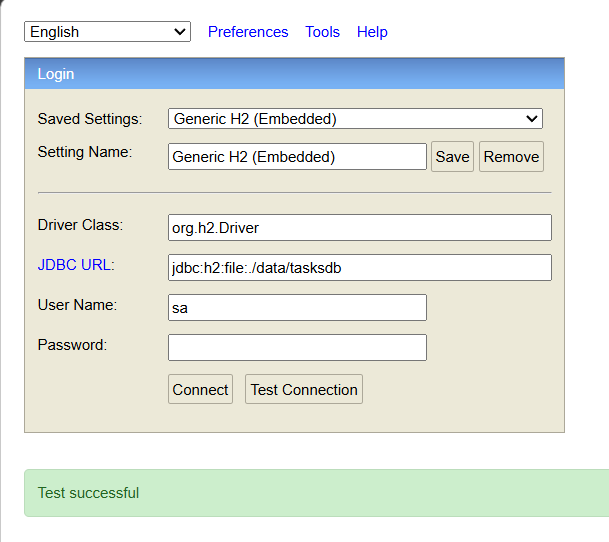
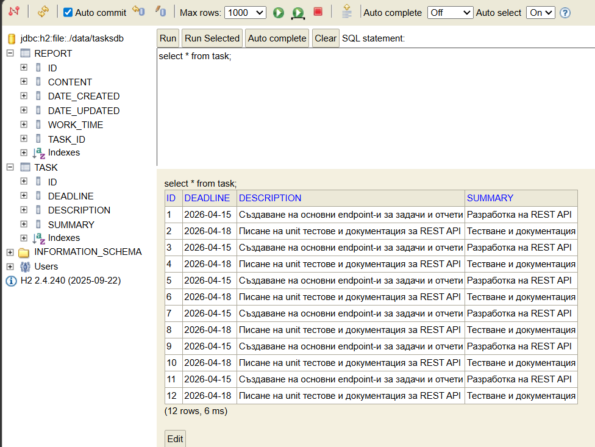
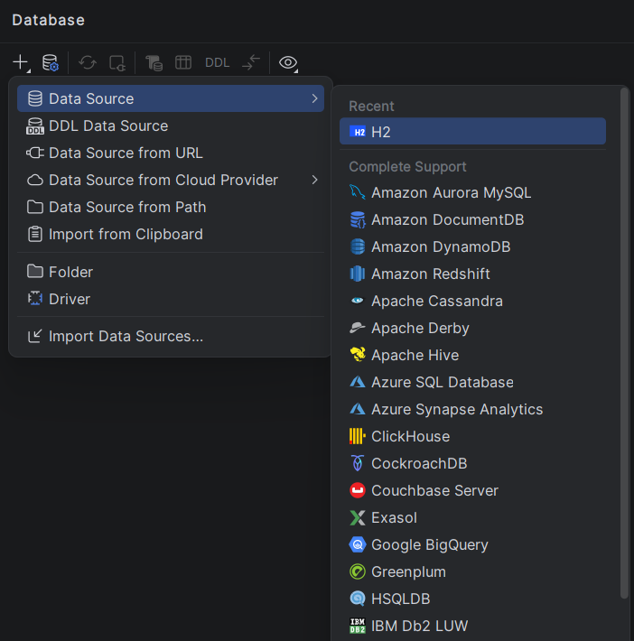
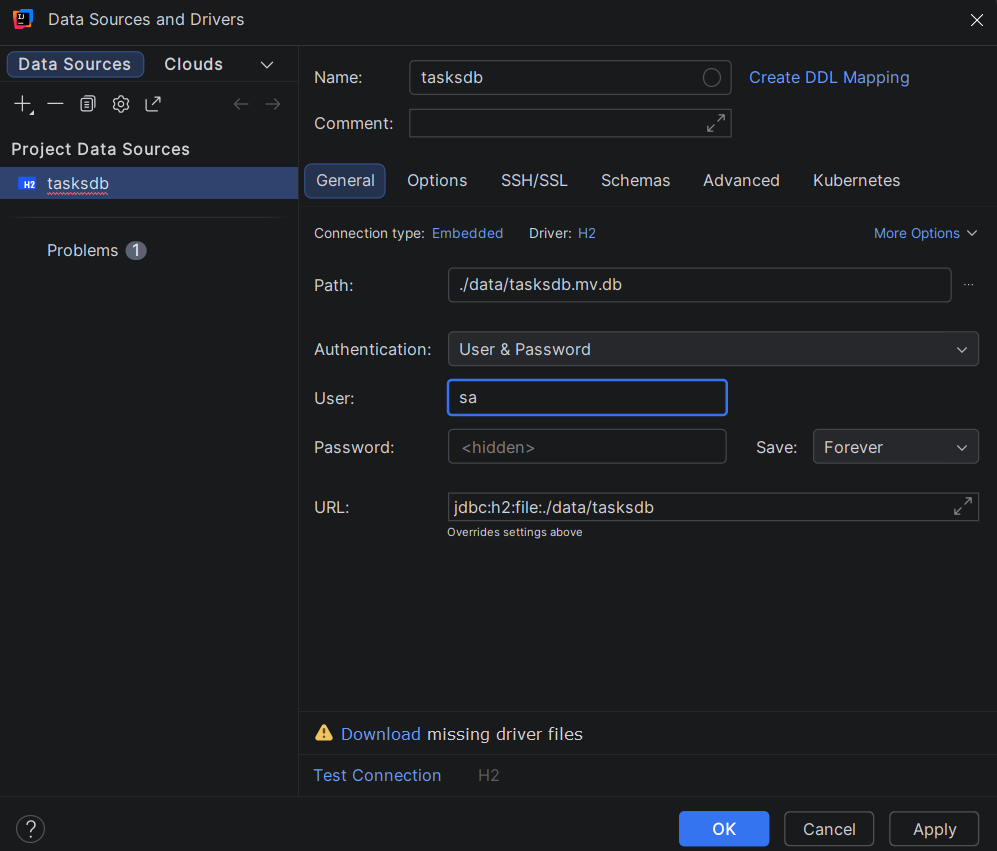
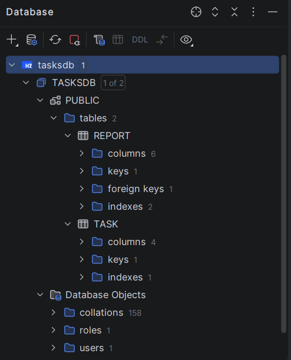

# Project library and configuration addition 

To activate JPA in a Spring Boot application there must be `spring-boot-starter-data-jpa` dependency added, as well as JDBC driver for H2. Spring Boot configures by default Hibernate to use JPA.

In `pom.xml` should be added:

```xml

<dependency>
    <groupId>org.springframework.boot</groupId>
    <artifactId>spring-boot-starter-data-jpa</artifactId>
</dependency>

<dependency>
    <groupId>com.h2database</groupId>
    <artifactId>h2</artifactId>
    <scope>runtime</scope>
</dependency>

```
---

## 2. Introduction to H2 data storage and access types
   
H2 is a relational database written in Java for local development, training and testing. It offers different **types of data storage** and **access types** which are chosen depending on application needs.

- **data storage types** define id the data is lost on application shutdown or they are stored on disk;

- **access modes** define how application or external clients are connected to the database - directly in the application or via separate process (TCP).

Each type and mode has specific **JDBC URL** which is used for connection configuration. In a Spring Boot application this JDBC URL is defined in `application.properties` file while in case of H2 console or IntelliJ Data Source there is connection form input field.

---

## 3. Data storage types

### In-Memory database

- data is stored completely in operational memory

- data dissappears when the application is shutted down

- very fast thus useful for testing and demonstrations

- does not create physical file.

**Examplary JDBC URL:**
`jdbc:h2:mem:testdb`

URL components:
- `jdbc` – JDBC connection usage  
- `h2` – type of database  
- `mem` – in-memory storage 
- `testdb` – database name 

**Note** This URL is placed as property value for `spring.datasource.url` from `application.properties` file (or is entered in form in case of Console/Data Source).

---

### File-Based database

- data is stored as physical file in the local system
    
- data is stored inbetween different application runs

- suitable for local development

**Examplary JDBC URL:**  
`jdbc:h2:file:./data/tasksdb`

URL components:

- `jdbc` – JDBC connection
- `h2` – database type
- `file` – data is stored in file
- `./data/tasksdb` – file location regarding project 
<br>

---

## 4. H2 access modes

### Embedded mode

- database works **inside** the application  
- doesn't need separate server  
- direct management through JDBC done by application  
- could be used both for in-memory and file-based storage.    
<br>

<p align="center">
  
</p>


### Server mode

- H2 starts as **separate process** listening to TCP port  
- allows simultaneous connection of multiple clients 
- could be used both for in-memory and file-based storage.

**Examplary JDBC URL:**  
`jdbc:h2:tcp://localhost/~/tasksdb`

Компоненти:

- `jdbc` – JDBC connection 
- `h2` – database type 
- `tcp` – network connection
- `localhost` – server address
- `~/tasksdb` – database location     
<br>


<p align="center">
  
</p>

### Mixed mode

- combines **Embedded and Server** access modes
- application has direct local access and external clients could connect by TCP
- mode implementation requires AUTO_SERVER=TRUE to be added to database location address: jdbc:h2:mem:testdb;AUTO_SERVER=TRUE
<br> 

<p align="center">
  
</p>

> Mixed mode allows simultaneous local access and sharing between applications.

---

## 5. Spring Boot configuration for file-based + embedded

Following properties should be added in file `src/main/resources/application.properties`:

```properties
spring.datasource.url=jdbc:h2:file:./data/tasksdb;AUTO_SERVER=TRUE
spring.datasource.driverClassName=org.h2.Driver 
spring.datasource.username=padawan
spring.datasource.password=R2D2c3pO

spring.jpa.properties.hibernate.dialect=org.hibernate.dialect.H2Dialect
spring.jpa.hibernate.ddl-auto=update  
```


- **`spring.datasource.url=jdbc:h2:file:./data/tasksdb`**  
  Defines database location, type (H2) and storage type (file-based). The file is created in `./data` of the project. This URL is also used both by Spring Boot on connection establishment, and by H2 Console / Data Source in IntelliJ for database work.

- **`spring.datasource.driverClassName=org.h2.Driver`**  
  Defines H2 JDBC driver used by Spring Boot for database connection.

- **`spring.datasource.username=padawan`**  
  Inital H2 database user creation is done by the configuration and has admin rights.

- **`spring.datasource.password=R2D2c3pO`**  
  Allows working without password in local environment. In order of server protection, using password is mandatory.

- **`spring.jpa.properties.hibernate.dialect=org.hibernate.dialect.H2Dialect`**  
  Defines H2 SQL dialect used for Hibernate thus allowing correct SQL command generation.

- **`spring.jpa.hibernate.ddl-auto=update`**  
  Declares how Hibernate controls database scheme: checks, creates or updates tables according to entity classes (`update` adds changes without data deletion).
  <br>

> JDBC URL is defined here in order to be used by Spring Boot on application start. H2 Console and IntelliJ Data Source use the same URL for database interactions.

---

## 6. Database scheme management

The property `spring.jpa.hibernate.ddl-auto` defines how Hibernate manages database scheme.  

| Value          | Description                                                                   | When to use                               |
|----------------|-------------------------------------------------------------------------------|-------------------------------------------|
| `validate`     | Checks if existing scheme corresponds to entity classes                       | If the databased is externally managed    |
| `create`       | Creates scheme on start, removes previous data                                | Tests and initial development             |
| `create-drop`  | Creates scheme on start, removes scheme on shutdown                           | Temporal tests                            |
| `update`       | Adds new changes to the already existing scheme without data deletion         | Local development with persistent data    |

---

## 7. H2 Console and Data Source in IntelliJ

There are different ways to access and work with H2 Database Engine:

1. **H2 Console** – embedded web interface activated by corresponding configuration.
2. External databsae clients (as **Data Source в IntelliJ IDEA**) – tools for database interactions via standard JDBC connection.

These approaches allow structure and database content overview as well as execution of diiferent SQL queries, but they differ in access and available functionalities.

### 7.1. H2 Console

H2 Database Engine is ebedded web interface accessible through browser. 

Dependency should be added in `pom.xml` to allow its usage:

```xml
<dependency>
    <groupId>org.springframework.boot</groupId>
    <artifactId>spring-boot-h2console</artifactId>
</dependency>
```

Application configuration should be also modified:

- **`spring.h2.console.enabled=true`**  
  Activates the console.

- **`spring.h2.console.path=/h2-console`**  
  Defines path to the web interface - the console is accessible via application address combined with that path (`http://localhost:8080/h2-console` for example).

Once these modifications are done, there are few more steps:
- start the application (Embedded Tomcat listens at port 8080).  
- open the browser: `http://localhost:8080/h2-console`  
- fill the form:  
  - JDBC URL: `jdbc:h2:file:./data/tasksdb`  
  - User Name: `padawan`  
  - Password: `R2D2c3pO`
  <br>


  <p align="center">
  
</p>

- press **Connect**  
- all tables are visible and SQL queries could be performed:    
<br>

<p align="center">
  
</p>


### 7.2. Data Source in IntelliJ Ultimate

- Open **Database** tool window → **+ → Data Source → H2**  

<p align="center">
  
</p>

- Enter:  
  - URL: `jdbc:h2:file:./data/tasksdb`  
  - User: `padawan`  
  - Password: `R2D2c3pO`  
  <br>

<p align="center">
  
</p>

- if necessary, required drivers should be downloaded; then press **Test Connection → OK** to check connection; **OK** should be presed again for connection.
- tables and SQL pannel are available.

<p align="center">
  
</p>

