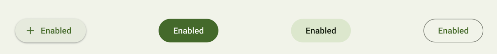
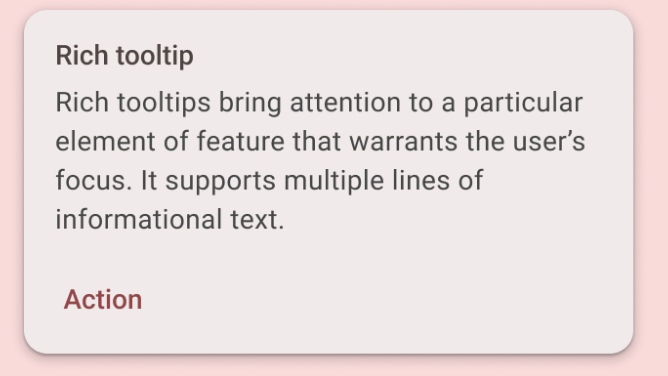
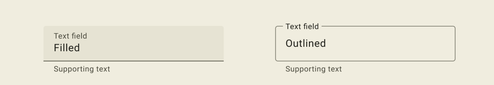
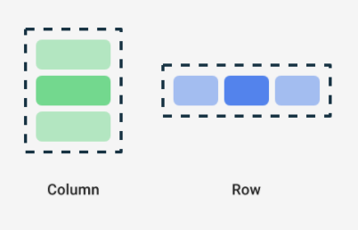
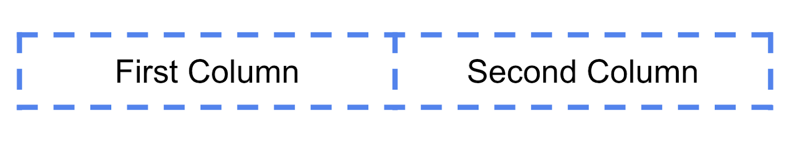

# Лабораторно упражнение 5

## Построяване на потребителски интерфейс

Потребителският интерфейс (UI) на приложението е това, което виждате на екрана: текст, изображения, бутони и много други видове елементи и как е разположен на екрана. Това е начинът, по който приложението показва нещата на потребителя и как потребителят взаимодейства с приложението.







Бутон с възможност за щракване, Текстово съобщение в картичка, Поле за въвеждане на текст

Всеки от тези елементи се нарича компонент на потребителския интерфейс. Почти всичко, което виждате на екрана на вашето приложение, е елемент на потребителския интерфейс (известен също като компонент на потребителския интерфейс). Те могат да бъдат интерактивни, като бутон с възможност за щракване или поле за въвеждане с възможност за редактиране, или могат да бъдат декоративни изображения.

## Jetpack Compose 

Jetpack Compose е модерен инструментариум за изграждане на потребителски интерфейси за Android. Compose опростява и ускорява разработването на потребителски интерфейс на Android с по-малко код, мощни инструменти и интуитивни възможности на Kotlin. С Compose можете да изградите своя потребителски интерфейс, като дефинирате набор от функции, наречени компонуеми функции, които приемат данни и описват елементи на потребителския интерфейс.

## Composable функции

Composable функции са основният градивен елемент на потребителския интерфейс в Compose. Компонуема функция:

Описва част от вашия потребителски интерфейс.
Не връща нищо.
Взема някои входни данни и генерира това, което се показва на екрана.

# Мащабируеми пиксели

Мащабируемите пиксели (SP) са мерна единица за размера на шрифта. Елементите на потребителския интерфейс в приложенията за Android използват две различни мерни единици: независими от плътността пиксели (DP), които по-късно използвате за оформлението, и мащабируеми пиксели (SP). По подразбиране SP модулът е със същия размер като DP модула, но се преоразмерява въз основа на предпочитания от потребителя размер на текста в настройките на телефона.

Библиотеката за AndroidX (разширение за Android) съдържа набор от библиотеки и класове, които помагат за ускоряване на разработването на приложенията, като ви предоставят основната функционалност. Можете да получите достъп до класовете, свойствата и други артефакти с помощта на androidx пакета.

# Йерархия на потребителския интерфейс

Йерархията на потребителския интерфейс се основава на задържане, което означава, че един компонент може да съдържа един или повече компоненти, а понякога се използват термините родител и дете. Контекстът тук е, че родителските елементи на потребителския интерфейс съдържат елементи на дъщерния потребителски интерфейс, които от своя страна могат да съдържат елементи на дъщерния потребителски интерфейс. Трите основни, стандартни елемента на оформлението в Compose са Column, Row, и Box.



Column, Row, и Box са Compose функции, които приемат Compose съдържание като аргументи, така че можете да поставяте елементи в тези елементи на оформлението. Например, всеки дъщерен елемент в Compose елемент се поставя хоризонтално един до друг в редица.

Пример:

```kotlin
Row {
    Text("First Column")
    Text("Second Column")
}
```



В Compose функцията се използват къдрави () скоби вместо скоби. Това се нарича Trailing Lambda Syntax. Kotlin предлага специален синтаксис за предаване на функции като параметри към функции, когато последният параметър е функция.

Когато подадете функция като този параметър, можете да използвате крайния ламбда синтаксис. Вместо да поставяте функцията в скобите, можете да я поставите извън скобите във къдрави скоби. Това е препоръчителна и често срещана практика в Compose, така че трябва да сте запознати с това как изглежда кодът.

Например, последният параметър в компонуемата функция е параметърът, функция, която описва дъщерните елементи на потребителския интерфейс. Да предположим, че искате да създадете ред, който съдържа три текстови елемента. Този код би свършил, но е много тромаво да се използва именуван параметър за крайната ламбда

Пример

```kotlin
Row(
    content = {
        Text("Some text")
        Text("Some more text")
        Text("Last text")
    }
)
```

Тъй като параметърът е последният в сигнатурата на функцията и вие предавате стойността му като ламбда израз (засега е добре, ако не знаете какво е ламбда, просто се запознайте със синтаксиса), можете да премахнете параметъра и скобите, както следва:

```kotlin
Row {
    Text("Some text")
    Text("Some more text")
    Text("Last text")
}
```

## Оформление на елементите на потребителския изглед

Оформлението се извършва с обекта модификатор, който е колекция от елементи, които украсяват или променят поведението на елементите на потребителския интерфейс на Compose, като padding, align. Освен това всекиелемент на потребителския интерфеис приежава собсвени параметри за оформление fontSize, lineHeight, textAlign, verticalArrangement и други.

## Обработка на потребителски взаимодействия

Компонентите на потребителския интерфейс дават обратна връзка на потребителя на устройството по начина, по който реагират на взаимодействията на потребителите. Всеки компонент има свой собствен начин да реагира на взаимодействия, което помага на потребителя да знае какво правят неговите взаимодействия. Например, ако потребител докосне бутон на сензорния екран на устройството, бутонът вероятно ще се промени по някакъв начин, може би чрез добавяне на цвят на подчертаване. Тази промяна уведомява потребителя, че е докоснал бутона. Ако потребителят не иска да го направи че те ще знаят да отдръпнат пръста си от бутона преди Освобождаване - в противен случай бутонът ще се активира.

В много случаи не е необходимо да знаете точно как вашият Compose компонент интерпретира потребителските взаимодействия. Например Button разчита на Modifier.clickable, за да разбере дали потребителят е щракнал върху бутона. Ако добавяте типичен бутон към приложението си, можете да дефинирате кода onClick на бутона и Modifier.clickable изпълнява този код, когато е подходящо. Това означава, че не е нужно да знаете дали потребителят е докоснал екрана или е избрал бутона с клавиатура; Modifier.clickable установява, че потребителят е извършил щракване и отговаря, като изпълнява вашия onClick код.

## Ресурси на приложението

Resource Manager слъжи за управление на ресурсите в проекта. Той може да се стртира от View > Tool Windows. От него могат да се добавят към проекта различни ресурси сред които и изображения. Ако един ресурс не е правилно интегриран с проекта той няма да може да се използва. Всички ресурси, които се добавят към приложението получават идентификатор, идентификаторите на ресурсите се генерират автоматично и са описани в автоматично генерирания класа R.

Извличането на ресурси става с Resource методите: stringResource, painterResource

## Динамичен потребителски интерфейс

Composables функциите са без състояние по подразбиране, което означава, че те не съдържат стойност и могат да бъдат прекомпозирани по всяко време от системата, което води до нулиране на стойността. Compose обаче предоставя удобен начин да избегнете това. Съставимите функции могат да съхраняват обект в паметта, използвайки запомнянето на съставяемия.

За да пази състояние една променлива в Composables функция трябва да се дефинира като remember composable.
Remember composable елемент изисква функция, която трябва да бъде предадена.
Remember composable observable, за да следи промените на обекта и да уведомява потребителския интерфейс че трябва да се промени.
Функцията която приема като параметър е управляващата функция след настъпване на промяна.


