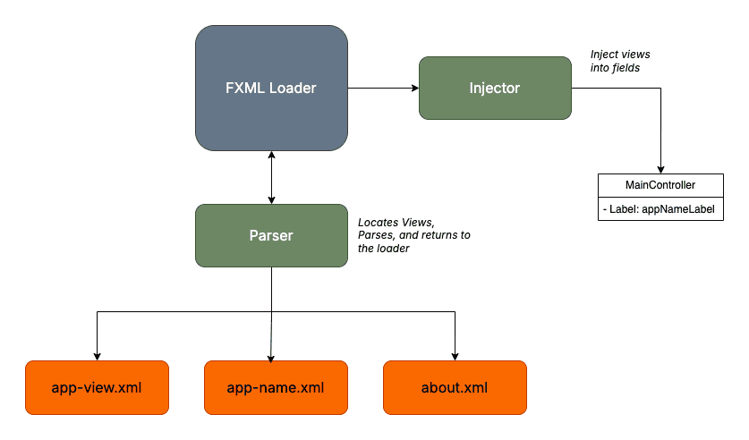

### Controller

A Controller is a class that processes user actions (clicks, data input, etc.), reads and validates data from the FXML files, and updates the UI using JavaFX mechanisms (binding, setText, disable, etc.).

In JavaFX, a Controller is a Java class that is connected to an FXML file and manages the behavior of the user interface.

The FXML file does not contain logic; it only provides a declarative description of the interface and the connections to the controller.

In an FXML file, the controller is defined and used through several key elements.

``` fx:controller ``` - The attribute connects the FXML file with a specific Java Controller class.

The creation of user interface objects and the Java Controller class object is performed by FXMLLoader, which converts the FXML definition into Java objects. This happens when FXMLLoader parses the view files and connects the corresponding UI elements to the fields in the controller.

The connection is established using the @FXML annotation, which marks fields and methods that are linked to the elements declared in the FXML file.




The `fx:controller` attribute is specified only on the root element.

```xml
<VBox spacing="10" alignment="CENTER"
      xmlns:fx="http://javafx.com/fxml/1"

      fx:controller="bg.tu_varna.sit.ps.lab4.task2.controller.RegistrationController">
      
</VBox>
```

When the controller is not defined in the FXML file, it must be initialized when the interface is loaded using the Application class.

```xml
<GridPane xmlns:fx="http://javafx.com/fxml/1">
    <Label fx:id="labelTitle"></Label>
</GridPane>
```

```java
public class LoginController  implements Initializable {

    private final String title;

    @FXML
    private Label labelTitle;

    public LoginController(String title) {
        this.title = title;
    }

    @Override
    public void initialize(URL location, ResourceBundle res) {
        this.labelTitle.setText(this.title);
    }
}
```

```java
public class LoginApplication extends Application {

    @Override
    public void start(Stage stage) throws Exception {

        FXMLLoader loader = new FXMLLoader(
                getClass().getResource("login-view.fxml")
        );

        LoginController controller = new LoginController("Login Manager");

        loader.setController(controller);

        Parent root = loader.load();

        Scene scene = new Scene(root, 600, 400);

        stage.setTitle("Login Application");
        stage.setScene(scene);
        stage.show();
    }
}
```

After the fields are successfully initialized, we can safely access them through the initialization method for operations such as registering event handlers and applying styling.

In essence, the initialization of the objects does not happen in initialize, but after the constructor is invoked. Therefore, the fields are not accessible for use inside the constructor.


During object creation with the constructor, the view is practically invalid. If we try to access the FXML views in the constructor, the program will throw a NullPointerException.

Therefore, initialize() provides a safe way for post-processing FXML views and configuring them at the start of the program execution. After that, the UI is rendered when the view is ready. Consequently, we can place the interface initialization logic in the initialization method.

```java
@FXML
public void initialize() {
    this.labelTitle.setText(this.title); 
}
```

| Constructor                                    | *initialize()*                                          |
| ---------------------------------------------- | ------------------------------------------------------- |
| Executed when the controller object is created | Executed automatically after the FXML views are loaded  |
| Called by the JVM during object instantiation  | Called by the JavaFX FXML Loader                        |
| FXML views are not accessible                  | FXML views are accessible                               |
| Used to set up the object's state              | Used to initialize the user interface                   |
| Called once per controller                     | Called once per controller                              |
| Can take parameters                            | Requires only two arguments: *URL* and *ResourceBundle* |
