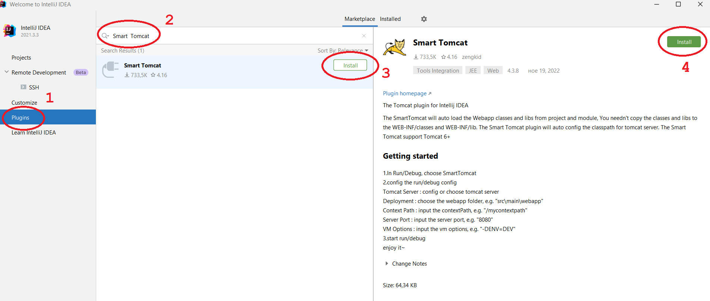

# Създаване на Maven проект в IntelliJ Community Edition

1. Добавяне на плъгин Smart Tomcat в IntelliJ (еднократно)\


<figure><figcaption></figcaption></figure>

2. Създаване на Maven проект

<figure><figcaption></figcaption></figure>

<figure><figcaption></figcaption></figure>

<figure><figcaption></figcaption></figure>

3. В pom.xml добавяме servlet dependency

```xml
<dependency>
    <groupId>jakarta.servlet</groupId>
    <artifactId>jakarta.servlet-api</artifactId>
    <version>6.0.0</version>
    <scope>provided</scope>
</dependency>
```

<figure><figcaption></figcaption></figure>

4\. Презареждане на проекта

<figure><figcaption></figcaption></figure>

5\. Добавяне на Source директория

<figure><figcaption></figcaption></figure>

6\.  Избор на Source директория

.png>)

7\. Конфигуриране на Tomcat

Избираме "Add configuration"

<figure><figcaption></figcaption></figure>

Добавяме нова конфигурация, като избираме Smart Tomcat

<figure><figcaption></figcaption></figure>

Натискаме бутона Configure

<figure><figcaption></figcaption></figure>

Избираме директорията, в която е поставен Tomcat

<figure><figcaption></figcaption></figure>

Попълваме данните на проекта

<figure><figcaption></figcaption></figure>

14\. Билдваме и стартираме проекта
