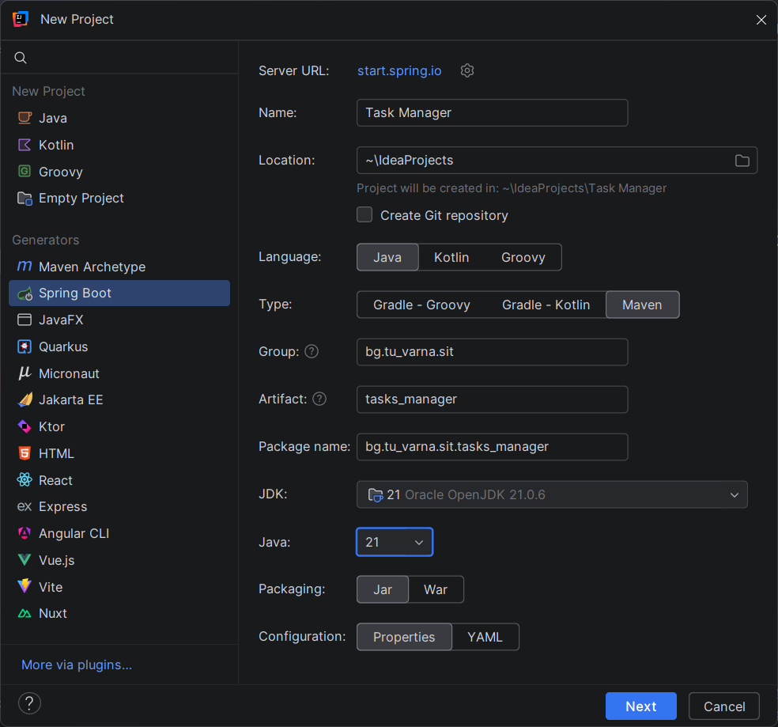
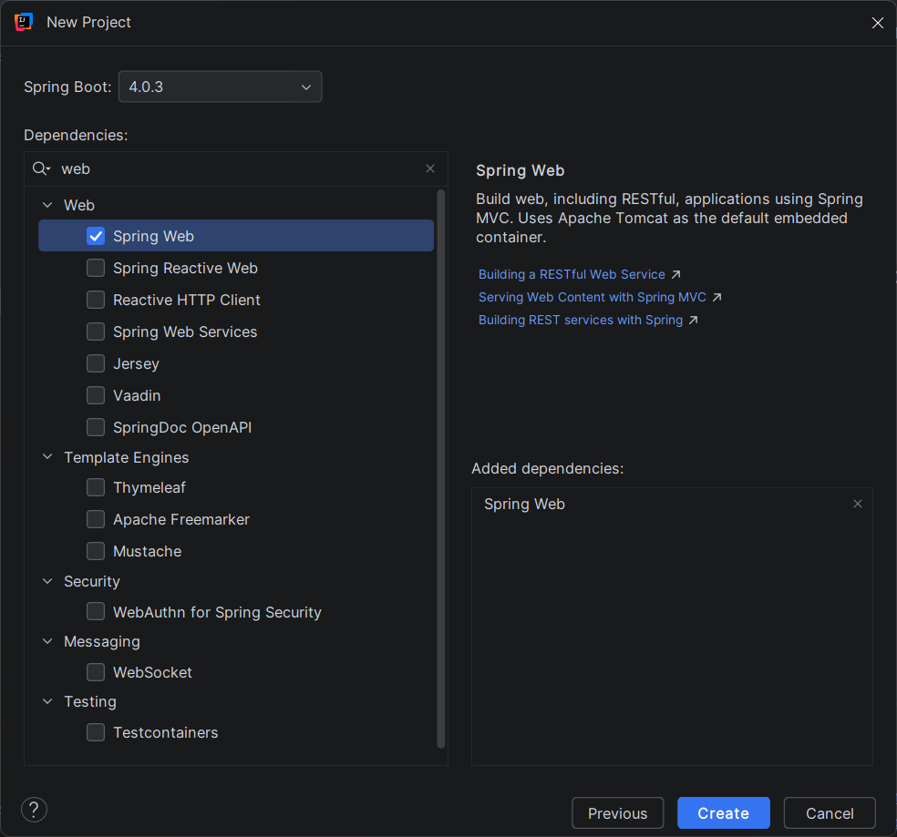

# Създаване на Spring Boot проект с IntelliJ IDEA Ultimate

### Използване на IntelliJ IDEA Ultimate

Spring Boot проект може да бъде създаден директно в IntelliJ IDEA Ultimate без използване на външен генератор като Spring Initializr в браузър. IntelliJ IDEA Ultimate предоставя вградена поддръжка за Spring Boot wizard, чрез който проектът се генерира автоматично с необходимата структура и зависимости.

Този подход е удобен, защото всички основни параметри на проекта се задават в една последователност от стъпки, без необходимост от изтегляне и разархивиране на ZIP архив.

Важно е да се отбележи, че тази възможност е налична само в Ultimate версията на IntelliJ IDEA. Community версията не съдържа Spring Boot wizard и няма вградена Spring поддръжка, поради което не позволява директно създаване на Spring Boot проект по този начин.

## Защо използваме IntelliJ IDEA Ultimate при създаване на проекта

При създаване на Spring Boot проект Ultimate версията предоставя няколко практически предимства:

* автоматично генериране на Maven конфигурацията;
* директен избор на Spring Boot версия;
* избор на starter зависимости още при създаването;
* автоматично генериране на package структурата;
* създаване на основния клас с анотация `@SpringBootApplication`.

Това намалява вероятността от грешки при първоначалната конфигурация на проекта.

## Стъпки за създаване на проект

1. Стартирайте IntelliJ IDEA Ultimate.

2. Изберете **New Project**.

3. От менюто с налични технологии изберете **Spring Boot**.

<figure><figcaption></figcaption></figure>

4. Попълнете основните параметри:

   * Name: `Task Manager`
   * Language: `Java`
   * Type (Build system): `Maven`
   * Group: `bg.tu-varna.sit`
   * Artifact: `task_manager`
   * JDK: `21`
   * Java: `21`

5. Натиснете **Next**.

6. Изберете необходимата зависимост:

   * Spring Web

<figure><figcaption></figcaption></figure>

7. Натиснете **Create**.

## Какво генерира IntelliJ автоматично

След създаването IntelliJ генерира:

* файл `pom.xml` с избраните зависимости;
* основен Java клас със `main()` метод;
* папка `src/main/resources`;
* файл `application.properties`;
* стандартна Maven структура.

## Ограничение в Community версията

В IntelliJ IDEA Community липсва вградената Spring Boot интеграция, поради което:

* не се появява опция **Spring Boot** при създаване на нов проект;
* dependencies трябва да се добавят ръчно;
* структурата на проекта се създава ръчно или чрез външен Spring Initializr.

Поради тази причина при използване на Community версията се препоръчва проектът първо да бъде генериран чрез Spring Initializr и след това да бъде импортиран в IntelliJ.
