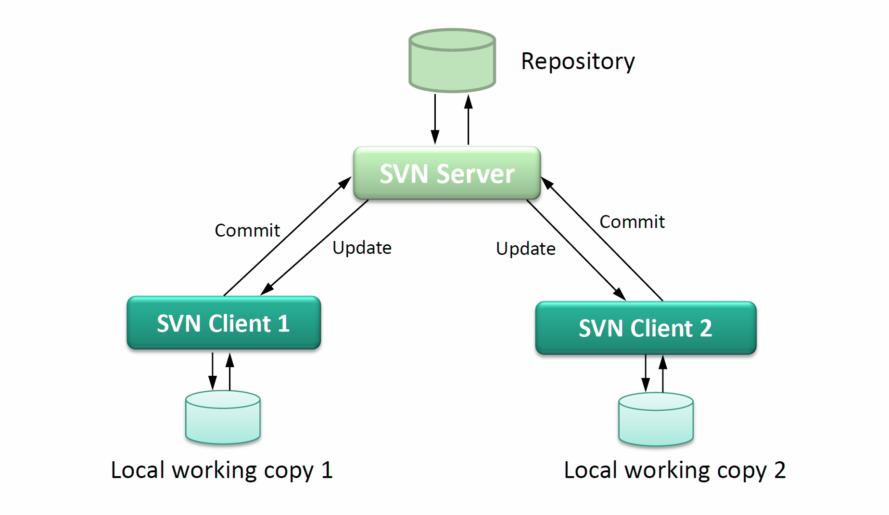
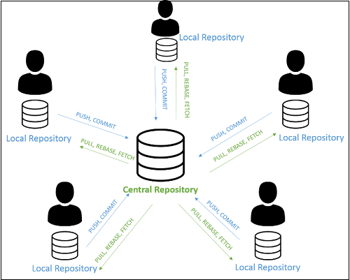
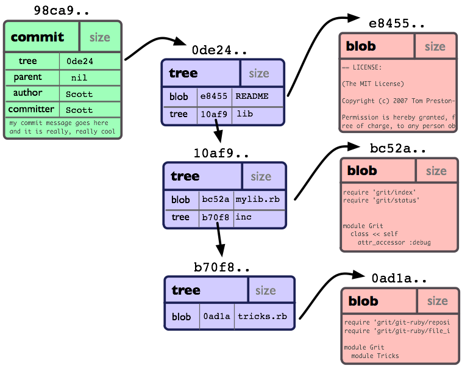
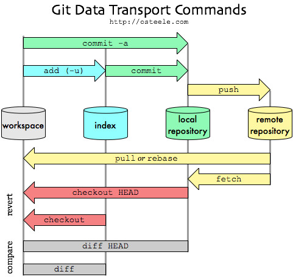
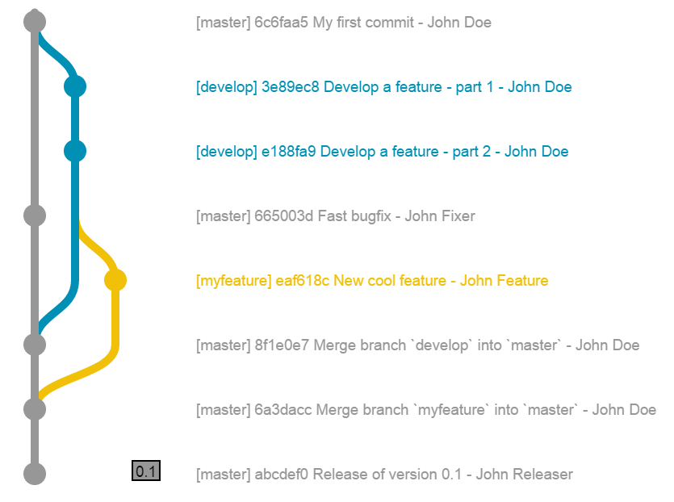

# Лабораторно упражнение 1

## GitСистеми за контрол на версиите (VCS)

Система за контрол на версиите (Version Control System, VCS) е софтуерен механизъм за идентифициране, съхраняване и управление на последователни състояния (версии) на набор от артефакти (изходен код, конфигурации, документация). VCS предоставя:

- проследимост на измененията (traceability),
- възпроизводимост на състояния (reproducibility),
- управление на паралелни линии на развитие (branching),
- интеграция на изменения (merging) и разрешаване на конфликти,
- аудит: кой/кога/какво е променено.

Формално може да се разглежда като поддържане на история на състоянията на проект S<sub>0</sub>, S<sub>i</sub>, ..., S<sub>n</sub>, където всяко състояние 
S<sub>i</sub> е резултат от операция „commit“ върху предходно състояние (или няколко при merge).

2. Класификация на VCS

2.1 Централизирани VCS (CVCS)



Един централен сървър съдържа каноничната история. Клиентите изтеглят работни копия и изпращат промени обратно към сървъра.

Предимства: централен контрол, опростени политики.
Недостатъци: единична точка на отказ, ограничена работа офлайн.

2.2 Разпределени VCS (DVCS)



Всеки участник притежава пълно копие на хранилището, включително цялата история. Синхронизацията се осъществява чрез обмен на обекти между хранилища.

Предимства: работа офлайн, висока устойчивост, бързи локални операции, гъвкави модели на сътрудничество.

### Git - Разпределени VCS

Git е разпределена система за контрол на версиите (DVCS), при която основният модел не е съхраняване на разлики (diff), а съхраняване на съдържание като обекти, адресирани чрез криптографски хеш-функции.

Това осигурява:

- целостта на историята (integrity) – всяка модификация променя хеша,
- ефективност – повечето операции са локални,
- проследимост – историята представлява граф от зависимости между версии.

#### Модел на данните в Git (обектен модел)



Git използва content-addressable storage, при който всеки обект се идентифицира чрез хеш.

Основни типове обекти:

- Blob – съдържание на файл (без име и метаданни).
- Tree – структура на директории (препратки към blob/tree).
- Commit – указва snapshot чрез tree + метаданни (author, дата, message) + родител.
- Tag – именована референция към commit.

Историята представлява насочен ацикличен граф (Directed Acyclic Graph – DAG) от commit-и. Merge commit може да има два или повече родителя.

#### Работни състояния в Git



Git разделя процеса на работа на три логически слоя:

1. Working Directory – текущо редактирани файлове.

2. Staging Area (Index) – междинна зона за подготовка на commit.

3. Repository (.git) – база от обекти и история.

Този модел позволява селективно включване на изменения в даден commit.

##### Branching и Merging




- Branch представлява референция (указател) към commit.
- Създаването на branch е O(1) операция (не се копират файлове).
- Merge използва 3-way merge алгоритъм (общ предшественик + две версии).
- При конкуриращи се изменения възниква merge conflict, който изисква ръчно разрешаване.

Основни операции (формализирано)

| Команда      | Функционално значение                              |
| ------------ | -------------------------------------------------- |
| `git init`   | Създава ново хранилище                             |
| `git add`    | Добавя промени в staging area                      |
| `git commit` | Създава нов commit обект                           |
| `git branch` | Създава нова референция към commit                 |
| `git merge`  | Интегрира две линии на развитие                    |
| `git rebase` | Пренаписва историята върху нова база               |
| `git fetch`  | Изтегля обекти от remote                           |
| `git pull`   | Fetch + merge или rebase                           |
| `git push`   | Публикува локални commits към отдалечено хранилище |

#### Примерен сценарий - демонстрация с Github Desktop

1. Инициализация:

```bash
git init
git add .
git commit -m "Initial version"
```

2. Създаване на функционален клон:

```bash
git checkout -b feature/login
```

3. Добавяне на промени:

```bash
git add Login.java
git commit -m "Implement login module"
```

4. Интеграция:

```bash
git checkout main
git merge feature/login
```

Git реализира разпределен модел за контрол на версиите чрез обектно-хеширана архитектура и представя историята като DAG от commit-и. Това осигурява надеждност, целостност на данните и ефективна паралелна разработка. Благодарение на тези характеристики Git е стандартен инструмент в съвременното софтуерно инженерство, DevOps процесите и CI/CD практиките.
