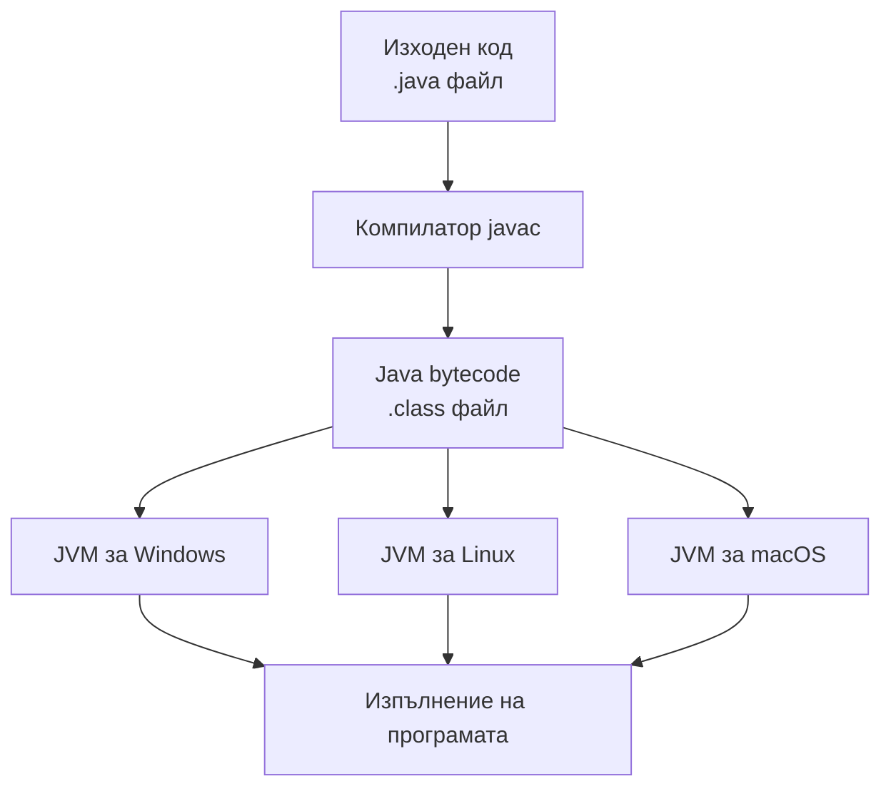
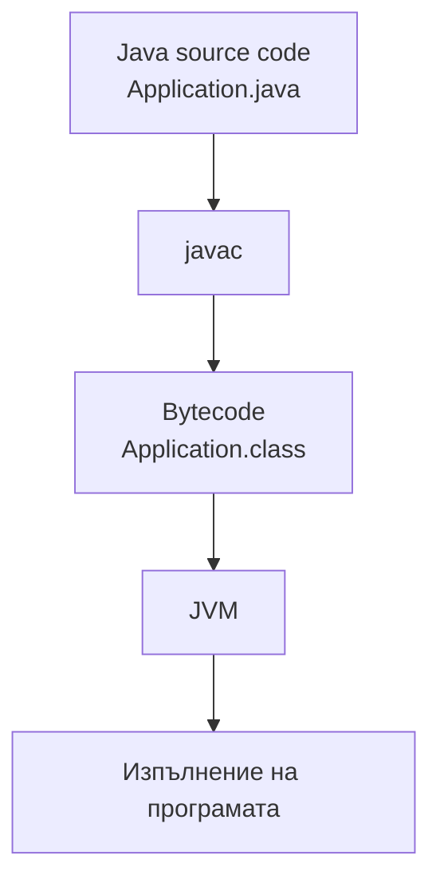
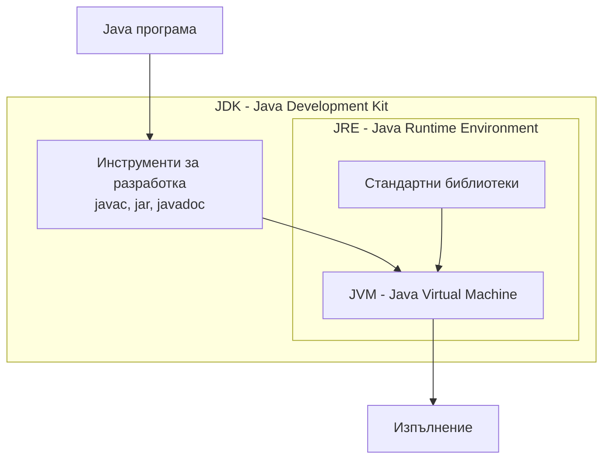

# Основни характеристики на Java

## Java е платформено независим език

Компилаторът javac преобразува изходния код (.java) в **Java bytecode** (.class). Bytecode се изпълнява от Java Virtual Machine (JVM). Тъй като за всяка операционна система съществува реализация на JVM, един и същ bytecode може да бъде изпълнен без промяна под Windows, Linux, macOS и други операционни системи.

## Java е обектно-ориентиран език

Java е обектно-ориентиран език за програмиране. Обектно-ориентираното програмиране (ООП) е парадигма, при която програмата се моделира чрез взаимодействащи класове и обекти. Всеки обект представлява екземпляр на определен клас.

Основните принципи на ООП са:

1. Абстракция
2. Капсулация
3. Наследяване
4. Полиморфизъм

Подробно разглеждане на принципите на обектно-ориентираното програмиране е представено в следващите лабораторни упражнения.

## Java е надежден език

Java е проектиран с акцент върху надеждността. Компилаторът открива голяма част от потенциалните грешки още по време на компилация, а автоматичното управление на паметта намалява риска от възникване на грешки при работа с паметта.

**Java използва механизъм за автоматично управление на паметта (Garbage Collector, GC)**, който освобождава паметта, заета от обекти, които вече не се използват от програмата. По този начин програмистът не е необходимо ръчно да освобождава паметта, което намалява риска от много грешки, свързани с управлението на паметта, като елиминира необходимостта програмистът ръчно да заделя и освобождава паметта.

## Java разполага с богата стандартна библиотека

Java предоставя богата стандартна библиотека, която включва готови класове за работа с колекции, файлове, мрежови приложения, многонишкови програмиране, дати и други.

## Java поддържа разработване на разпределени приложения

Java предоставя средства за разработване на приложения, които обменят данни по мрежа.

## Java поддържа многонишковост

Java поддържа многонишковост (multithreading), което позволява едновременно изпълнение на няколко нишки в рамките на едно приложение и по-ефективно използване на процесорните ресурси.

## Общи термини в Java

Преди да се пристъпи към разработването на Java приложения, е необходимо да бъдат изяснени някои основни понятия, свързани с процеса на компилация и изпълнение на програмите. Най-важните от тях са **Java bytecode**, **JVM**, **JRE (Java Runtime Environment)** и **JDK (Java Development Kit)**.

## Java bytecode

**Java bytecode** представлява междинен код, който се генерира след компилиране на дадена Java програма. Той се записва във файлове с разширение *.class* и се изпълнява от Java Virtual Machine.

Използването на bytecode позволява една и съща Java програма да бъде изпълнявана върху различни операционни системи без необходимост от повторно компилиране.

## Java Virtual Machine (JVM)

Java Virtual Machine (JVM) представлява виртуална машина, която осигурява среда за изпълнение на Java bytecode. Тя не е физическо устройство, а спецификация, реализирана по различен начин за различните операционни системи.

Основните задачи на JVM са: зареждане на класовете; проверка на bytecode; изпълнение на bytecode; управление на паметта по време на изпълнение чрез Garbage Collector.

## Java Runtime Environment (JRE)

Java Runtime Environment (JRE) представлява средата, необходима за изпълнение на Java приложения. Тя включва JVM и стандартните библиотеки, използвани по време на изпълнение на програмата.

Ако на даден компютър е инсталирана само JRE, могат да се изпълняват готови Java приложения, но не могат да се компилират нови програми.

## Java Development Kit (JDK)

Java Development Kit (JDK) представлява комплект от инструменти за разработване на Java приложения. Освен JRE, той включва компилатора *javac*, документиращи и помощни инструменти, необходими за разработката и тестването на програми.

*Процес на компилация и изпълнение*

*Компоненти на Java платформата*

