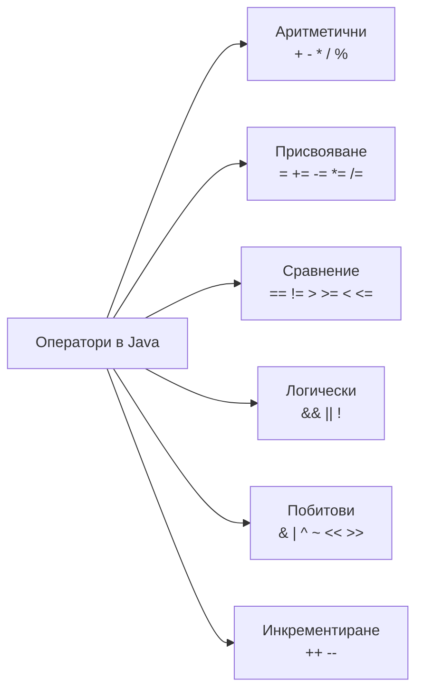

# Оператори

Операторите извършват различни операции върху една или повече стойности. Повечето оператори в Java са аналогични на тези, използвани в други езици за програмиране. При сложни изрази е препоръчително използването на скоби, дори когато приоритетът на операторите е известен. Това подобрява четимостта на кода.



## Деление на цели числа

При делението на две цели числа резултатът също е цяло число. Дробната част се отрязва:

```java
int result = 5/2;
System.out.println(result);			// 2

double secondResult = 5/2;
System.out.println(secondResult);		// 2.0
```

*secondResult* е със стойност 2.0, тъй като отново делението е целочислено, въпреки различния тип на променливата, съхраняваща резултата.

## Остатък при деление

```java
int reminder = 10 % 3;
System.out.println(reminder);			// 1
```

Операторът *%* връща остатъка при деление.

## Инкрементиране и декрементиране

```java
int number = 6;
number++;
number--;
```

Операторите *++* и *--* увеличават или намаляват стойността на променливата с единица.

## Кратко оценяване на изрази

```java
if (number != 0 && 10/number > 1) {
	System.out.println("Valid");
}
```

При оператора *&&*, ако първото условие е *false*, второто не се оценява. Аналогично, при оператор *||*, ако първото условие е *true*, второто не се оценява.

## Логически оператори

Логическите оператори се използват за комбиниране или отрицание на булеви изрази. Резултатът от тях винаги е стойност от тип *boolean* (*true* или *false*).

| Оператор | Значение        | Пример                 | Резултат |
| -------- | --------------- | ---------------------- | -------- |
| `&&`     | логическо И     | `true && true`         | `true`   |
| `&&`     | логическо И     | `true && false`        | `false`  |
| `&&`     | логическо И     | `false && true`        | `false`  |
| `&&`     | логическо И     | `false && false`       | `false`  |
| `||`     | логическо ИЛИ   | `true || true`         | `true`   |
| `||`     | логическо ИЛИ   | `true || false`        | `true`   |
| `||`     | логическо ИЛИ   | `false || true`        | `true`   |
| `||`     | логическо ИЛИ   | `false || false`       | `false`  |
| `!`      | логическо НЕ    | `!true`                | `false`  |
| `!`      | логическо НЕ    | `!false`               | `true`   |

## Побитови оператори

Побитовите оператори работят с битовото представяне на числата. Тяхното използване е важно при проследяване на изрази, работа с флагове и операции от ниско ниво.

Побитовите операции използват същите логически принципи като логическите оператори, но ги прилагат върху отделните битове на числата. Всеки бит със стойност 1 може да се разглежда като логическа истина (*true*), а този със стойност 0 - като логическа лъжа (*false*). Следващата таблица показва резултата от побитовите операции AND, OR и XOR.

| Оператор | Значение | Пример  | Резултат |
| -------- | -------- | ------- | -------- |
| `&`      | AND      | `1 & 1` | `1`      |
| `&`      | AND      | `1 & 0` | `0`      |
| `&`      | AND      | `0 & 1` | `0`      |
| `&`      | AND      | `0 & 0` | `0`      |
| `|`      | OR       | `1 | 1` | `1`      |
| `|`      | OR       | `1 | 0` | `1`      |
| `|`      | OR       | `0 | 1` | `1`      |
| `|`      | OR       | `0 | 0` | `0`      |
| `^`      | XOR      | `1 ^ 1` | `0`      |
| `^`      | XOR      | `1 ^ 0` | `1`      |
| `^`      | XOR      | `0 ^ 1` | `1`      |
| `^`      | XOR      | `0 ^ 0` | `0`      |
