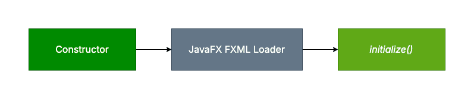

### Контролер (Controller)

Controller е клас, който обработва действията на потребителя (кликове, въвеждане на данни и д.р.), чете и валидира данните от fxml файловете, обновява декора чрез JavaFX механизми (binding, setText, disable и др.)

В JavaFX Controller е Java клас, който се свързва с fxml файла и управлява поведението на потребителския интерфейс.

FXML файлът не съдържа логика, а само декларативно описание на интерфейса и връзките към контролера.

Във fxml файл контролерът се дефинира и използва чрез няколко ключови елемента.

``` fx:controller ``` атрибута свързва FXML файла с конкретен Java Controller клас.

Създаването на обектите на потребителския интерфейс и обекта на Java Controller класа се осъществява от FXMLLoader, който преобразува fxml дефиницията към Java обект. Това се случва като FXMLLoader анализира файловете с изгледи и свързва съответните изгледи в полетата на контролера. Свързването се усъществява с анотацията @FXML, която маркира полета и методи, които се свързват с елементите, декларирани в fxml файла.


```xml
<GridPane fx:controller="bg.tu_varna.sit.ps.lab4.LoginController" xmlns:fx="http://javafx.com/fxml/1">
```

```java
public class LoginController implements Initializable {

    private final String title;

    @FXML
    private Label labelTitle;

    public LoginController(String title) {
        this.title = title;
    }

    @Override
    public void initialize(URL location, ResourceBundle res) {
        this.labelTitle.setText(this.title); 
    }
}
```

```java
public class App extends Application {

    @Override
    public void start(Stage stage) throws Exception {

        FXMLLoader loader = new FXMLLoader(
                getClass().getResource("/login-view.fxml")
        );

        LoginController controller = new LoginController("Login Manager");

        loader.setController(controller);

        Parent root = loader.load();

        Scene scene = new Scene(root, 600, 400);

        stage.setTitle("Login Application");
        stage.setScene(scene);
        stage.show();
    }
}
```

След като полетата бъдат успешно инициялизирани, можем безопасно да ги достъпим чрез метода за инициализация за операции като регистриране на обработвачи на събития и стилизиране. По същество инициялизацията на обектите не се случва при initialize, а след като конструкторът бъде извикан. Така че, полетата не са достъпни за използване в конструктора.



По време на създаване на обектите с конструктор изгледа е практически невалидни. Ако опитаме да достъпим FXML изгледите в конструктор, програмата ще хвърли NullPointerException.

Затова initialize() предоставя безопасен начин за постобработка на FXML изгледи и настройването им в началото на изпълнението на програмата. След това декора се рендерира, когато изгледа в готов. Следователно можем да поставим логиката на инициализация на интерфейса в метода за инициализация.

```java
@FXML
public void initialize() {
    this.labelTitle.setText(this.title); 
}
```

| Конструктор | *initialize()* |
|---|---|
| Изпълнява се, когато е създаден контролер обект | Изпълнява се автоматично след въвеждане на FXML изгледи |
| Извикване от JVM по време на инстанциация на обекти | Извикан от JavaFX FXML Loader |
| FXML изгледите са недостъпни | FXML изгледи са достъпни |
| Използва се за настройване на състояние на обекта | Използва се за инициализация на потребителския интерфейс |
| Извиква се веднъж на контролер | Извиква се веднъж на контролер |
| Може да взема параметри | Изисква само два аргумента: *URL* и *ResourceBundle* |