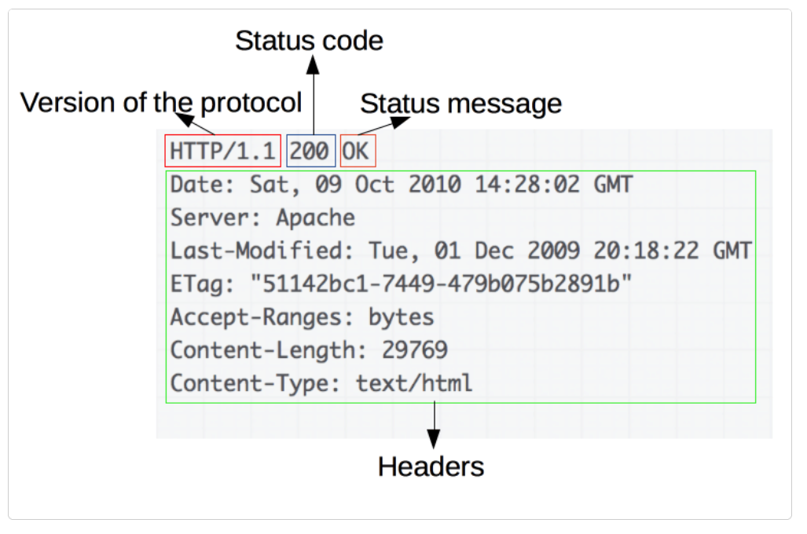

# HTTP протокол

Hypertext Transfer Protocol (HTTP) е протокол на ниво приложен слой за предаване на хипермедийни документи като HTML. Проектиран е за комуникация между уеб браузър и уеб сървър, но може да се използва и за други цели. HTTP следва класическия модел клиент-сървър, като клиентът отваря връзка, за да направи заявка, след което чака, докато получи отговор. HTTP е протокол без състояние, което означава, че сървърът не пази никакви данни (състояние) между две заявки.

Целта на HTTP заявката се нарича "ресурс", който може да бъде документ, изображение и т.н. Всеки ресурс се идентифицира чрез Uniform Resource Identifier (URI). Най-често срещаната форма на URI е Uniform Resource Locator (URL), който е известен като уеб адрес.

# Синтаксис на URL

<figure><figcaption></figcaption></figure>

#### 1.      Схема или протокол

Първият елемент на URL показва кой протокол следва да използва браузърът. Обикновено това е HTTP протоколът или неговата защитена версия, HTTPS. Мрежата изисква използването на един от тези два протокола, но браузърите могат да работят и с други протоколи като mailto: (за отваряне на пощенски клиент), ftp: (за обработка на прехвърляне на файлове) и т.н.

#### 2.      Домейн

www.example.com е името на домейна. Той показва кой уеб сървър е заявен. Като алтернатива е възможно директно да се използва IP адрес, но поради неудобството си не се използва често в мрежата.

#### 3.      Порт

Портът посочва техническата "врата", използвана за достъп до ресурсите на уеб сървъра. Обикновено се пропуска, ако уеб сървърът използва стандартните портове на HTTP протокола (80 за HTTP и 443 за HTTPS), за да предостави достъп до своите ресурси. В противен случай посочването му е задължително.

#### 4.      Path

/path/to/myfile.html е пътят до ресурса на уеб сървъра. В ранните дни на мрежата път като този е представлявал физическото местоположение на файл на уеб сървъра. В наши дни съдържа предимно абстракция.

#### 5.      Query

?key1=value1\&key2=value2 са допълнителни параметри, подадени към уеб сървъра. Тези параметри са списък от двойки ключ/стойност, разделени със символа &. Уеб сървърът може да използва тези параметри за реализация на определена логика, преди да върне ресурса на потребителя.

#### 6.      Фрагмент

\#SomewhereInTheDocument е котва към друга част от самия ресурс. Котвата представлява отметка вътре в ресурса, която дава на браузъра указания за показване на съдържанието, разположено на това маркирано място. На HTML документ, например, браузърът ще превърти до точката, където е дефинирана котвата; на видео или аудио документ, браузърът ще се опита да отиде до времето, което представлява котвата. Частта след #, известна още като идентификатор на фрагмент, никога не се изпраща до сървъра със заявката.

# HTTP съобщения

HTTP съобщенията са начинът, по който се обменят данни между сървър и клиент. Има два типа съобщения: **заявка**, изпратена от клиента за стартиране на действие от сървъра (request) и **отговор** от сървъра (response).

HTTP съобщенията са съставени от текстова информация, кодирана в ASCII, и са разположени в последователност от редове. В HTTP/1.1 и по-ранните версии на протокола тези съобщения се изпращат открито през връзката. В HTTP/2 съобщението, което някога е било четимо от човека, сега е разделено в HTTP фреймове, осигурявайки оптимизация и подобрения в производителността.

HTTP заявките и отговорите споделят подобна структура и се състоят от:

·        Начален ред (start line), описващ заявката, която трябва да бъде изпълнена, или статус за успех или неуспех по отношение на получени отговор. Тази начална линия винаги е разположена на един ред.

·        Опционален набор от HTTP хедъри, уточняващи заявката или описващи тялото, включено в съобщението.

·        Празен ред, указващ, че цялата метаинформация на заявката е изпратена.

·        Незадължително тяло, съдържащо данни, свързани със заявката (като съдържание на HTML формуляр), или документа, свързан с отговора. Наличието на тялото и неговият размер се определят от началния ред и HTTP заглавките.

Началният ред и хедърите на съобщението са общо известни като head на заявката, докато неговият payload е известен като body.

<figure><figcaption></figcaption></figure>

### Структура  на заявка

<figure><figcaption></figcaption></figure>

Заявките се състоят от следните елементи:

·        HTTP метод, обикновено глагол като GET, POST или съществително като OPTIONS или HEAD, който дефинира операцията, която клиентът иска да изпълни. Обикновено клиентът иска да извлече ресурс (чрез GET) или да публикува данни от HTML формуляр (чрез POST).

·        Пътят на ресурса за извличане; URL адресът на ресурса, лишен от елементи, които са очевидни от контекста, например без протокола (http://), домейна (тук developer.mozilla.org), или TCP порта (тук 80).

·        Версията на HTTP протокола.

·        Незадължителни хедъри, които предават допълнителна информация за сървърите.

·        Тяло за някои методи като POST, които съдържат изпратения ресурс.

### Структура на отговор

<figure><figcaption></figcaption></figure>

Отговорите се състоят от следните елементи:

·            Версията на HTTP протокола, който следват.

·            Код на състоянието, показващ дали заявката е била успешна или не и защо.

·            Съобщение за състояние, кратко описание на кода за състояние.

·            HTTP хедъри, подобни на тези на заявките.

·            Опционално тяло, съдържащо извлечения ресурс.

# Методи за HTTP заявка

HTTP дефинира набор от методи за заявка, за да посочи желаното действие, което да бъде извършено за даден ресурс. Всеки от тях изпълнява различна семантика, но някои общи характеристики се споделят от група от тях: напр. метод на заявка може да бъде безопасен, идемпотентен или кеширащ.

### GET

Методът GET изисква предоставяне на посочия ресурс. Заявките, използващи GET, трябва да извличат само данни.

Твърди се, че това е безопасен метод, тъй като не променя състоянието на ресурса. Методът GET е идемпотентен. Следователно извикването на този метод многократно винаги ще дава същия резултат.

GET e методът на заявка по подразбиране. При него данните се изпращат посредством заглавната част на заявката. Двойките name-value, съдържащи предаваните данни, се добавят към URL адреса като query string.

http://www.example.com:80/path/to/myfile.html?key1=value1\&key2=value2

Пример за GET заявка:

<figure><figcaption></figcaption></figure>

Други характеристики на GET заявките са:

·        Остават в историята на браузъра;

·        Могат да се добавят в „отбелязани“ (bookmarked);

·        Могат да се кешират;

·        Имат ограничения за дължината на предаваните параметри;

·        Никога не трябва да се използват при работа с чувствителни данни;

·        Трябва да се използват само за извличане на данни.

### POST

Методът POST изпраща обект на посочения ресурс, често причинявайки промяна в състоянието или странични ефекти на сървъра.

HTTP методът POST изпраща данни към сървъра. Типът на тялото на заявката се определя от хедъра Content-Type. Разликата между PUT и POST е, че PUT е идемпотентен: извикването му веднъж или няколко пъти последователно има същия ефект, докато последователните идентични POST могат да имат допълнителни ефекти, като например създаване на поръчка многократно. POST заявката обикновено се изпраща чрез HTML форма и води до промяна на сървъра. В този случай типът съдържанието се избира чрез поставяне на подходящатата стойност на атрибута enctype на елемента \<form> или атрибута formenctype на елементите \<input> или \<button>:

·        application/x-www-form-urlencoded: ключовете и стойностите са кодирани в двойки ключ-стойност, разделени с '&', с '=' между ключ и стойност. Небуквено-цифровите знаци и в ключовете, и в стойностите са процентно кодирани: това е причината този тип да не е подходящ за използване с двоични данни (вместо това използвайте multipart/form-data)

·        multipart/form-data: всяка стойност се изпраща като блок от данни, с дефиниран от потребителския агент разделител, разделящ всяка част.

·        text/plain

При този метод двойките име-стойност, съдържащи предаваните данни, се изпращат посредством тялото на заявката.

<figure><figcaption></figcaption></figure>

Други характеристики на POST заявките са:

·        Не могат да бъдат отметнати (bookmarked);

·        Нямат ограничения за дължина на данните;

·        Не се кешират;

·        Не се запазват в историята на браузъра

### PUT

Методът за заявка PUT създава нов ресурс или замества целевия ресурс с пренасяните от заявката данни. Разликата между PUT и POST е, че PUT е идемпотентен: извикването му веднъж или няколко пъти последователно има същия ефект, докато последователните идентични POST заявки могат да имат допълнителни ефекти, подобни на пускането на поръчка няколко пъти.

### DELETE

Методът DELETE се използва за изтриване на посочения ресурс.

### PATCH

Методът PATCH прилага частични модификации към ресурс. Заявка за PATCH се счита за набор от инструкции как да се модифицира ресурс, за разлика от PUT, който пълно представя ресурса.

PATCH не е непременно идемпотентен, въпреки че може да бъде. За разлика от PUT, който винаги е идемпотентен. Думата "идемпотентен" означава, че произволен брой повтарящи се идентични заявки ще оставят ресурса в същото състояние. Например, ако автоматично увеличаващо се поле за брояч е неразделна част от ресурса, тогава PUT естествено ще го презапише (тъй като презаписва всичко), но не е задължително да е така за PATCH. PATCH (като POST) може да има странични ефекти върху други ресурси. 

### HEAD

Методът HEAD иска отговор, идентичен на GET заявка, но без тялото на отговора.

HEAD изисква хедърите, които биха били върнати, ако URL адресът на заявката HEAD е поискан с метода GET. Например, ако URL може да доведе до изтегляне с голям обем, заявка HEAD може да прочете заглавката си Content-Length, за да провери размера на файла, без действително да го изтегли.

### CONNECT

Методът CONNECT установява тунел към сървъра, идентифициран от целевия ресурс.

CONNECT стартира двупосочна комуникация с искания ресурс. Може да се използва например за достъп до уебсайтове, които използват SSL (HTTPS). Клиентът иска от HTTP прокси сървър да тунелира TCP връзката до желаната дестинация. След това сървърът продължава да осъществява връзката от името на клиента. След като връзката бъде установена от сървъра, прокси сървърът продължава да проксира TCP потока към и от клиента.

### OPTIONS

Методът OPTIONS описва комуникационните опции за целевия ресурс.

Изисква разрешени опции за комуникация за даден URL или сървър. Клиентът може да посочи URL адрес с този метод или астерикс (\*), за да посочи целия сървър.

### TRACE

Методът TRACE извършва тест за обратна връзка на съобщението по пътя до целевия ресурс, осигурявайки полезен механизъм за отстраняване на грешки. 

# Кодове за състояние на HTTP отговор

Кодовете за състояние на HTTP отговор показват дали конкретна HTTP заявка е изпълнена успешно. Отговорите са групирани в пет класа:

·        Information responses (100 – 199)

·        Successful responses (200 – 299)

·        Redirection messages (300 – 399)

·        Client error responses (400 – 499)

·        Server error responses (500 – 599)

Някои по-важни кодове за състояние:

| Код                          | Описание                                                                                                                                                                                                                                                                                                                                                                                                                                                                                   |
| ---------------------------- | ------------------------------------------------------------------------------------------------------------------------------------------------------------------------------------------------------------------------------------------------------------------------------------------------------------------------------------------------------------------------------------------------------------------------------------------------------------------------------------------ |
| **Successful responses**     |                                                                                                                                                                                                                                                                                                                                                                                                                                                                                            |
| 200 OK        | Заявката е успешна. Резултатното значение на "успех" зависи от HTTP метода: GET: Ресурсът е извлечен и предаден в тялото на съобщението.    
HEAD: репрезентационните хедъри са включени в отговора без никакво тяло на съобщението. PUT или POST: Ресурсът, описващ резултата от действието, се предава в тялото на съобщението. TRACE: Основният текст на съобщението съдържа съобщението за заявка, получено от сървъра. |
| 201 Created | Заявката е успешна и в резултат на това е създаден нов ресурс. Това обикновено е отговорът, изпратен след POST заявки или някои PUT заявки.                                                                                                                                                                                                                                                                                                                                                |
| **Redirection messages**     |                                                                                                                                                                                                                                                                                                                                                                                                                                                                                            |
| 301 Moved Permanently        | URL адресът на искания ресурс е променен за постоянно. Новият URL е даден в отговора.                                                                                                                                                                                                                                                                                                                                                                                                      |
| 302 Found                    | Този код на отговор означава, че URI на искания ресурс е променен временно. Допълнителни промени в URI може да бъдат направени в бъдеще. Следователно същият URI трябва да се използва от клиента в бъдещи заявки.                                                                                                                                                                                                                                                                         |
| 304 Not Modified             | Това се използва за целите на кеширането. Той казва на клиента, че отговорът не е бил променен, така че клиентът може да продължи да използва същата кеширана версия на отговора.                                                                                                                                                                                                                                                                                                          |
| **Client error responses**   |                                                                                                                                                                                                                                                                                                                                                                                                                                                                                            |
| 400 Bad Request              | Сървърът не може или няма да обработи заявката поради нещо, което се възприема като клиентска грешка (напр. неправилен синтаксис на заявка, невалидно рамкиране на съобщение на заявка или измамно маршрутизиране на заявка).                                                                                                                                                                                                                                                              |
| 401 Unauthorized             | Показва, че клиентската заявка не е завършена, защото липсват валидни идентификационни данни за заявения ресурс.                                                                                                                                                                                                                                                                                                                                                                           |
| 403 Forbidden                | Клиентът няма права за достъп до съдържанието, така че сървърът отказва да предостави искания ресурс. За разлика от 401 Unauthorized, самоличността на клиента е известна на сървъра.                                                                                                                                                                                                                                                                                                      |
| 
404 Not Found

 
 | Сървърът не може да намери искания ресурс. В браузъра това означава, че URL адресът не е разпознат. В API това може също да означава, че крайната точка е валидна, но самият ресурс не съществува. Сървърите могат също да изпратят този отговор вместо 403 Забранено, за да скрият съществуването на ресурс от неоторизиран клиент. Този код за отговор е може би най-известният поради честото му появяване в мрежата.                                                                   |
| 405 Method Not Allowed       | Методът на заявката е известен на сървъра, но не се поддържа от целевия ресурс. Например API може да не позволява извикване на DELETE за премахване на ресурс.                                                                                                                                                                                                                                                                                                                             |
| **Server error responses**   |                                                                                                                                                                                                                                                                                                                                                                                                                                                                                            |
| 500 Internal Server Error    | Сървърът е изпаднал в ситуация, с която не знае как да се справи.                                                                                                                                                                                                                                                                                                                                                                                                                          |
| 501 Not Implemented          | Методът на заявка не се поддържа от сървъра и не може да бъде обработен. Единствените методи, които сървърите трябва да поддържат (и следователно не трябва да връщат този код), са GET и HEAD.                                                                                                                                                                                                                                                                                            |
| 502 Bad Gateway              | Този отговор за грешка означава, че сървърът, докато работи като gateway за получаване на отговор, необходим за обработка на заявката, е получил невалиден отговор.                                                                                                                                                                                                                                                                                                                        |
| 503 Service Unavailable      | Сървърът не е готов да обработи заявката. Често срещаните причини са сървър, който не работи за поддръжка или е претоварен.                                                                                                                                                                                                                                                                                                                                                                |
|                              |                                                                                                                                                                                                                                                                                                                                                                                                                                                                                            |

