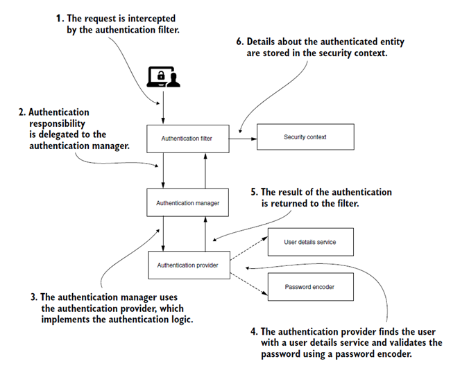

# Spring Security

Сигурността е съществен аспект от дизайна на софтуерното приложение. Той защитава софтуера от неоторизиран достъп и злоупотреба.

Има два основни термина, които трябва да се разбират, когато говорим за сигурност. Удостоверяването (_authentication_) се отнася до проверка на идентификационните данни на потребителя. Упълномощаването (_authorization_) се отнася до проверка на способността на потребителя да извършва определена дейност.

Spring Framework предоставя специален модул, наречен Spring Security, който се фокусира върху аспектите на сигурността на Spring приложенията. Spring Boot осигурява лесна интеграция със Spring Security с помощта на зависимостта spring-boot-starter-security. Някои от функциите за сигурност по подразбиране, предлагани от Spring Security в приложение за Spring Boot, са както следва:

·        Spring Security налага потребителите на приложението да бъдат удостоверени преди достъп до него.

·        Ако приложението няма страница за вход, Spring Security генерира страница за вход по подразбиране за потребителско влизане и позволява на потребителя да излезе от приложението.

·        Spring Security осигурява потребител по подразбиране с име user и генерира парола по подразбиране (отпечатана в регистрационния файл на конзолата) за базирано на форма влизане.

·        Spring Security предоставя няколко енкодера на пароли за кодиране на паролата и съхраняването й в хранилището.

·        Spring Security предотвратява атаки за фиксиране на сесия чрез промяна на ID на сесията след успешно удостоверяване на потребителя.

·        Spring Security осигурява защита по подразбиране от атаки за фалшифициране на заявки между сайтове (CSRF). Това става чрез включване на произволно генериран токен в HTTP отговора. Той очаква този токен да бъде наличен във всички последващи заявки, базирани на форма, които възнамеряват да извършат операция за промяна на състоянието в приложението. Злонамерен потребител няма да има достъп до токена и следователно не може да извършва CSRF атаки.

# Добавяне на Spring Security в Spring Boot приложение

За да започнете, е необходимо да добавите следната зависимост към вашето Spring Boot приложение:

```
	implementation "org.springframework.boot:spring-boot-starter-security"
```

Това е всичко, което трябва да направите, за да добавите базова защита към вашето приложение. Когато стартирате приложението, можете да видите следния запис:

Using generated security password: b5dd65a5-b0e7-49d0-8f2b-eaa55abf0487

Тази генерирана парола е само за разработка. Трябва да актуализирате своята конфигурация за сигурност, преди да стартирате приложението в производствена среда. Ако отворите приложението си на http://localhost:8080, браузърът ще отиде до страница за вход по подразбиране.

Нека въведем идентификационните данни за достъп до приложението. Потребителят по подразбиране е user, а паролата се генерира автоматично и можете да я намерите в логовете, както беше споменато. Можете да промените потребителските идентификационни данни по подразбиране в application.properties, както следва:

```
spring.security.user.name=admin
spring.security.user.password=secret
spring.security.user.roles=ADMIN
```

Това ,решение е подходящо за бърза демонстрация. Може да искате да внедрите по-сложна и зряла система за сигурност като функция за регистрация, при която потребителите могат да се регистрират преди достъп до приложението и достъп до ресурси, където потребителят има необходимите разрешения. Може също да искате да въведете роли като ADMIN, USER и други.

# Конфигуриране на филтри

Начинът, по който Spring действително работи с HttpSecurity, е чрез редица защитни филтри. Всъщност той създава верига за филтър за сигурност. Погледнете по-отблизо изхода в конзолата за отстраняване на грешки, когато стартирате приложението:

<figure><figcaption></figcaption></figure>

Както можете да видите, Spring взема настройките в нашата персонализирана конфигурация за сигурност и ги поставя в редица предварително дефинирани (по подразбиране) филтри за сигурност. Списъкът с тези филтри всъщност е подреден списък от филтри, който се управлява от Spring, и всички те образуват DefaultSecurityFilterChain.

Новият начин за сигурност, който се поддържа от Spring, е да използваме нашите персонализирани http филтри за сигурност (във веригата на филтъра за сигурност), вместо да ги конфигурираме чрез клас, който трябва да разшири WebSecurityConfigurerAdapter. По същество Spring ни позволява да конфигурираме нашия HttpSecurity с помощта на bean метод, който изгражда и връща нашата персонализирана реализация на интерфейса SecurityFilterChain.

```
@Bean
SecurityFilterChain defaultSecurityFilterChain(HttpSecurity http) throws Exception {
http.csrf().disable()
.authorizeHttpRequests()

.requestMatchers("/auth/**").permitAll()

.requestMatchers(HttpMethod.GET, "/api/somepath/**").permitAll()

.requestMatchers("/api/delete/**").hasAnyRole("ROLE_ADMIN")

.anyRequest().authenticated()

//Конфигурира вписването в приложението
.and().formLogin()
.and().httpBasic();

//Конфигурира изхода от приложението
http.logout(logout -> logout.logoutUrl("api/auth/logout")
.invalidateHttpSession(true));

//Задава политика за управление на сесията   
http.sessionManagement().sessionCreationPolicy(SessionCreationPolicy.IF_REQUIRED);

//и т.н.
return http.build();
}

```
# Удостоверяване със Spring Security

В изложението по-долу са представени някои от основните участници и понятия в архитектурата на Spring Security и взаимовръзките между тях.  

·       SecurityContextHolder - SecurityContextHolder е мястото, където Spring Security съхранява подробности за това кой е удостоверен.

·       SecurityContext - получава се от SecurityContextHolder и съдържа удостоверяването на текущо удостоверения потребител.

·       Authentication - Може да бъде вход към AuthenticationManager за предоставяне на идентификационните данни, предоставени от потребител за удостоверяване или текущия потребител от SecurityContext.

·       GrantedAuthority - правомощие, което се предоставя на принципала при удостоверяването (т.е. роли, обхвати и т.н.)

·       AuthenticationManager - API, който определя как филтрите на Spring Security извършват удостоверяване.

·       ProviderManager - най-често срещаната реализация на AuthenticationManager.

·       AuthenticationProvider - използва се от ProviderManager за извършване на определен тип удостоверяване.


<figure><figcaption></figcaption></figure>

## Authentication Manager

AuthenticationManager е основният  интерфейс за удостоверяване. Ако принципалът на входното удостоверяване е валиден и проверен, неговият метод authenticate() връща инстанция на Authentication с флаг за удостоверяване, зададен на true. В противен случай, ако принципалът не е валиден, той ще хвърли AuthenticationException. В краен случай връща нула, ако не може да реши.

ProviderManager е имплементацията по подразбиране на AuthenticationManager. Той делегира процеса на удостоверяване на списък от екземпляри на AuthenticationProvider.

Конфигуриране на имплементацията по подразбиране на AuthenticationManager.

```java
@Bean
public AuthenticationManager authenticationManager(
AuthenticationConfiguration configuration) throws Exception {
    return configuration.getAuthenticationManager();
}
```
Примерен метод за вписване на потребителя:

```java
public String login(HttpServletRequest req, LoginDto loginDto) {

        Authentication authentication = authenticationManager.authenticate(
                new UsernamePasswordAuthenticationToken(
                        loginDto.getUsername(), loginDto.getPassword()));

        SecurityContext sc = SecurityContextHolder.getContext();
        sc.setAuthentication(authentication);

        HttpSession session = req.getSession(true);
        session.setAttribute(SPRING_SECURITY_CONTEXT_KEY, sc);
        return "User logged-in successfully!";
    }
```
## AuthenticationProvider
Spring Security предоставя различни опции за извършване на удостоверяване. Тези опции следват проста логика: заявката за удостоверяване се обработва от AuthenticationProvider и се връща напълно удостоверен обект с пълни идентификационни данни. Стандартната и най-често срещана реализация е DaoAuthenticationProvider, която извлича потребителските данни от прост потребителски DAO само за четене - UserDetailsService. Тази услуга за потребителски подробности има достъп само до потребителското име, за да извлече пълния потребителски обект, което е достатъчно за повечето сценарии.

## UserDetailsService
UserDetailsService е основен интерфейс в Spring Security framework, който се използва за извличане на информация за удостоверяване и оторизация на потребителя. Този интерфейс има само един метод, наречен loadUserByUsername(), който можем да внедрим, за да подадем клиентската информация към API за защита на Spring. DaoAuthenticationProvider ще използва тази информация, за да зареди потребителската информация по време на процеса на удостоверяване.

Пример за имплементация на метода:

```java
// Some @Override
    public UserDetails loadUserByUsername(String username) throws UsernameNotFoundException {
        User user = userRepository.findByUsername(username)
                .orElseThrow(() -> new UsernameNotFoundException(
                        "User not found with username or email" + username ));

        Set<GrantedAuthority> authorities = user
                .getRoles()
                .stream()
                .map((role)->new SimpleGrantedAuthority(role.getName()))
                .collect(Collectors.toSet());
        return new org.springframework.security.core.userdetails.User(
                user.getUsername(), user.getPassword(), authorities);
    }
```

## PasswordEncoder
Интерфейсът PasswordEncoder дефинира метода encode() за преобразуване на обикновената парола в кодирана форма и метода matches() за сравняване на обикновена парола с кодираната парола. Всеки конкретен енкодер има конструктор по подразбиране, който създава екземпляр с работния фактор по подразбиране.

```java
@Bean
public static PasswordEncoder passwordEncoder() {
    return new BCryptPasswordEncoder();
}
```
