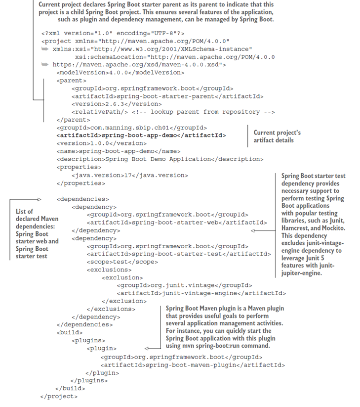

# Създаване на Spring boot проект

### Използване на Spring Initializr

Има много начини за създаване на Spring Boot приложение. Най-лесният начин е с помощта на Spring Initializr на https://start.spring.io/, онлайн генератор на приложения за Spring Boot.

<figure><figcaption></figcaption></figure>

1\.    Изберете Maven Project и версия на Spring Boot

2\.     Въведете подробностите за проекта Maven, както следва:

a.     Група: bg.tu-varna.sit

b.    Артефакт: tasks-manager

c.     Име на пакета: bg.tu\_varna.sit.tasks\_manager

d.    Пакет: JAR

e.    Версия на Java: 17

f.      Език: Java

3\.    Щракнете върху бутона Добавяне на зависимости. Можете да потърсите стартери, ако вече сте запознати с имената им. Ще видите много стартови модули, организирани в различни категории, като Core, Web и Data. Изберете Spring Web.

4\.    Щракнете върху бутона Генериране на проект. Разархивирайте изтегления ZIP файл и отворете проекта в предпочитаното от Вас IDE.

### Използване на Spring Tool Suite

Spring Tool Suite (STS: https://spring.io/tools) е разширение за широко използвани IDE като Eclipse и Visual Studio Code и съдържа множество свързани със Spring framework добавки. Можете лесно да създадете Spring Boot приложение с Eclipse варианта на STS като изберете File ➤ New ➤ Other ➤ Spring Boot ➤ Spring Starter Project ➤ Next. Ще достъпите съветника, който изглежда подобно на Spring Initializr.

Генерираната структура на Spring Boot проект е сравнително опростена и се състои само от компонентите, от които се нуждаете, за да продължите с разработването на приложението Spring Boot. Съдържа следните компоненти:

* Файл pom.xml, който съдържа зависимостите, които сте избрали по време на генерирането на проекта.
* Wrapper файл на Maven, който ви позволява да изградите проекта, без да инсталирате Maven на вашата локална машина.
* Пакетна структура, която съдържа изходните и тестови Java файлове. Изходният пакет съдържа Java клас с main метод, а тестовият пакет има празен тестов клас.
* Папка с ресурси за поддържане на допълнителни артефакти на проекта и празен файл application.properties.

Нека обсъдим подробно ключовите компоненти на генерирания проект.

### Файлът pom.xml

Файлът pom.xml на генерирания проект е показан по-долу.

<figure><figcaption></figcaption></figure>

Ще обърнем внимание на три сегмента от pom.xml:

* Spring-boot-starter-parent
* Разделът на зависимостите
* Maven плъгина Spring Boo

### Spring-boot-starter-parent

Spring-boot-starter-parent е родителската зависимост за всички зависимости на Spring Boot starter.  Той предоставя някои конфигурации по подразбиране, като например версията на Java по подразбиране, както и някои дефолтни конфигурации на Maven плъгина spring-boot-maven-plugin, който се използва за изграждане на дебели JAR файлове.  Включва и най-често използваните плъгини като maven-jar-plugin, maven-surefire-plugin, maven-war-plugin, exec-maven-plugin и maven-resources-plugin със зададени настройки по подразбиране.

Spring-boot-starter-parent има своята роля и при управлението на зависимостите. Забележете, че няма посочена версия на зависимост за никоя от декларираните зависимости. Подходящата версия на тези библиотеки е посочена в spring-boot-starter-parent. Трябва само веднъж да посочите версията на Spring Boot в родителскта зависимост и след това не е необходимо да посочвате версията за всички стартови зависимости и други поддържащи библиотеки.

### Spring Boot starter dependency

Spring Boot starter dependency има за цел да направи разработката на приложението Spring Boot лесна, бърза и ефективна. Ако имате предишен опит в разработването на Java приложения с инструмент за изграждане като Apache Maven или Gradle, можете да си припомните, че управлението на зависимости е едно от ключовите предизвикателства за разработчика на приложения. Първото предизвикателство е да идентифицирате библиотеките (зависимостите), от които се нуждаете, за да разработите специфичен компонент на вашето приложение. След като ги идентифицирате, трябва да намерите правилните версии на библиотеките. Дори и да намерите правилните библиотеки и версии, в този забързан свят на разработка на приложения е относително лесно да излезете от синхронизиране с версиите. За да увеличите допълнително проблемите си, избраните от вас зависимости имат свои собствени зависимости или по-точно транзитивни зависимости.

Стартовата зависимост от Spring Boot е решение в Spring Boot, което ви освобождава от всички гореспоменати проблеми. Началната зависимост групира заедно набор от зависимости, които може да са ви необходими, за да разработите част от вашето приложение. Ако изберете да разработите уеб приложение с Spring Boot, най-вероятно ще изберете зависимостта spring-boot-starter-web. Тя гарантира, че всички необходими зависимости за разработване на уеб приложение са налични. Разбира се, вие получавате набора от зависимости, които екипът на Spring препоръчва да имате, за да разработите уеб приложение. Въпреки това, ключовата част тук е, че сте освободени от версиите на зависимостите, надстройките и много други проблеми. Стартерна зависимост може също да зависи от друга стартова зависимост. Например, spring-boot-starter-web се нуждае от няколко общи стартови зависимости:

* spring-boot-starter
* spring-boot-starter-json
* spring-boot-starter-tomcat
* spring-web
* spring-webmvc

Те от своя страна изтеглят друг набор от зависимости, свързани съответно със Spring Boot, Tomcat и JSON. 

Spring Boot ви позволява да създавате собствени стартери, които можете да използвате във вашето приложение. Това е полезно за големи приложения за модулиране и управление на зависимости по отношение на персонализирани стартови устройства. 

В генерирания проект сме включили две начални зависимости: spring-boot-starter-web и spring-boot-starter-test. Зависимостта на уеб стартера включва необходимите JAR файлове за изграждане на уеб приложение, докато тестовата зависимост ви позволява да пишете тестовe за вашето приложение.

### Spring-boot-maven-plugin

В последния раздел на pom.xml можете да намерите spring-boot-maven-plugin. Този плъгин е предоставен за удобство на разработчиците, за да опрости няколко дейности по управление на приложения. Ще забележите, че е доста лесно да се създаде изпълним JAR или WAR файл на Spring Boot приложение. Това е така, защото repackage goal на spring-boot-maven-plugin гарантира, че той взема генерирания от Maven оригинален JAR или WAR файл (който не е изпълним) и го препакетира, за да го направи изпълним. 

<figure><figcaption></figcaption></figure>

# Main клас в Spring Boot

В генерирания проект можете да откриете, че Spring Initializr е генерирал Java клас с Java main() метод в него.

```java
package com.manning.sbip.ch01;
import org.springframework.boot.SpringApplication;
import org.springframework.boot.autoconfigure.SpringBootApplication;

@SpringBootApplication
public class SpringBootAppDemoApplication {
      public static void main(String[] args) {
             SpringApplication.run(SpringBootAppDemoApplication.class, args);
      }
}
```

Нека разгледаме следните компоненти на генерирания Java файл:

1\.    Метода main().

2\.    Употребата на анотацията @SpringBootApplication

3\.    Ролята на класа SpringApplication

### Методът main()

За да стартирате уеб приложение, вие изграждате и пакетирате компонентите на приложението в WAR или EAR архивен файл и го използвате в мрежата (напр. в Apache Tomcat) или на application сървър (напр. Red Hat JBoss). Spring Boot опростява този процес до известна степен. Не ви принуждава да създавате WAR или EAR файл за вашето приложение. Вместо това ви позволява да стартирате приложението Spring Boot като обикновено Java приложение, използвайки конвенционален main() метод.

Въпреки че Spring Boot следва познатия подход “Keep it simple”, за да направи нещата прости за разработчиците, изпълнява голямо количество тежка работа зад кулисите. Например базирано на сървлет уеб приложение може да работи само в контейнер като Apache Tomcat или Jetty. Spring Boot позволява тази поддръжка чрез използването на вграден Apache Tomcat сървър в приложението по подразбиране. По този начин при стартиране на приложението, използвайки метода main(), Spring Boot стартира вградена инстанция на Apache Tomcat сървър и изпълнява уеб приложението вътре в него. Ако проучите допълнително зависимостта spring-boot-starter-web, можете да откриете транзитивна зависимост към модула spring-boot-starter-tomcat.

### Анотацията @SpringBootApplication

Може да забележите, че класът в генерирания Java файл е анотиран с @SpringBootApplication анотация. Това е удобна анотация, която съдържа в себе си три анотации: @EnableAutoConfiguration, @ComponentScan и @SpringBootConfiguration, всяка от които изпълнява специфична задача в приложението:

* **@EnableAutoConfiguration** – осигурява необходимата поддръжка за автоматично конфигуриране на приложението въз основа на наличните JAR зависимости в неговия classpath.
* **@ComponentScan** - осигурява поддръжка за сканиране на пакетите за Spring компоненти. Компонент в Spring е Java bean, който се управлява от Spring и е антотиран с @Component, @Bean или друга специализирана анотация за компонент.  При наличието на анотация @ComponentScan, Spring Boot приложението сканира за идентифицирането на всички компоненти, присъстващи в основния пакет и подпакети под него, за да управлява впоследствие техния жизнен цикъл.
* **@SpringBootConfiguration** - показва, че този клас е Spring конфигурационен клас. Той е мета-анотиран със Spring @Configuration анотация, така че конфигурациите в анотирания клас могат да бъдат намерени автоматично от Spring Boot. 

Имайте предвид, че основният клас на Spring Boot приложението трябва да се намира в root пакета, тъй като анотацията @SpringBootApplication е конфигурирана в този клас. @SpringBootApplication анотацията използва основния пакет като базов пакет. Така базовият пакет и всички други подпакети се сканират автоматично от Spring Boot за зареждане на Spring компоненти (напр. класове, конфигурирани с @Component, @Configuration и други Spring анотации) и други типове. 

### Класът SpringApplication

Следващият и последен компонент е използването на SpringApplication в генерирания Java файл. Този клас се предоставя от Spring Boot за удобно зареждане на Spring Boot приложение. През повечето време ще използвате статичния метод run() на SpringApplication, за да стартирате вашето приложение. Spring Boot изпълнява няколко дейности, докато изпълнява метода run():

1\.    Създава екземпляр на ApplicationContext въз основа на библиотеките, присъстващи в classpath

2\.    Регистрира CommandLinePropertySource, за да изложи аргументите на командния ред като свойства на Spring

3\.    Опреснява ApplicationContext, създаден в стъпка 1, за да зареди всички сингълтон beans

4\.    Задейства ApplicationRunners и CommandRunners, конфигурирани в приложението

#### ApplicationContext

Повечето Java приложения, които разработвате, се състоят от обекти. Тези обекти взаимодействат помежду си и между тях съществуват зависимости. За да управлява ефективно създаването на обекти и взаимозависимостите, Spring използва принципа за инжектиране на зависимости (DI). Това инжектиране на зависимости или подход за инверсия на управлението (IoC) позволява на Spring да създава обектите (или beans на езика на Spring) и да инжектира зависимостите външно. Дефинициите на bean се представят на Spring или чрез файловете с дефиниции на XML bean (напр. applicationContext.xml), или чрез базираните на анотации конфигурации (@Configuration анотация). Spring зарежда bean дефинициите и ги поддържа налични в Spring IoC контейнера. Интерфейсът ApplicationContext действа като Spring IoC контейнер. Spring предоставя изобилие от имплементации на ApplicationContext въз основа на типа на приложението (Servlet или Reactive приложение), конфигурациите на дефинициите на beans (напр. за зареждане от classpath или анотация) и т.н. 

Класът SpringApplication се опитва да създаде екземпляр на ApplicationContext въз основа на JAR зависимостите, присъстващи в classpath. Уеб приложението Spring Boot може да бъде базирано на сървлет или реактивен тип. Използвайки техниките за зареждане на класове на Spring и въз основа на наличността на класовете в classpath, Spring извежда типа на текущото приложение. След като типът на приложението е известен, Spring Boot прилага стратегията по-долу, за да зареди контекста на приложението:

* Ако приложението е идентифицирано като уеб приложение, базирано на Servlet, Spring Boot се опитва да създаде екземпляр на клас AnnotationConfigServletWebServerApplicationContext.
* Ако приложението е от реактивен тип, Spring Boot създава екземпляр на класа AnnotationConfigReactiveWebServerApplicationContext.
* Ако приложението не е нито базирано на Servlet, нито реактивно, Spring Boot се опитва да създаде екземпляр на клас AnnotationConfigApplicationContext.

Spring Boot приложението се стартира като използвате статичния метод run() на класа SpringApplication. Въпреки че използването на статичния метод run() е полезно, Spring Boot допълнително ви позволява да създадете екземпляр на клас SpringApplication, за да персонализирате режима за стартиране на приложението. Например, ако знаете типа на приложението, можете директно да го зададете в екземпляра SpringApplication, както е показано по-долу.

<figure><figcaption></figcaption></figure>

SpringApplication също така предоставя няколко метода за настройка, така че можете да контролирате различни функции на Spring Boot, като например задаване на допълнителни Spring профили или задаване на средство за зареждане на ресурси.

# Управление на конфигурацията с application.properties

Spring Initializr генерира празен файл application.properties в папката src/main/resources. Този файл със свойства ви позволява да зададете различни конфигурации на приложението (напр. подробности за сървъра или подробности за базата данни). Въпреки че има множество начини за задаване на properties на Spring Boot приложение, това е най-често използваният подход. Този файл със свойства ви позволява да укажете конфигурациите във формат на двойка ключ-стойност, където ключът е отделен от свързаната стойност със знак =. Следващата фигура показва примерна конфигурация в application.properties файл за конфигуриране на адреса на сървъра и порта на Spring Boot приложение.

<figure><figcaption></figcaption></figure>

За да видите файла application.properties на практика, можете да промените стойността на server.port в текущото приложение до различна стойност на HTTP порт (напр. до 9090). Ако стартирате приложението след тази модификация, можете да видите, че стартира на актуализирания HTTP порт.

Ако не харесвате този файлов формат, можете алтернативно да използвате файловия формат YAML (https://yaml.org/spec/1.2.2/), за да конфигурирате свойствата на приложението. YAML ви позволява да дефинирате йерархично свойствата. Ако искате да използвате файловия формат YAML, можете да преименувате съществуващия файл application.properties на application.yml и да зададете свойствата във YAML формат. 

.png>)

Можете да откриете  списък на поддържаните свойства от application.properties  на уебсайта на Spring Boot ([https://docs.spring.io/spring-boot/docs/current/reference/html/application-properties.html](https://docs.spring.io/spring-boot/docs/current/reference/html/application-properties.html)).
