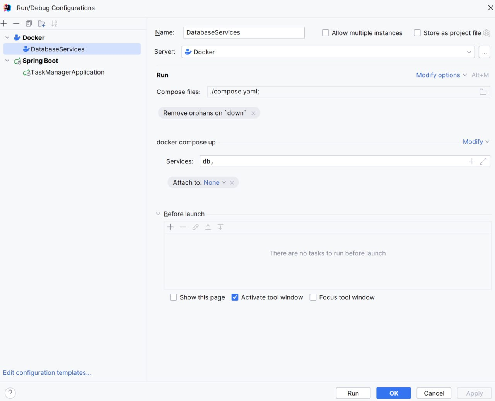
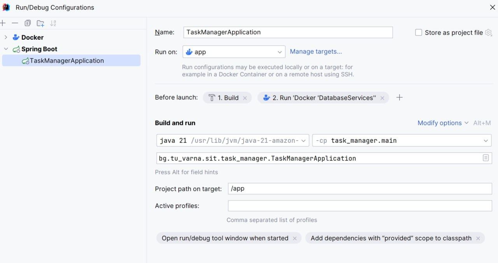
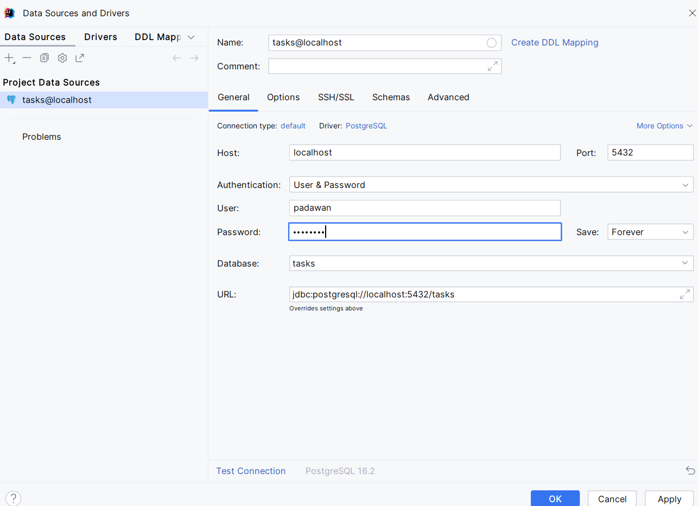

# Конфигуриране на Docker контейнери

1. Коригирайте compose.yml, като включите конфигурационните данни на контейнер, който ще осигури нужната среда за базата от данни на приложението:

```
version: "3.8"
networks:
  jedi:

services:
  app:
    container_name: padawan-6156-app
    platform: linux/x86_64
    build:
      context: .
      dockerfile: Dockerfile
    ports:
      - "6280:8080"
    networks:
      - jedi

  db:
    container_name: padawan-6156-db
    image: postgres:latest
    ports:
      - 5432:5432
    environment:
      POSTGRES_PASSWORD: R2D2c3p0
      POSTGRES_USER: padawan
      POSTGRES_DB: tasks
    networks:
      - jedi

```

2. Актуализирайте конфигурацията за стартиране на приложението в контейнерна среда, както следва: 
- добавете контейнер за нуждите на Postgres

<figure><figcaption></figcaption></figure>

- задайте добавеният контейнер да се стартира преди стартиране на контейнера с приложението

<figure><figcaption></figcaption></figure>

# Добавяне на библиотеки и конфигурации на проекта

За да активирате JPA в Spring Boot приложението, се нуждаем от зависимостта _spring-boot-starter-data-jpa_. Необходимо е да се добави и зависимост към JDBC драйвер, специфичен за базата данни, в нашия случай драйвера на PostgreSQL. Spring boot конфигурира Hibernate като JPA провайдер по подрабиране.

```
implementation 'org.springframework.boot:spring-boot-starter-data-jpa'
runtimeOnly 'org.postgresql:postgresql'
```

2. В application.properties добавете следните конфигурации:

```
spring.datasource.url=jdbc:postgresql://localhost:5432/tasks
spring.datasource.username=padawan
spring.datasource.password=R2D2c3p0
spring.jpa.properties.hibernate.dialect=org.hibernate.dialect.PostgreSQLDialect

# Hibernate ddl auto (create, create-drop, validate, update)
spring.jpa.hibernate.ddl-auto=update
```

Със свойството spring.jpa.hibernate.ddl-auto можете да зададете как Hibernate да реализира автоматичното генериране на схема. Възможни опции:

·       validate – извършва се проверка дали вече съществуващата схема съответства на предвидените entity.  Това е полезна опция, ако базата данни се управлява външно, но все пак искате да сте сигурни, че схемата отговаря на вашите очаквания.

·       create – създава схeма, като ако са налице предходно съществуващи данни, те се унищожават.

·       create-drop – изтрива схемата в края на сесията. Подходящо за провеждане на тестове.

·       update - Hibernate автоматично генерира схемата според предоставените Java entity. Работи на принципа на добавяне на нови изменения. Не се препоръчва да се използва при вече работещи приложения.

3\.      Добавете Data Source в Database

Data Source e местоположението на данните на вашето приложение. 

<figure><figcaption></figcaption></figure>

