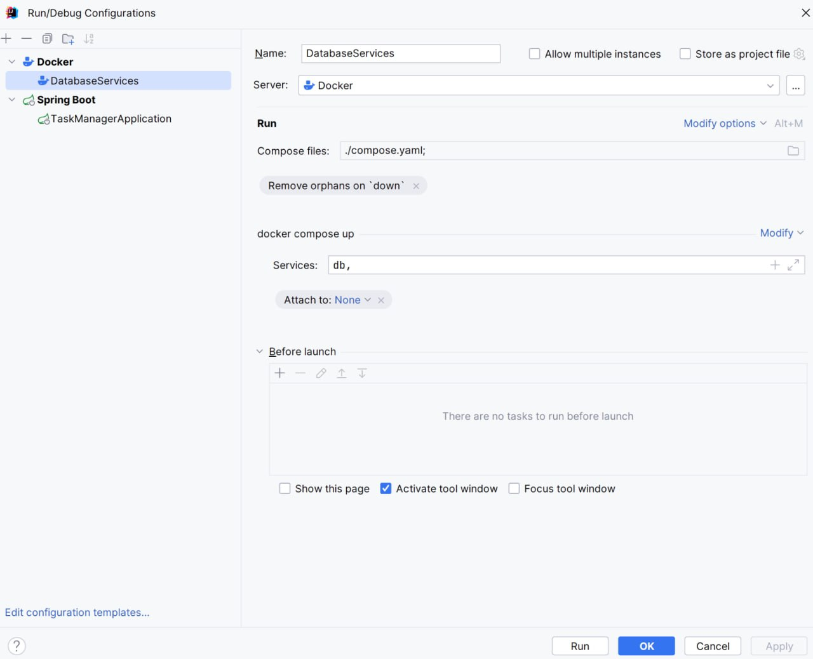
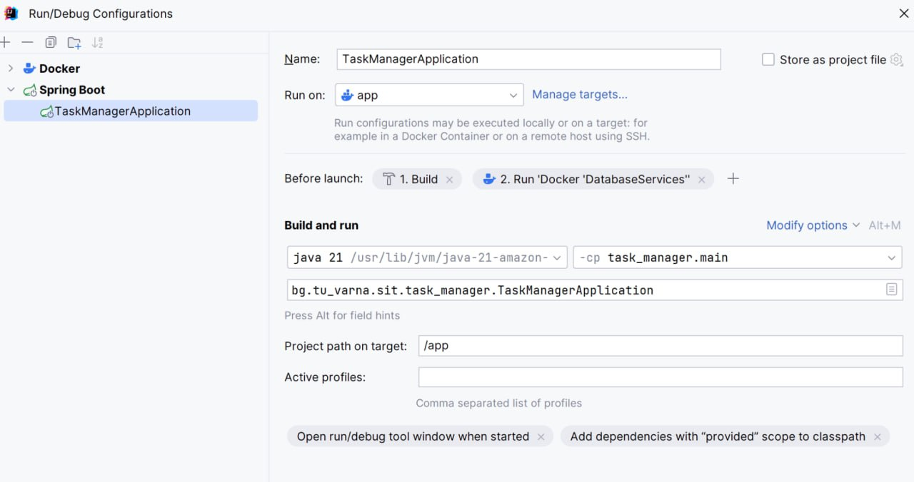
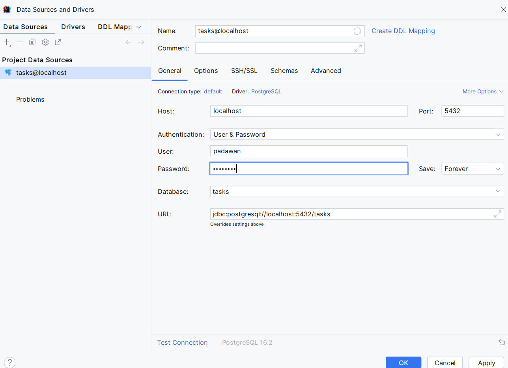

# Configuring Docker containers

1. Edit compose.yml by including the configuration data for a container that will provide the necessary environment for the application database:

```yaml
networks:
  jedi:

services:
  app:
    container_name: padawan-6156-app
    build:
      context: .
      dockerfile: Dockerfile
    ports:
      - "6280:8080"
    networks:
      - jedi

  db:
    container_name: padawan-6156-db
    image: postgres:latest
    ports:
      - "5432:5432"
    environment:
      POSTGRES_PASSWORD: R2D2c3p0
      POSTGRES_USER: padawan
      POSTGRES_DB: tasks
    networks:
      - jedi

```

2. Update the configuration to run the application in a container environment as follows:
   
- add a container for Postgres needs

<figure><figcaption></figcaption></figure>

- set the added container to start before starting the container with the application
  
<figure><figcaption></figcaption></figure>

# Adding libraries and project configurations

To enable JPA in a Spring Boot application, we need the _spring-boot-starter-data-jpa_ dependency. We also need to add a dependency on the database-specific JDBC driver, in our case the PostgreSQL driver. Spring boot configures Hibernate as the JPA provider by default.

```xml
        <dependency>
            <groupId>org.springframework.data</groupId>
            <artifactId>spring-data-jpa</artifactId>
        </dependency>
        <dependency>
            <groupId>org.postgresql</groupId>
            <artifactId>postgresql</artifactId>
            <version>42.7.5</version>
        </dependency>
        <dependency>
            <groupId>org.springframework.boot</groupId>
            <artifactId>spring-boot-starter-data-jpa</artifactId>
        </dependency>
```

2. In application.properties add the following configurations:

```properties
spring.datasource.url=jdbc:postgresql://db:5432/tasks
spring.datasource.username=padawan
spring.datasource.password=R2D2c3p0
spring.jpa.properties.hibernate.dialect=org.hibernate.dialect.PostgreSQLDialect

# Hibernate ddl auto (create, create-drop, validate, update)
spring.jpa.hibernate.ddl-auto=update
```

With the spring.jpa.hibernate.ddl-auto property you can specify how Hibernate should implement automatic schema generation. Possible options:

· validate – checks whether the existing schema matches the intended entities. This is a useful option if the database is managed externally, but you still want to make sure that the schema meets your expectations.

· create – creates a schema, and if there is any previously existing data, it is destroyed.

· create-drop – deletes the schema at the end of the session. Suitable for testing.

· update - Hibernate automatically generates the schema according to the provided Java entities. It works on the principle of adding new changes. It is not recommended to use it for already running applications.

3\.      Add Data Source to Database

Data Source is the location of your application's data. 

<figure><figcaption></figcaption></figure>

