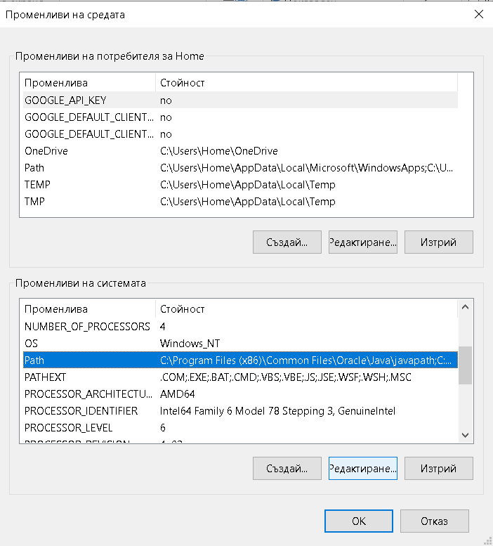
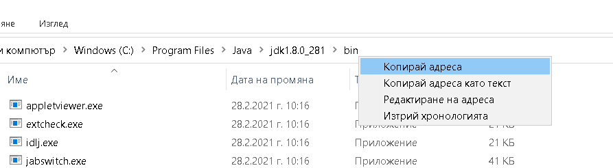
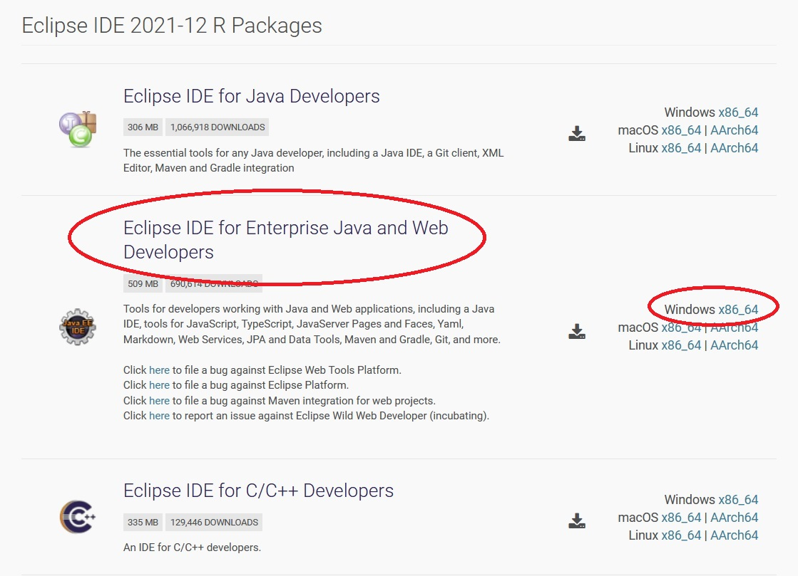

# Инсталиране и настройка на необходимата среда за работа в упражненията

1.  **Инсталиране на JDK** (Java Development Kit), ако до този момент не e наличен на компютъра. В упражненията е предвидено да се работи с **Java 8**. Дали на компютъра вече има инсталирана Java и коя версия е тя може най-лесно да се провери в Command prompt (cmd в инструмента за търсене на Windows -> java -version).

    1.1. Изтегляне на JDK от сайта на Oracle, като се избира версията за операционната система на съответния компютър

[https://www.oracle.com/java/technologies/downloads/](https://www.oracle.com/java/technologies/downloads/)

Ако сайтът изиска потребителско име и парола, могат да се ползват следните данни за вход:

[donikas@gmail.com](mailto:donikas@gmail.com)

MyJava12345

1.2. Инсталиране – следват се инструкциите на инсталатора

1.3. Настройване на променливите на средата

Променливи на средата могат да бъдат зададени конзолно или като се следва следния път в графичния интерфейс на Windows:

Този компютър /десен бутон/ -> Свойства -> Допълнителни системни настройки -> Променливи на средата

.png>) 

Променливата Path се редактира и към нея се добавя пътят до папка bin в инсталационната папка на JDK

.png>)

Добавя се нова системна променлива JAVA\_HOME, указваща пътя до инсталационната папка на JDK

.png>)

Пътят до съответните папки може лесно да бъде копиран в Windows Explorer (десен бутон върху пътя на съответната папка)

За проверка дали Java е инсталирана успешно, рестартирайте Command prompt и впишете в командния ред командата javac. Ако Java работи коректно, конзолата ще изведе списък с опции. В противен случай командата няма да бъде разпозната.

**2. Инсталация на Eclipse**

За създаване на JavaServer Pages и Servlet е необходимо да бъде използван Eclipse IDE for **Enterprise** Java Developers. Той може да бъде инсталиран посредством предвидения от разработчика инсталатор или изтеглен като portable version:&#x20;

[http://www.eclipse.org/downloads/packages/](http://www.eclipse.org/downloads/packages/)

Във втория вариант пакетът се записва на твърдия диск на компютъра, разархивира се и се ползва директно, като се стартира eclipse.exe.

**3. Инсталация на Tomcat server**

[https://tomcat.apache.org/download-10.cgi](https://tomcat.apache.org/download-10.cgi)

Сървърът се изтегля и разархивира в устройство С. За функционирането му е необходимо да се настрои още една променлива на средата - CATALINA\_HOME. В нея се записва пътя до папката, съдържаща файловете на сървъра.
