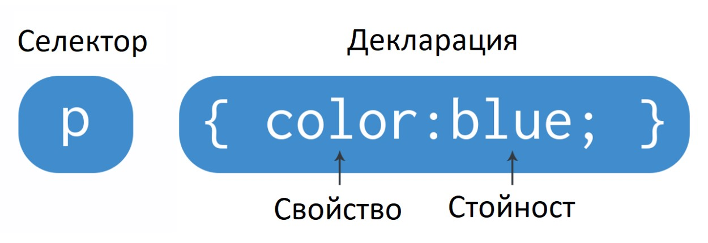

# Cascading Style Sheets (CSS)

CSS е опростен език, с помощта на който може да се опише начинът, по който да се визуализират HTML елементите от дадена уеб страница.

### Включване на CSS

CSS може да се добави към дадена страница по три начина:

* Външен CSS. Включва се външен CSS файл, в който са описани съответните стилове:

```
<head>
	...
	<link rel="stylesheet" type="text/css" href="css/styles.css">
</head>
```

* Вътрешен CSS. Помества се в таг \<style>\</style> в секция \<head> на документа 

```
<head>
	...
  <style type="text/css">
    body {
      background-color: #ccc;
    }
  </style>
</head>
```

* Инлайн CSS. Задава стилизиране на HTML елемента, в който е разписан, с помощта на атрибута style.

```
<p style="text-align: justify; color: darkblue;">Денят на народните будители 
е официален български празник, който се чества всяка година на 1 ноември</p>
```

### Синтаксис


