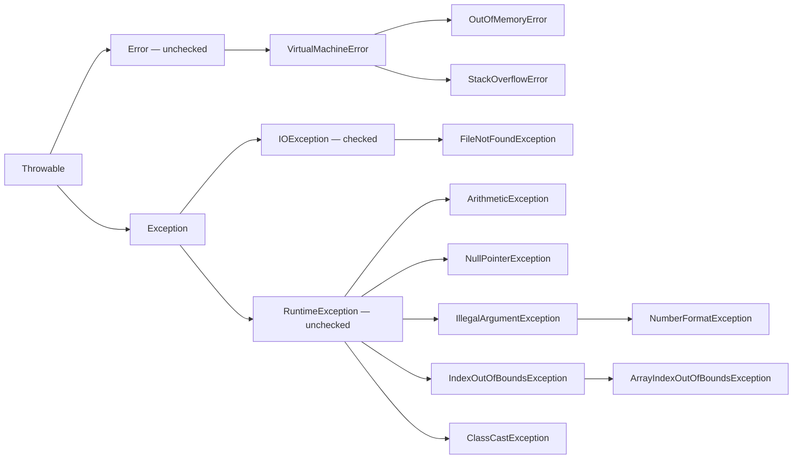

# Обработка на изключения


Изключение е обект, който описва необичайна ситуация по време на изпълнение на програма. При хвърляне на изключение нормалният поток на текущия блок се прекъсва и се търси подходящ обработчик. Ако никой извикващ метод не го обработи, засегнатата нишка приключва; в обикновена програма с една нишка това прекратява програмата.

```java
int result = 10 / 0;
```

В този пример възниква `ArithmeticException`, защото деление на нула не може да бъде извършено за цели числа.

## `try` и `catch`

Блокът `try` съдържа код, при който може да възникне изключение. Блокът `catch` съдържа код за обработка на конкретен тип изключение.

```java
try {
    int result = 10 / 0;
    System.out.println(result);
} catch (ArithmeticException exception) {
    System.out.println("Division by zero is not allowed.");
}
```

Ако в `try` възникне `ArithmeticException`, изпълнението преминава към `catch`. Програмата не прекъсва аварийно, а изпълнява предвидената обработка.

## Йерархия на изключенията

Всички изключения и грешки в Java наследяват класа `Throwable`. Двата основни наследника са `Error` и `Exception`.

`Error` описва сериозни проблеми на средата за изпълнение. Такива проблеми обикновено не се обработват в приложния код.

`Exception` описва ситуации, които могат да бъдат предвидени и обработени от програмата.

Дървото показва част от йерархията. Стрелките водят **от родител към пряк наследник**.



Клонът на `RuntimeException` и клонът на `Error` са непроверявани. `Exception` и неговите наследници извън клона `RuntimeException` са проверявани. Разделянето е описано в [Java Language Specification, §11.1.1](https://docs.oracle.com/javase/specs/jls/se21/html/jls-11.html#jls-11.1.1).

## Изключения и грешки

Думата „грешка“ в ежедневен смисъл е по-широка от Java класа `Error`.

| Ситуация | Как се проявява | Подход |
| --- | --- | --- |
| Грешка при компилация | Липсващ `;`, несъвместим тип | Поправка на изходния код; `catch` не я обработва |
| Логическа грешка | Грешна формула, но програмата продължава | Проверки с известни резултати и debugger |
| `Exception` | Например невалидно число или недостъпен файл | Обработка там, където може да се предприеме смислено действие |
| `Error` | Например изчерпана памет или стек | Обикновено отстраняване на причината; не е нормален начин за управление на програмата |

`catch (Exception exception)` не прихваща `Error`, защото двата класа са различни наследници на `Throwable`. Не използвайте общ `catch (Throwable ...)`, за да скриете всички проблеми. Хващайте конкретни типове, за които можете да дадете полезно съобщение, да повторите операция или да възстановите състоянието.

## Клас `Throwable`

`Throwable` е базовият клас за всички обекти, които могат да бъдат хвърляни и обработвани като проблеми по време на изпълнение. От него наследяват както `Exception`, така и `Error`.

Обект от тип изключение съдържа информация за възникналия проблем. Част от тази информация може да се достъпи чрез наследени методи.

| Метод | Предназначение |
| ----- | -------------- |
| `getMessage()` | Връща текстовото описание на изключението |
| `printStackTrace()` | Отпечатва информация за изключението и стека на извикванията |
| `getStackTrace()` | Връща стека на извикванията като масив от `StackTraceElement` |

```java
try {
    int number = Integer.parseInt("abc");
} catch (NumberFormatException exception) {
    System.out.println(exception.getMessage());
}
```

Методът `getMessage()` връща съобщението, свързано с конкретното изключение. Стекът на извикванията показва през кои методи е преминало изпълнението преди възникване на проблема.

## Проверявани (Checked) и непроверявани (unchecked) изключения

Проверяваните изключения (Checked) се проверяват от компилатора. Ако метод може да предизвика проверявано изключение,
компилаторът изисква това изключение да бъде обработено с `try-catch` или да бъде декларирано чрез `throws` в
сигнатурата на метода.

Непроверяваните типове (unchecked) включват `RuntimeException`, `Error` и наследниците им. Компилаторът не изисква задължителна обработка или деклариране. „Проверявано“ не означава, че проблемът възниква при компилация: тогава се проверява задължението за обработка, а самото изключение възниква по време на изпълнение.

## Изключения при масиви и преобразуване на тип

При индекс извън границите на масив възниква `ArrayIndexOutOfBoundsException`:

```java
int[] numbers = {10, 20};
// System.out.println(numbers[2]); // валидните индекси са 0 и 1
```

При несъвместимо явно преобразуване на референция възниква `ClassCastException`:

```java
Object value = "Java";
// Integer number = (Integer) value; // обектът е String, а не Integer
```

Това са имената на проблемите, които срещнахме при масивите и полиморфизма. Правилните граници и съвместимите типове предотвратяват причините; `try-catch` не поправя автоматично погрешния алгоритъм.

## `NullPointerException`

`NullPointerException` е unchecked изключение. То възниква, когато чрез референция със стойност `null` се направи опит
за достъп до поле или метод.

```java
String text = null;
System.out.println(text.length());
```

Променливата `text` не сочи към реален обект. Затова извикването на `length()` води до `NullPointerException`.

Това изключение показва, че преди използване на референцията трябва да бъде гарантирано, че тя сочи към обект.

```java
if (text != null) {
    System.out.println(text.length());
}
```

## `NumberFormatException`

`NumberFormatException` е unchecked изключение. То възниква, когато текст не може да бъде преобразуван до число.

```java
String value = "abc";
int number = Integer.parseInt(value);
```

Методът `Integer.parseInt(value)` очаква текст, който съдържа валидно цяло число. Текстът `"abc"` не може да бъде
преобразуван до `int`, затова възниква `NumberFormatException`.

```java
try {
    int number = Integer.parseInt(value);
    System.out.println(number);
} catch (NumberFormatException exception) {
    System.out.println("Invalid number.");
}
```

Този тип изключение се среща често при работа с входни данни, защото въведената стойност първоначално е текст.

## Няколко `catch` блока

Един `try` блок може да бъде последван от няколко `catch` блока. Всеки `catch` блок обработва различен тип изключение.

```java
try {
    int[] numbers = {1, 2, 3};
    int index = Integer.parseInt("5");
    System.out.println(numbers[index]);
} catch (NumberFormatException exception) {
    System.out.println("Invalid number.");
} catch (ArrayIndexOutOfBoundsException exception) {
    System.out.println("Invalid index.");
}
```

Ако текстът не може да бъде преобразуван до число, се изпълнява първият `catch` блок. Ако индексът е извън границите на масива, се изпълнява вторият `catch` блок.

Редът на `catch` блоковете има значение. По-специфичните типове трябва да бъдат поставени преди по-общите типове.

## Multi-catch

Когато няколко типа изключения трябва да бъдат обработени по един и същ начин, може да се използва `multi-catch`. Типовете се разделят със символа `|`.

```java
try {
    int[] numbers = {1, 2, 3};
    int index = Integer.parseInt("5");
    System.out.println(numbers[index]);
} catch (NumberFormatException | ArrayIndexOutOfBoundsException exception) {
    System.out.println("Invalid input.");
}
```

В този пример двата типа изключения водят до една и съща обработка. Променливата `exception` съдържа конкретния обект на възникналото изключение.

## `finally`

Блокът `finally` задължително се изпълнява **при напускане на `try` или избрания `catch`**, независимо дали е възникнало изключение. Това включва нормален край, обработено или необработено изключение, `return`, `break` и `continue`.

```java
try {
    System.out.println("Open resource");
} catch (RuntimeException exception) {
    System.out.println("Handle error");
} finally {
    System.out.println("Close resource");
}
```

`finally` се използва за освобождаване на ресурси, когато това не се управлява автоматично.

```java
static int calculate() {
    try {
        return 42;
    } finally {
        System.out.println("Finally before return");
    }
}
```

При `System.out.println(calculate())` първо се отпечатва съобщението от `finally`, а после `42`.

Гаранцията предполага, че JVM продължава изпълнението. При прекратяване на JVM, например чрез `System.exit(...)`, или принудително спиране на процеса, `finally` може да не се изпълни. Ако `try` никога не приключва, например при безкраен цикъл, до `finally` още не се достига. Това уточнение е част от [официалното описание на finally](https://docs.oracle.com/javase/tutorial/essential/exceptions/finally.html).

Не поставяйте `return` или ново `throw` във `finally`: те могат да заменят първоначалния резултат или да скрият първоначалното изключение. За ресурси с `AutoCloseable` предпочитайте `try-with-resources`.

## `throw`

Ключовата дума `throw` се използва за явно сигнализиране на възникнало изключение чрез хвърляне на конкретен обект от тип изключение.

```java
public void setAge(int age) {
    if (age < 0) {
        throw new IllegalArgumentException("Age cannot be negative.");
    }
}
```

Методът не допуска невалидно състояние. При отрицателна стойност се хвърля `IllegalArgumentException`.

`throw` прекъсва нормалното изпълнение на текущия блок. След хвърлянето на изключението изпълнението се прехвърля към
подходящ `catch` блок. Ако такъв блок не съществува, изключението се предава към извикващия код.

## `throw` в конструктор

Конструкторът може да проверява дали подадените стойности са валидни. Ако стойностите не позволяват създаване на
коректен обект, може да се хвърли изключение.

```java
class Product {

    String name;
    double price;

    Product(String name, double price) {
        if (price < 0) {
            throw new IllegalArgumentException("Price cannot be negative.");
        }

        this.name = name;
        this.price = price;
    }
}
```

В примера не се допуска създаване на продукт с отрицателна цена. Обектът се създава само ако началното му състояние е
коректно.

## `throw` в `record`

В `record` може да се дефинира компактен конструктор. Той се използва, когато подадените стойности трябва да бъдат
проверени преди създаване на обекта.

```java
record Product(String name, double price) {

    Product {
        if (price < 0) {
            throw new IllegalArgumentException("Price cannot be negative.");
        }
    }
}
```

В компактния конструктор не се присвояват ръчно стойности към полетата. След изпълнение на проверките компилаторът
автоматично записва параметрите в съответните компоненти. Ако бъде хвърлено изключение, обект от този `record` не се
създава.

## `throws`

Ключовата дума `throws` се използва в декларация на метод и показва, че методът може да предаде изключение към извикващия код.

```java
public static String readFirstLine(String path) throws IOException {
    return Files.readAllLines(Path.of(path)).get(0);
}
```

Кодът, който извиква този метод, трябва да обработи или също да декларира `IOException`.

## Разлика между `throw` и `throws`

`throw` и `throws` имат различно предназначение, въпреки че и двете ключови думи са свързани с изключения.

| Ключова дума | Място на използване | Предназначение |
| ------------ | ------------------- | -------------- |
| `throw` | в тяло на метод, конструктор или блок | Хвърля конкретен обект от тип изключение |
| `throws` | в декларация на метод или конструктор | Обявява, че изключение може да бъде предадено към извикващия код |

```java
public static void validateAge(int age) {
    if (age < 0) {
        throw new IllegalArgumentException("Age cannot be negative.");
    }
}
```

В примера `new` създава обекта на изключението, а `throw` го хвърля. `throw` може да хвърли и вече съществуващ обект.

```java
public static String readText(String path) throws IOException {
    return Files.readString(Path.of(path));
}
```

В този пример `throws IOException` не хвърля изключение само по себе си. То показва, че методът може да предаде `IOException` към кода, който го извиква.

## Собствено изключение

Собствено изключение се дефинира чрез клас, който наследява `Exception` или `RuntimeException`.

```java
class InvalidGradeException extends RuntimeException {

    public InvalidGradeException(String message) {
        super(message);
    }
}
```

Такъв клас позволява грешките в конкретна предметна област да бъдат описани с по-точен тип.

## `try-with-resources`

`try-with-resources` се използва за ресурси, които трябва да бъдат затворени. Ресурсът се затваря автоматично след края на блока.

```java
class SimpleResource implements AutoCloseable {

    public void use() {
        System.out.println("Resource is used");
    }

    @Override
    public void close() {
        System.out.println("Resource is closed");
    }
}

try (SimpleResource resource = new SimpleResource()) {
    resource.use();
}
```

Ресурсът трябва да реализира `AutoCloseable`. След приключване на `try` блока методът `close()` се извиква автоматично.
Тази конструкция намалява риска ресурсът да остане незатворен.
