# Упражнение 2 — Жизнен цикъл, методологии и подготовка на AI проект

## Теория

### 1. Софтуерен жизнен цикъл

**Софтуерният жизнен цикъл (SDLC)** обхваща работата от възникването на потребност до извеждането на системата от употреба. Етапите описват какво правим; моделът на процеса определя как подреждаме, повтаряме и проверяваме тези дейности.

| Дейност | Въпрос | Принос на AI инженера в Task Manager |
| --- | --- | --- |
| Анализ на потребността | Какъв проблем решаваме и за кого? | Проверява дали предложена категория помага на потребителя и дали AI е необходим |
| Изисквания | Какво поведение и качество са приемливи? | Договаря категории, вход, метрики, отказ и човешко потвърждение |
| Проектиране | Къде са данните и границите на компонентите? | Разделя обучение от предсказване и уточнява API с backend разработчика |
| Реализация | Как създаваме работещото поведение? | Подготвя данни, baseline, модел, валидиране и услуга за предсказване |
| Проверка | Покрива ли промяната изискванията? | Проверява договор, качество по класове, изтичане на данни и поведение при отказ |
| Внедряване | Как доставяме проверена версия? | Пакетира модел с произход, зависимости и възможност за rollback |
| Експлоатация и поддръжка | Как откриваме и поправяме проблеми? | Следи грешки, време, качество и промяна на входните данни |
| Извеждане от употреба | Как спираме компонент безопасно? | Спира предложенията, запазва ръчната работа и прилага договореното съхранение на данни |

Жизненият цикъл на модела включва събиране и проверка на данни, обучение, оценка, версиониране, предсказване и наблюдение. Той е част от жизнения цикъл на продукта: по-висока метрика няма стойност, ако потребителят губи записана задача при отказ на модела.

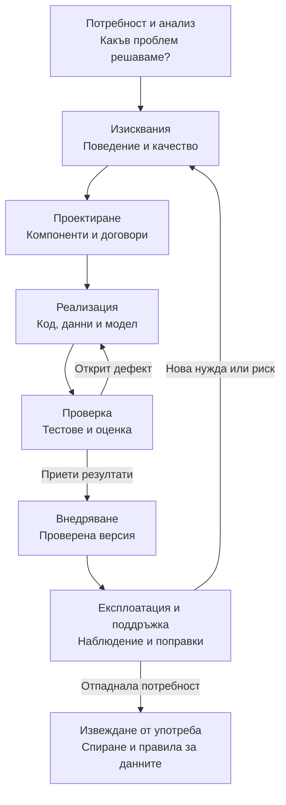

Стрелките назад показват обратна връзка. Дейностите се повтарят при нова функционалност или проблем; една проверка може да върне екипа към реализацията или към уточняване на изискванията.

### 2. Методологии и подходи за управление на проект

| Подход | Организация | Подходящ контекст и ограничение |
| --- | --- | --- |
| Waterfall — последователен модел | Планирани етапи с документирани резултати и предаване между тях | При добре изяснен обхват улеснява планирането; късно открит проблем с данните може да наложи скъпа преработка |
| Итеративно и инкрементално развитие | Повтаряме дейностите и добавяме малки използваеми части | Ранна обратна връзка; изисква контрол на зависимостите и регресионни проверки |
| Agile | Ценности и принципи за адаптиране чрез работещ софтуер и сътрудничество | Променящи се нужди; не освобождава от документация и критерии за качество |
| Scrum | Работа с обща продуктова цел, подредена работа и кратки спринтове | Неопределеността около категоризатора се проверява чрез малки прирасти |
| Kanban | Видим поток, изрични правила, ограничена започната работа и измерване на потока | Полезен за входящи дефекти и заявки; табло без управление на потока не е достатъчно |
| XP | Кратка обратна връзка чрез инженерни практики като тестове, работа по двойки и рефакториране | Подпомага промяната на кода; сам по себе си не задава протокол за оценка на ML модел |

Agile е подход, Scrum е рамка, а Waterfall е модел на процеса; терминът „методологии“ тук обединява различни начини за организиране на работата. Scrum може да се съчетава с практики от XP и управление на потока.

#### 2.1. Agile Manifesto и трима от неговите автори

[Манифестът за Agile разработка на софтуер](https://agilemanifesto.org/iso/bg/manifesto.html) е създаден през февруари 2001 г. в Snowbird, САЩ, от 17 участници. Сред авторите и подписалите го са Робърт Сесил Мартин, Мартин Фаулър и Кент Бек.

<div class="agile-authors">
  <figure>
    
    <figcaption>
      <strong>Робърт Сесил Мартин</strong>
      <span class="author-name">Robert C. Martin · „Чичо Боб“ (Uncle Bob)</span>
      <p>Инициатор на поканата за срещата през 2001 г., довела до манифеста. Работата му свързва Agile и XP с дисциплина в софтуерния дизайн.</p>
      <small>Снимка: <a href="https://commons.wikimedia.org/wiki/File:Robert_C._Martin_surrounded_by_computers_%28cropped%29.jpg">Angelacleancoder</a>; изрязване: PhotographyEdits · <a href="https://creativecommons.org/licenses/by-sa/4.0/">CC BY-SA 4.0</a>.</small>
    </figcaption>
  </figure>
  <figure>
    
    <figcaption>
      <strong>Мартин Фаулър</strong>
      <span class="author-name">Martin Fowler</span>
      <p>Участник в създаването на манифеста и автор на книгите „Refactoring“ и „UML Distilled“. Свързва адаптивния процес с поддържането на добър дизайн.</p>
      <small>Снимка: <a href="https://commons.wikimedia.org/wiki/File:Martin_Fowler_%282008%29.jpg">Ade Oshineye</a> · <a href="https://creativecommons.org/licenses/by/2.0/">CC BY 2.0</a>.</small>
    </figcaption>
  </figure>
  <figure>
    
    <figcaption>
      <strong>Кент Бек</strong>
      <span class="author-name">Kent Beck</span>
      <p>Създател на Extreme Programming (XP). Организира среща през 2000 г., която подготвя почвата за Snowbird и създаването на Agile Manifesto.</p>
      <small>Снимка: <a href="https://commons.wikimedia.org/wiki/File:Kent_Beck_1.jpg">Mulling it Over</a>; изрязване: Edward · <a href="https://creativecommons.org/licenses/by-sa/2.0/">CC BY-SA 2.0</a>.</small>
    </figcaption>
  </figure>
</div>

#### 2.2. Сравнение на Waterfall и Scrum

Следващото сравнение показва различната организация на работата: при Waterfall преобладава предаване между етапи, а при Scrum всеки спринт включва нужните дейности за малък използваем прираст.

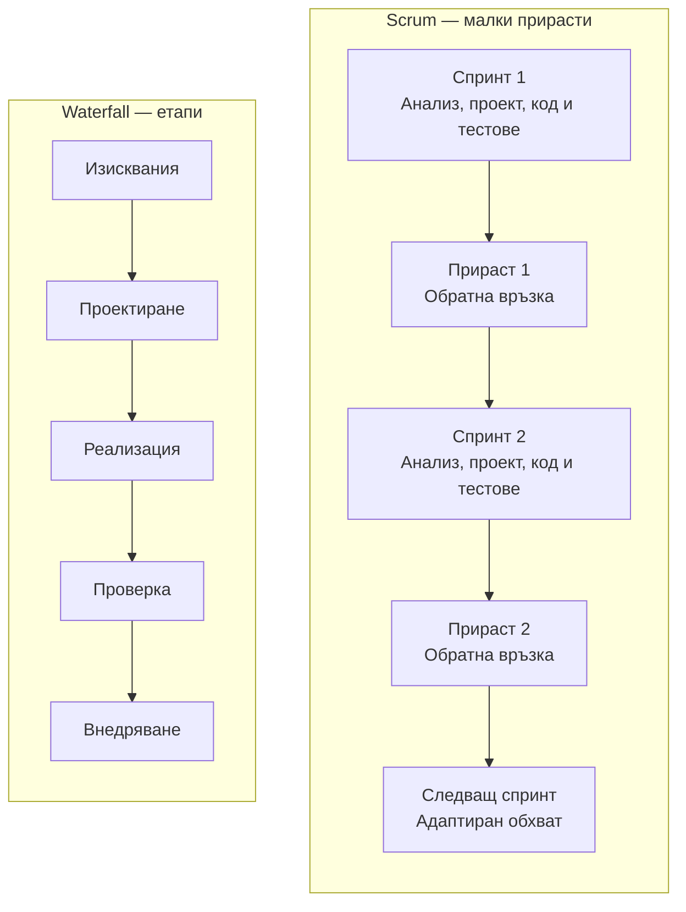

Схемата е опростено сравнение. Преработка е възможна и при Waterfall; при Scrum обратната връзка редовно влияе на следващия избор на работа.

### 3. Scrum и AI инженерът в екипа

Scrum използва прозрачност, проверка и адаптиране. **Product Owner** отговаря за продуктовата стойност и подреждането на Product Backlog. **Scrum Master** подпомага ефективността на екипа и прилагането на Scrum. **Developers** планират и създават прираста; AI инженерът е специализация сред тях, а не допълнителна Scrum роля.

**Sprint** е период до един месец. **Sprint Planning** уточнява целта и плана; **Daily Scrum** е 15-минутна проверка на напредъка от Developers; **Sprint Review** събира обратна връзка за продукта; **Retrospective** определя подобрение в начина на работа. Refinement е текущо уточняване на работата, а не отделно задължително събитие.

**Product Backlog** е подредената работа към Product Goal. **Sprint Backlog** съдържа Sprint Goal, избраната работа и план. **Increment** е използваем резултат, покриващ **Definition of Done (DoD)**. Спринтът включва нужните дейности по анализ, проектиране, реализация и проверка. Упражнение и спринт не са едно и също; упражнението задълбочава конкретна дейност. Внедряване е възможно преди Review.

В проекта AI инженерът договаря с Product Owner полезното поведение, с backend разработчика — договорите, а с останалите Developers — тестовете и внедряването. Не предава само notebook: предава проверим компонент с данни, ограничения и инструкции. Отговорността за качеството на продукта е обща.

**Пример за ограничено проучване (spike):** „За два часа провери дали имаме примери за трите категории и предложи начин за етикетиране“. Резултатът е решение с доказателства и нови backlog записи; проучването само по себе си не е използваем AI прираст. Story points, user stories и таблото са помощни практики, които екипът може да избере.

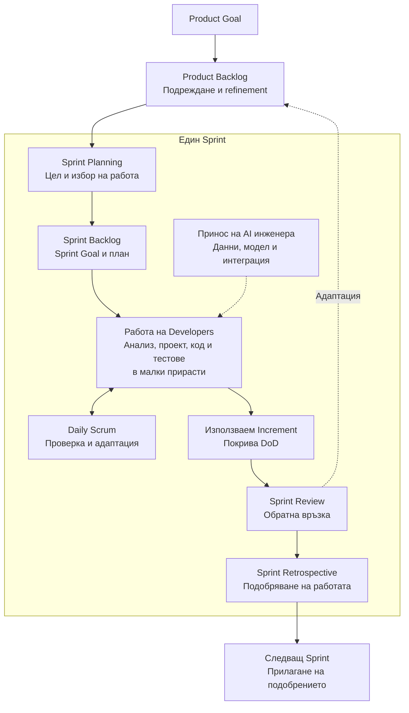

AI инженерът работи сред Developers през целия спринт. Анализът, реализацията и тестовете се повтарят за избраната работа. Може да има повече от един Increment; доставката не изчаква задължително Review. Refinement продължава според нуждите на екипа.

#### 3.1. Sprint Retrospective — от наблюдение към подобрение

**Ретроспективата (ретро среща)** завършва спринта. Целият Scrum Team — Developers, Product Owner и Scrum Master — разглежда как взаимодействията, процесът, инструментите и DoD са повлияли на работата и избира подобрения в качеството и ефективността. Максималната продължителност е три часа за едномесечен спринт; при по-кратък спринт срещата обикновено е по-кратка.

Използвайте конкретни наблюдения: „два пъти променихме API полето без общ пример“, „четири етикета останаха спорни“. AI инженерът допринася с информация за данните, експериментите и интеграцията; останалите участници допълват картината. Обсъждайте действия и условия, като всеки получава възможност да се изкаже. След това формулирайте малка промяна, която екипът може да приложи и провери.

Двете игри в примерен проблем 3 са възможни формати за такъв разговор. Изходът от всяка е **наблюдение → избрано подобрение → отговорник → срок → проверка на ефекта**. Запишете договорената работа и при нужда я включете в следващия Sprint Backlog. На следващото ретро проверете какво действително е приложено и дали е помогнало. Изборът на игра и начинът на гласуване са уговорки на екипа, а не задължителни правила на Scrum.

### 4. Epic, User Story и Task

#### 4.1. От продуктова цел до конкретна работа

**Epic (епик)** е голям обхват от свързана работа с обща продуктова цел, който разделяме на по-малки истории. **User Story (потребителска история)** описва малък полезен резултат от гледната точка на потребителя. **Task (работна задача)** описва конкретна дейност за постигане на този резултат. Историята обяснява **какво и защо**, а задачите — **как** ще го реализираме и проверим.

| Ниво | Какво записваме | Пример за Task Manager | Кога е завършено в нашия проект? |
| --- | --- | --- | --- |
| Epic | Цел, обхват, очаквана полза, свързани истории | E-AI-01: „Подпомогнато категоризиране с потребителски контрол“ | Историите от договорения обхват са завършени и резултатът покрива критериите на епика |
| User Story | Потребител, нужда, полза и критерии за приемане | AI-01: „Като автор искам предложение по правила и ръчно потвърждение, за да подреждам задачите по-бързо“ | Критериите за приемане и общият DoD са изпълнени в интегрирания продукт |
| Task | Действие, резултат, зависимости и проверка | AI-01c: „Реализирай baseline зад CategorySuggester“ | Кодът и проверките са готови според условията на задачата и е преминат преглед |

Епикът може да обхваща няколко спринта. Разделяйте историята така, че екипът да може да я завърши в един спринт с анализ, реализация и проверка. Работната задача е по-малка: например AI инженерът подготвя fixture за невалидна категория, а backend разработчикът добавя проверката в адаптера. Историята може да изисква няколко специализации.

Scrum определя Product Backlog и Sprint Backlog, но не задължава екипа да използва Epic/Story/Task или конкретни статуси. Следващите диаграми са **примерен работен процес за този проект**. Ready е наша уговорка за достатъчно уточнена работа; не е допълнителен задължителен Scrum артефакт.

В този курс Task означава техническа работа към история. В различни системи същата връзка може да се нарича подзадача; например инструментът може да поставя Story и Task на едно ниво. Това е различно и от обекта `Task` в кода на Task Manager: неговите статуси OPEN/IN_PROGRESS/DONE описват потребителска задача в приложението. Тук описваме работата на екипа, който разработва приложението.

#### 4.2. Връзка Epic → Story → Task

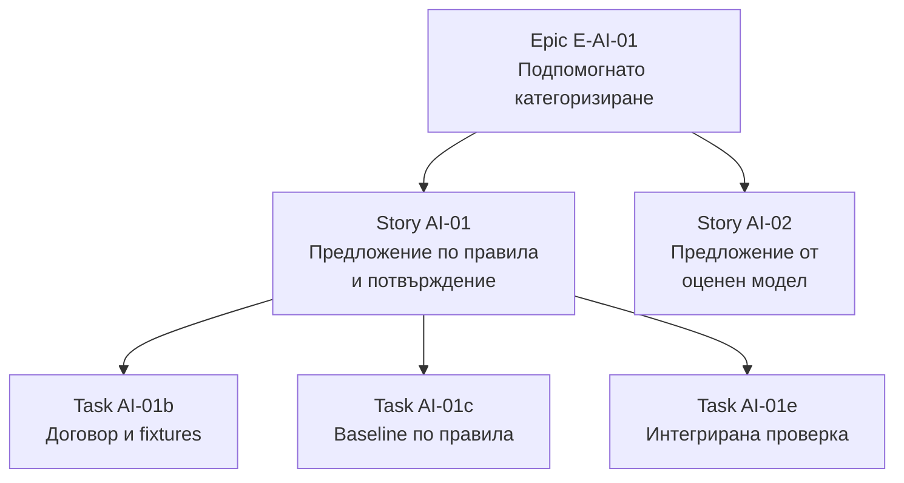

Стрелките означават **разбиване на работа**, а не ред на изпълнение. Показани са част от задачите на AI-01; зависимостите се записват отделно в backlog. „Обучи модела“ е Task с технически резултат. Полезната Story е „Като автор искам предложение от оценен модел, за да категоризирам и текстове без предварително зададените ключови думи“.

#### 4.3. Жизнен цикъл на Epic

В нашия процес епикът започва като идея, преминава през анализ и разбиване на истории и влиза в изпълнение. След работещите истории проверяваме общия резултат. Product Owner уточнява продуктовия обхват с екипа; AI инженерът дава доказателства за приложимостта и ограниченията на AI решението.

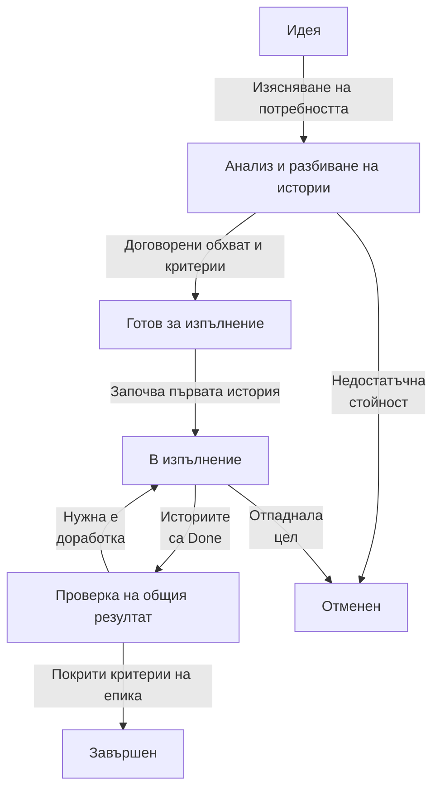

**Пример:** AI-01 е Done, но обучената версия от AI-02 още няма валиден оценъчен отчет. E-AI-01 остава „В изпълнение“, ако AI-02 е част от договорения му обхват. Ако екипът установи, че правилата са достатъчни, Product Owner може да договори по-малък обхват с нова обосновка. Не изтривайте неудобна история само за да отчетете завършен епик. „Отменен“ означава съзнателно прекратена работа и не е успешно завършване.

#### 4.4. Жизнен цикъл на User Story

Историята започва в Product Backlog. При refinement уточняваме входове, критерии, зависимости и размер. Ready означава, че екипът разбира достатъчно работата, за да я избере за спринт. След реализацията проверяваме целия потребителски сценарий, а не само отделните файлове.

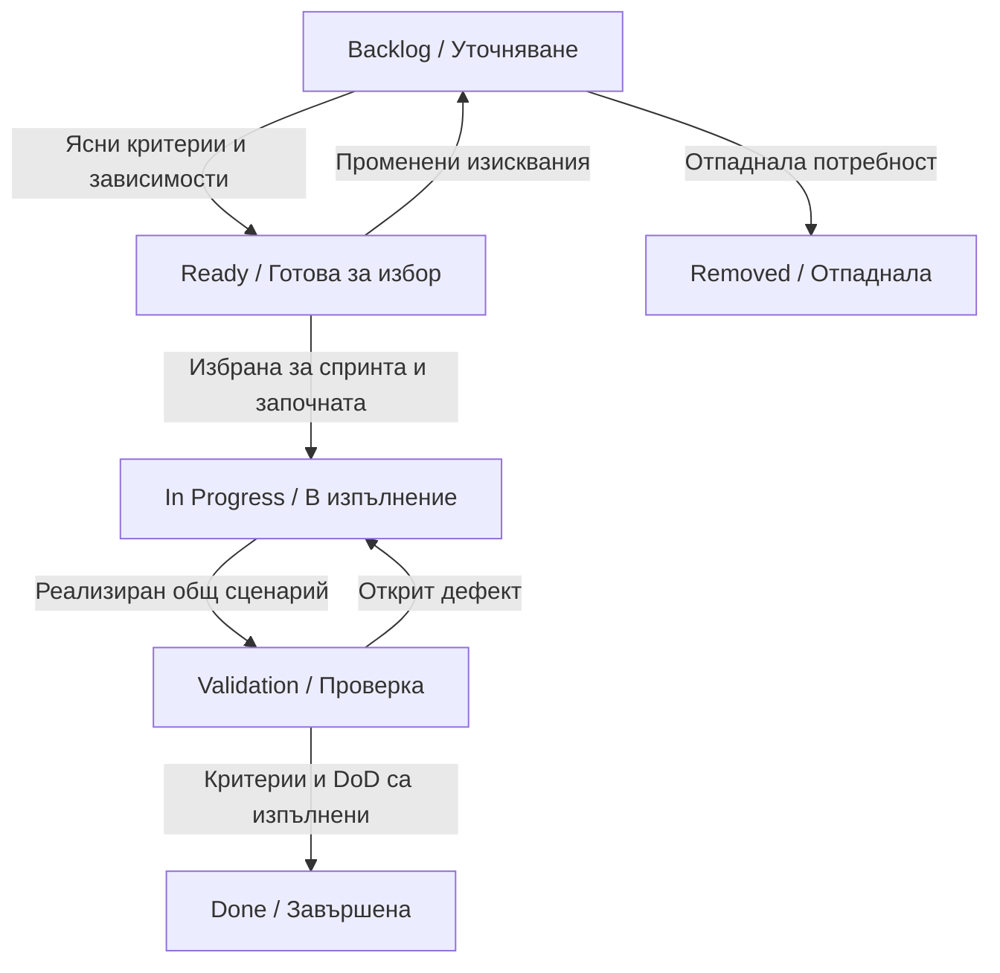

**Пример за критерий:** при записана задача с потвърдена категория DOCUMENTATION заявка за ново предложение връща BUG, а прочитането на задачата продължава да връща DOCUMENTATION. Ако предложеният BUG се запише автоматично, AI-01 се връща от Validation към In Progress независимо колко подзадачи са отбелязани Done.

Колоната Validation обозначава проверка на интегрирания сценарий; тестовете се разработват и изпълняват и по време на работата. История може да стане Done преди Sprint Review. Review не е задължителна опашка за подпис от Product Owner. Незавършена история в края на спринта остава незавършена, а останалата работа се уточнява и преподрежда; не се прехвърля автоматично със статус Done.

#### 4.5. Жизнен цикъл на Task

Работната задача има конкретен изпълним резултат: договорен fixture, валидиращ скрипт, baseline, тест или инструкция. Преди започване проверете зависимостите. При блокиране запишете причина, необходима помощ и следващо действие, за да може екипът да адаптира плана.

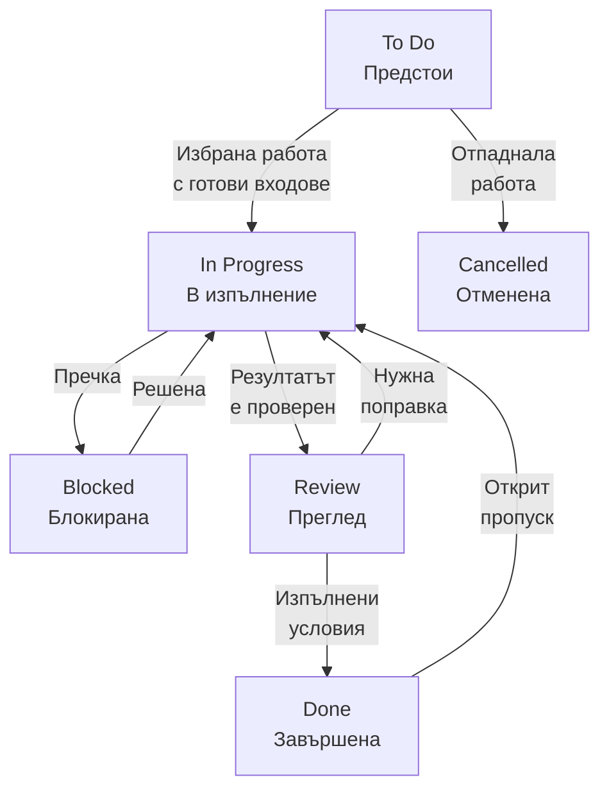

**Пример:** AI-01c е Blocked, защото договорът AI-01b още не определя допустимите категории. AI инженерът записва въпроса и го изяснява с backend разработчика, след което продължава работата. Review тук е преглед на конкретния резултат, например code review, и е различен от Sprint Review.

При повторно отваряне проверете влиянието върху Story и Epic; предишното отбелязване Done не отменя откритото несъответствие. Нова потребност извън договорения обхват се описва с нов запис и връзка към стария. Някои екипи използват флаг Blocked вместо отделен статус. Избраният модел трябва да е изричен и еднакво разбран.

#### 4.6. Как се свързва завършването на трите нива

| Наблюдение | Какво може да заключим? | Следваща проверка |
| --- | --- | --- |
| Кодът за baseline е готов | Една Task може да мине към Review | Покрива ли нейните входове и очаквани резултати? |
| Всички Tasks на AI-01 са Done | Техническият план изглежда изпълнен | Работи ли интегрираният сценарий и изпълнен ли е DoD? |
| AI-01 е Done | Доставена е конкретна потребителска стойност | Кои други истории и критерии остават за E-AI-01? |
| Всички задължителни Stories са Done | Можем да проверим общия резултат | Постигнат ли е договореният обхват на епика? |

Статусът е твърдение, което трябва да бъде подкрепено с резултат. „5 от 5 задачи Done“ не доказва, че моделът е полезен, че историята работи през API или че епикът е изпълнен.

Диаграмите са схеми на работния процес с Mermaid `flowchart`. За собствен вариант създайте схема в [Mermaid Live Editor](https://mermaid.live/) и експортирайте SVG. Запазете и изходния файл в UTF-8. Формалните UML модели на софтуерната система се разглеждат в [упражнение 3](/courses/bg/software-engineering-ai/laboratorno-uprazhnenie-3/).

### 5. Анализ, функционални и нефункционални изисквания

Започнете от потребителя, проблема, заинтересованите страни и границите на продукта. Разграничете факт от допускане: „имаме английски синтетични задачи“ може да бъде проверен факт; „моделът работи еднакво на български“ е непроверено допускане. Сравнете AI решение с ръчно категоризиране и прости правила, преди да изберете обучение.

**Функционално изискване (FR)** описва наблюдаемо поведение. **Нефункционално изискване (NFR)** задава качество или ограничение с измерима проверка. „Моделът е точен и бърз“ не позволява приемане: нужни са метрика, данни, среда и праг. ML-01 по-долу е NFR за статистическо качество, с отделен префикс за проследимост.

| ID | Изискване | Критерий и проверка |
| --- | --- | --- |
| FR-01 | Влязъл потребител създава задача | Валидни summary, description и бъдещ deadline → 201 и ID; прочитането връща подадените данни |
| FR-02 | Предлага категория без запис | `POST /tasks/{id}/category-suggestion` връща category, source, modelVersion; confirmedCategory остава непроменена |
| FR-03 | Потребителят потвърждава категория | `PATCH /tasks/{id}/category` с BUG → повторно прочитане връща BUG; неизвестна категория → 400 |
| FR-04 | Управлява статус | OPEN → IN_PROGRESS → DONE; изрично повторно отваряне DONE → OPEN; недоговорен преход → 409 |
| NFR-01 | Основната работа е независима от AI отказ | При спрян категоризатор създаването и ръчното потвърждение работят; предложението връща UNAVAILABLE |
| NFR-02 | Предложението има проследим произход | За source=MODEL версията съвпада с действително заредения артефакт |
| NFR-03 | Ограничено изчакване | Учебна цел: общ бюджет 1500 ms за предложение; локален протокол с 10 загряващи и 100 измервани заявки, concurrency=1, записана среда и входове |
| ML-01 | Измерено качество | Macro-F1 ≥ 0.70 върху отделена фиксирана извадка; отчет за всеки клас и брой примери |

Това са цели за разработката, а не измерени резултати. При NFR-03 записвайте всички времена, p95, максимума и отделно fallback; p95 не доказва, че всяка заявка е в бюджета. Допустимото измервателно отклонение се договаря предварително, не след провал. Категориите са BUG, FEATURE и DOCUMENTATION. OTHER означава въздържане от конкретна препоръка, а не четвърти обучен клас без данни.

**User story** свързва потребител, нужда и полза. **Критериите за приемане** са специфични за историята, а **DoD** задава общото качество на всяка завършена промяна. **SRS** е спецификация с обхват, речник, участници, изисквания, сценарии, договори и проверки. Матрица `изискване → backlog запис → проверка → резултат` пази проследимостта. Резултат „неизпълнено“ е коректен, когато функцията още липсва.

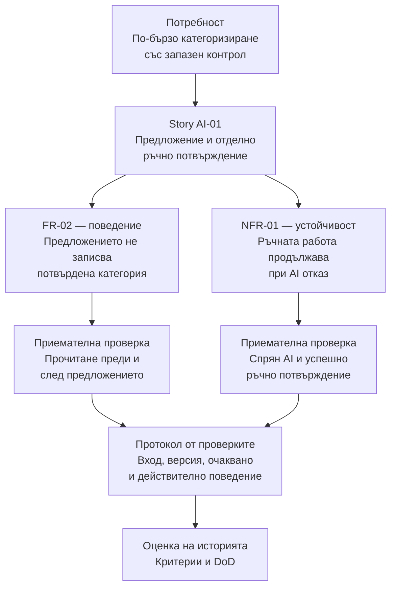

Двата клона свързват поведение и качество с отделни проверки. Диаграмата е план за проследимост; полето за действителен резултат се попълва след изпълнение на проверката.

### 6. Оценяване на работата (Estimation)

#### 6.1. Какво оценяваме?

**Estimation (естимация)** е приблизителна оценка на необходимата работа при известни условия и допускания. Тя подпомага избора на обхват и планирането; не е обещание за точен срок. Преди оценяването уточнете входа, очаквания резултат, критериите за приемане и DoD. „Подготви данните“ не задава достатъчен обхват: колко са записите, има ли етикети и как ще се проверят?

Разглеждайте заедно **обема работа**, **сложността** и **неопределеността**. За AI инженера 100 двусмислени текста може да изискват повече работа от 1000 вече проверени записа. Отчитайте и анализа, тестовете, прегледа и интеграцията до готов резултат. Зависимостите се описват изрично: изчакването на достъп до данни влияе върху календарния срок, дори когато не изисква постоянно активно усилие.

#### 6.2. Относителни оценки и story points

При **относително оценяване** сравняваме работата с общ, добре разбран **еталон**. **Story points (точки)** са условна мярка за относителния размер на работата, отчитаща обем, сложност и неопределеност. В примера използваме скала `1, 2, 3, 5, 8, 13`. По-големите стъпки избягват привидна точност при по-голяма работа. `?` означава, че липсва информация за смислена оценка.

**Точките не са часове.** Няма универсално правило „1 точка = 1 час“. Една и съща работа може да има различни оценки при различни еталони и екипи. Не използвайте точките за сравняване на хора или производителност между екипи.

| Ниво | Възможен начин за оценяване | Как използваме резултата? |
| --- | --- | --- |
| Epic | Груби размери S/M/L с описан обхват | Сравняваме големи възможности; уточняваме чрез разбиване на истории |
| Story / Product Backlog запис | Story points спрямо еталон на екипа | Сравняваме цялата работа до приет резултат, включително проверките |
| Task | Малък относителен размер или диапазон за активно време | Планираме конкретната дейност и зависимостите; записваме допусканията |

Екипът избира подхода и единицата. Не събирайте точки и часове в една сума и не броете едновременно Story и нейните Tasks като допълнителен обем. Оценката на историята покрива работата по задачите ѝ. При прекалено голям или неясен запис първо уточнете, разделете обхвата или направете ограничено по време проучване (spike).

#### 6.3. Planning Poker

**Planning Poker** е групова техника за сравняване на оценки и откриване на различни допускания:

1. Прочетете един backlog запис и уточнете какво означава „готово“.
2. Всеки участник избира самостоятелно карта от общата скала.
3. Покажете картите едновременно, за да не насочва първата обявена стойност останалите.
4. Участниците с най-ниска и най-висока оценка обясняват каква работа и риск са включили.
5. Изяснете разликите и гласувайте отново. Запишете договорената оценка и допусканията.

Не заменяйте обсъждането със средно аритметично. Ако липсва ключова информация, запишете `?` и конкретен въпрос за проверка; не повтаряйте гласуването до произволно съгласие.

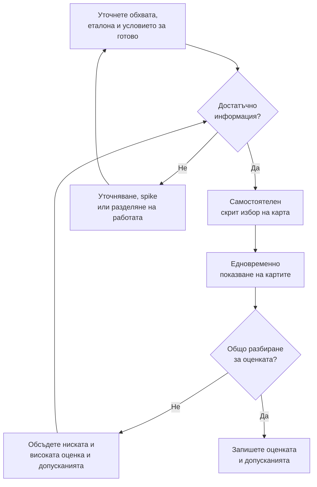

Приемането означава договорена обосновка; картите не е задължително да съвпадат. Ако разговорът открие липсваща информация, първо я изяснете и след това направете ново гласуване.

#### 6.4. Оценяване в Scrum и принос на AI инженера

За размера на работата отговарят **Developers**, които ще я изпълняват. Product Owner изяснява нуждата, стойността и възможните промени в обхвата. AI инженерът участва с информация за данни, етикетиране, експерименти, оценка на модела и интеграция. Story points и Planning Poker са възможни практики; Scrum не ги изисква. При Sprint Planning разглеждайте оценките заедно с наличния капацитет, предишните резултати, зависимостите, Sprint Goal и DoD.

Например четири часа автоматично обучение не означават четири часа непрекъснат човешки труд, но могат да забавят проверката. Запишете отделно активната подготовка и очакваното машинно време. Ако неизвестното е дали изобщо съществуват подходящи етикети, първата работа е кратка проверка на данните с конкретен резултат, след която оценявате реализацията. Не приемайте, че по-висока оценка гарантира постигане на целевата ML метрика.

### 7. Среда и начална организация

Организирайте собственото хранилище така; това е работната папка за курса, а не директорията на учебния сайт:

```text
task-manager-ai/
  task-manager/    Java starter и compose.yml
  ai-service/      Python код, data/, tests/, reports/, artifacts/
  docs/            анализ, спецификация, backlog, модели и протоколи
  .github/workflows/
```

Командите за Docker и Maven се изпълняват от `task-manager`, за Python — от `ai-service`, а документацията и Git са в общия корен. Добавете `.venv/`, `.env`, временни отчети и локални артефакти към `.gitignore`; запазвайте версиите и отчетите за предаване отделно по указанията на упражнението.

Работете в отделно копие на [Task Manager starter](/courses/downloads/task-manager-starter.zip). То съдържа Java/Spring API, PostgreSQL и регистрация/вход със сесия. AI услуга, статуси и категории предстои да добавите. Използвайте синтетични задачи в локална среда; началната версия няма изолация на задачите по собственик.

Нужни са Docker Desktop с Linux containers и свободен порт 19000. За редактиране и локално компилиране на Java използвайте JDK 17+ и предоставения Maven Wrapper. За AI разработката подгответе Python 3.11+; в това упражнение не са нужни ML библиотеки. Не включвайте `.env`, сесии или виртуална среда в Git.

## Примерен проблем 1 — Оценяване на задачи с плодове

Трябва да сравним усилието за подготовка на **ябълка, авокадо, диня и тиква**. Задачата е учебна симулация на планиране: оценяваме описаната работа, без да е необходимо да я изпълняваме в кухня. Самото име на плода не е достатъчно за оценка — нужна е договорка за количество и краен резултат.

### Стъпка 1. Уточнен обхват и общо условие за завършване

За всяка задача подготвяме **целия подаден плод**: измит и обелен, с отстранени сърцевина, костилка или семки според плода, нарязан на приблизително 2 cm кубчета. Кубчетата са в отделен означен съд, отпадъците са отделени и работното място е почистено. Това е общият ни DoD за симулацията. Не включваме пазаруване, доставка, готвене или изчакване за узряване.

Договорени входове: една ябълка около 180 g, едно узряло авокадо около 200 g, една цяла диня около 4 kg и една цяла тиква около 3 kg с твърда кора. Всички са здрави; авокадото е достатъчно стегнато за кубчета. Приемаме един изпълнител със сходен опит за четирите задачи и налични подходящи инструменти и съдове. Сравняваме усилието при тези условия, без ускоряване чрез допълнителни хора.

### Стъпка 2. Еталон и попълнена оценка

Избираме подготовката на ябълката за **еталон от 1 точка**. След сравнение на работата екипът записва следното решение:

| Задача | Обем и трудност спрямо ябълката | Оценка |
| --- | --- | --- |
| F-01 — Подготви ябълката | Малък обем; познати действия за кората, сърцевината и нарязването; включено почистване | **1 точка — еталон** |
| F-02 — Подготви авокадото | Подобен обем, но различна костилка и по-мека вътрешност; нужно е внимание, за да останат кубчета | **2 точки** |
| F-03 — Подготви динята | Много повече нарязване, кора, семки и почистване; действията са предимно повтаряеми | **5 точки** |
| F-04 — Подготви тиквата | Голям обем, твърда кора и плътна вътрешност; по-трудна обработка въпреки по-малката маса от динята | **8 точки** |

Това са **примерни оценки на екип при зададените допускания**, а не универсални стойности за плодовете или измерени времена. Тиквата получава повече точки от по-тежката диня, защото масата е само един фактор. Сборът е 16 точки за този набор работа; от него не следва „16 часа“ или гаранция, че всичко се побира в един спринт.

### Стъпка 3. Решен пример за Planning Poker

Трима участници използват ябълката като общ еталон. Първото гласуване показва, че не всички са разбрали входовете и обхвата еднакво. След обсъждането те записват и втория кръг:

| Задача | Първи карти | Открито различие и уточнение | Втори карти → записана оценка |
| --- | --- | --- | --- |
| Авокадо | 1, 2, 3 | Високата оценка допуска презрял плод, който се разпада; потвърден е стегнат плод, а костилката и внимателното нарязване остават в обхвата | 2, 2, 2 → **2** |
| Диня | 3, 5, 8 | Ниската оценка е за резен; задачата е за цялата диня, включително семки, кора и почистване | 5, 5, 5 → **5** |
| Тиква | 5, 8, 13 | Ниската оценка пропуска твърдата кора, високата включва печене; обхватът е подготовка на сурови кубчета с обелване | 8, 8, 8 → **8** |

Например средното от `3, 5, 8` е около `5.33`, но не го записваме като оценка. Разговорът за цяла диня срещу резен е причината за новото общо разбиране и второто гласуване. Съвпадението на картите в този пример е резултат от уточняването, а не изискване всеки разговор да приключва с единодушие.

### Стъпка 4. Промяна и проверка на решението

Преди започване получаваме нова информация: **тиквата вече е обелена и почистена от семки**. Количеството е останалата вътрешност от същата тиква; нарязването, означаването на съда и почистването остават. Екипът сравнява новия обхват с ябълката и динята, гласува `3, 3, 3` и записва **3 точки вместо 8**, с причина „отпадна трудната подготовка“. Друг екип може да избере друга стойност с последователна обосновка.

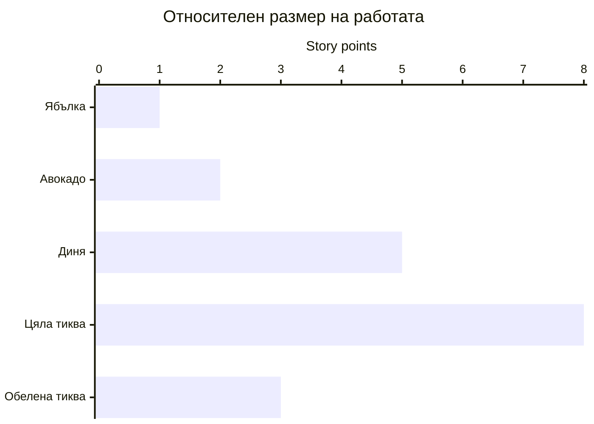

Последните два стълба са **два варианта на една и съща задача**: тиквата преди и след промяната на входните условия. Стълбовете сравняват усилието при договорения обхват; те не измерват масата на плодовете или време в часове.

Ако вместо това не знаем състоянието на авокадото, записваме `?` и действие „провери дали входът отговаря на условието за кубчета“. Не добавяме точки, за да представим изчакването за доставка или узряване като активна работа.

**Проверка на попълнения модел:** четирите задачи имат конкретни входове и общ DoD; ябълката е един и същ еталон; оценките включват цялата подготовка и почистване; различията в гласовете са обяснени; промяната на тиквата има нова оценка и причина; няма превръщане на точки в часове. Така можем да повторим обсъждането при същите условия или да обясним защо оценката се е променила.

### Стъпка 5. Приложение към работата на AI инженера

В Task Manager „етикетирай 100 текста“ прилича на задача за плод без уточнено състояние и краен резултат: нужни са правила за категориите, език, спорни случаи и проверка на резултата. Вече проверени етикети намаляват обхвата, както предварително обелената тиква. Неизвестното качество на данните изисква проучване, както неизвестното състояние на авокадото.

За AI backlog изберете **собствен еталон от добре разбрана софтуерна работа**. Пренасяме начина на сравняване от примера с плодовете, а числата не се прехвърлят автоматично към софтуерните задачи. Когато оценявате цяла история за предложения, включете подготовката на данни, реализацията, интеграцията и проверките, необходими за нейния DoD.

## Примерен проблем 2 — Подготовка на AI проекта

Потребителите губят време в ръчно подреждане на задачи. Екипът иска предложения за категории, но още няма етикетирани данни и не знае дали моделът ще е достатъчно полезен. Ще стартираме основата и ще изготвим конкретен анализ, изисквания и начална работа за AI инженера.

### Стъпка 1. Стартиране и проверка на наличния проект

Разархивирайте starter и отворете `task-manager`, където е `compose.yml`. В PowerShell изпълнете:

```powershell
./init-environment.ps1
$env:TASK_MANAGER_PORT = '19000'
docker compose -p se-task-manager config --quiet
docker compose -p se-task-manager up -d --build --wait
docker compose -p se-task-manager logs --tail 30 app
```

За Bash началните команди са `sh ./init-environment.sh` и `export TASK_MANAGER_PORT=19000`. Използвайте `-p se-task-manager` във всички команди. Изчакайте съобщението за стартирало Spring приложение; готовата база не доказва готов API. При зает порт изберете друг и използвайте същия в заявките.

Следващият PowerShell пример регистрира уникален учебен потребител, запазва сесията в паметта и проверява реалните данни:

```powershell
$baseUrl = 'http://localhost:19000'
$credentials = @{
    username = 'student-' + [guid]::NewGuid().ToString('N').Substring(0, 8)
    password = 'local-student-password!'
} | ConvertTo-Json
$null = Invoke-RestMethod "$baseUrl/auth/register" -Method Post -ContentType 'application/json' -Body $credentials
$null = Invoke-RestMethod "$baseUrl/auth/login" -Method Post -ContentType 'application/json' -Body $credentials -SessionVariable taskSession
$inputTask = @{
    summary = 'Fix login validation'
    description = 'Show a clear error for invalid input'
    deadline = (Get-Date).AddDays(30).ToString('yyyy-MM-ddTHH:mm:ss')
} | ConvertTo-Json
$response = Invoke-WebRequest "$baseUrl/tasks" -Method Post -ContentType 'application/json' -Body $inputTask -WebSession $taskSession -UseBasicParsing
if ($response.StatusCode -ne 201) { throw 'Expected HTTP 201' }
$createdTask = $response.Content | ConvertFrom-Json
$savedTask = Invoke-RestMethod "$baseUrl/tasks/$($createdTask.id)" -WebSession $taskSession
if ($savedTask.summary -ne 'Fix login validation') { throw 'Unexpected saved task' }
"PASS: created and read task $($savedTask.id)"
```

Очакваният изход е `PASS: created and read task <ID>`. Проверете допълнително в Postman анонимно `GET /tasks` → 401, без cookie или bearer token. При проблем запишете командата, HTTP статуса и грешката, без credentials и cookie. За спиране със запазване на данните: `docker compose -p se-task-manager down`.

За AI работата създайте съседна папка `ai-service` и виртуална среда с `python -m venv .venv` от нея. Проверете интерпретатора с `.venv/Scripts/python.exe --version` в Windows или `.venv/bin/python --version` в Linux/macOS. Ако командата `python` сочи стара версия, изберете инсталиран Python 3.11+ изрично. Запишете версиите чрез `docker --version`, `docker compose version` и командата за Python.

### Стъпка 2. Завършен пример за анализ и сценарий

| Поле | Решение за примера |
| --- | --- |
| Потребител и нужда | Автор на задачи, който иска по-бързо категоризиране, без загуба на контрол |
| Product Goal | Task Manager предлага категория, която потребителят може да потвърди или да замени |
| Обхват | Английски синтетични задачи; BUG, FEATURE, DOCUMENTATION; отделна операция за предложение |
| Извън обхвата | Автоматично изпълнение на задачи, автоматично записване на категория, обучение от всяко потвърждение |
| Алтернативи | Ръчен избор; правила по думи; обучен текстов модел |
| Риск и проверка | Недостатъчно примери за DOCUMENTATION → преброяване и преглед на етикетите преди обучение |

История AI-01: „Като автор на задача искам предложение за категория, за да намаля ръчната работа, като запазя последната дума“.

**Сценарий:** влязъл потребител има записана задача с confirmedCategory=null. Поисква предложение; получава BUG и версия на източника; повторното прочитане още връща null. След отделно потвърждение прочитането връща BUG. При недостъпна услуга предложението връща `{"category":null,"source":"UNAVAILABLE","modelVersion":null}` с HTTP 200; задачата и ръчният избор остават достъпни. Липсващ ID връща 404. Тези пътища са планирани разширения, не налични в starter.

### Стъпка 3. Попълнен начален backlog и DoD

Разбиваме E-AI-01 „Подпомогнато категоризиране с потребителски контрол“ на две истории:

| ID и тип | Потребителски резултат | Критерий за тази история | Начално състояние |
| --- | --- | --- | --- |
| AI-01 — Story | Предложение по правила с отделно ръчно потвърждение | FR-02/03: предложението не записва категория; потвърждението я запазва | Ready след уточнен договор и критерии |
| AI-02 — Story | Предложение от обучен и оценен модел | ML-01 е измерено и покрито; моделът спазва същия API договор | Backlog: оценъчният набор още не е подготвен |

Епикът е завършен, когато и двете истории покриват критериите си и DoD, ръчният избор работи при AI отказ и общият сценарий е демонстриран. Това е договореният обхват за примера; допълнителна поддръжка на език се обсъжда като нова работа.

Първата цел на спринта (Sprint Goal) е „Потребителят получава предложение по правила и го потвърждава ръчно“. Записите по-долу са примерен план към тази цел, не отчет за изпълнение.

AI-01a–AI-01e са **Tasks към Story AI-01**, а не пет отделни потребителски истории. В таблицата „Сътрудничество“ посочва участниците; Dependencies показват последователност, различна от връзката родител–дете.

| ID | Работа | Сътрудничество | Зависимост | Проверка |
| --- | --- | --- | --- | --- |
| AI-01a | Анализ и етикетиране на 12 синтетични примера | AI инженер + Product Owner | Няма | Всеки пример има категория и обосновка; спорните са отделени |
| AI-01b | Договор за предложение и отказ | AI инженер + backend разработчик | AI-01a | Успешен отговор и UNAVAILABLE са описани с вход/изход |
| AI-01c | Детерминистични правила зад CategorySuggester | AI инженер | AI-01b | error → BUG; add → FEATURE; readme → DOCUMENTATION; иначе OTHER |
| AI-01d | Свързване и ръчно потвърждение | AI инженер + backend разработчик | AI-01c | Предложението не записва категория; потвърждението записва |
| AI-01e | Интегрирана демонстрация и инструкции | Developers | AI-01d | Друг член повтаря сценария, включително отказ |

Примерен DoD: кодът е прегледан; критериите за избраната история са проверени; резултатите са записани; версиите на правилата/модела и данните са известни; инструкциите се възпроизвеждат; логовете не съдържат чувствителни данни. За обучен модел добавяме реалния отчет за ML-01. Документът за анализ сам не покрива DoD на работещата история AI-01.

### Стъпка 4. Решен пример за промени в статусите

Да разгледаме учебен сценарий: задачите за baseline и интеграция са отбелязани Done, но общата проверка открива, че предложението променя confirmedCategory. Следната таблица е завършено решение на задачата **как да отразим състоянието на работата**; тя не е протокол за реално изпълнен API тест.

| Събитие и доказателство в сценария | Task | Story AI-01 | Epic E-AI-01 |
| --- | --- | --- | --- |
| Прегледан е договорът и са съгласувани fixtures | AI-01b: Review → Done | In Progress | В изпълнение |
| Baseline и интеграцията са готови за обща проверка | AI-01c/AI-01d: Done; AI-01e: In Progress | Validation | В изпълнение |
| Проверка връща BUG вместо предишната DOCUMENTATION | AI-01d: Done → In Progress; AI-01e остава In Progress | Validation → In Progress | В изпълнение |
| Записът при предложение е премахнат; повторната проверка пази DOCUMENTATION | AI-01d: Review → Done; AI-01e: Review → Done след целия протокол | Validation → Done при покрити критерии и DoD | В изпълнение: AI-02 още липсва |

Проверяваме решението срещу диаграмите: има преход за връщане на Task и Story към работа; нито дефектът, нито краят на спринта води до автоматично Done. Дори след поправката епикът остава отворен заради AI-02. Към отворената Task добавяме очаквано/получено поведение и връзка към FR-02, за да е ясно как ще се провери поправката.

### Стъпка 5. Проверка на плана и адаптация

В `docs/specification.md` записваме анализа, сценария и изискванията. В `docs/backlog.md` — таблицата и зависимостите; в `docs/setup.md` — действителния стартов протокол. За FR-01 прилагаме получения ID и прочетените данни. FR-02/03, NFR и ML-01 остават „неизпълнено“ до съответната реализация и измерване.

Проверяваме плана: AI-01d зависи от договор и baseline; липсата на етикетирани данни не блокира ръчния избор; обучен модел е следващ кандидат за прираст. При Review потребител може да поиска български текстове — това става нов backlog запис с данни и критерии. При Retrospective екипът може да избере общ шаблон за етикетиране, ако различни хора разбират категориите различно. Следва [Упражнение 3 — UML моделиране и архитектура на AI компонент](/courses/bg/software-engineering-ai/laboratorno-uprazhnenie-3/).

## Примерен проблем 3 — Две игри за Sprint Retrospective

Следващите два сценария са **попълнени учебни модели на ретро среща**, а не отчети за проведени спринтове. За всяка игра са достатъчни общ лист или виртуално табло и бележки. Изберете формата според проблема; не е необходимо да провеждате и двете игри на една среща.

### Игра 1. „Платноходка“ (Sailboat)

**Проблем:** екипът е завършил предложението по правила в Task Manager, но две несъгласувани промени в API са наложили повторна интеграция. Искаме да открием какво е помогнало, какво е забавило работата и какъв риск остава пред AI екипа.

**Правила:** нарисувайте лодка за екипа, остров за целта, вятър за помощта, котва за пречките и скали за рисковете. Всеки записва самостоятелно по едно конкретно наблюдение на бележка и го поставя в съответната зона. Прочетете бележките, изяснете фактите и обединете повторенията. В този вариант всеки има два гласа, по един за две различни теми за подобрение. Обсъдете водещите теми и договорете едно действие; гласовете насочват разговора, а сериозен риск заслужава обсъждане и с малко гласове.

**Попълнено табло за нашия сценарий:**

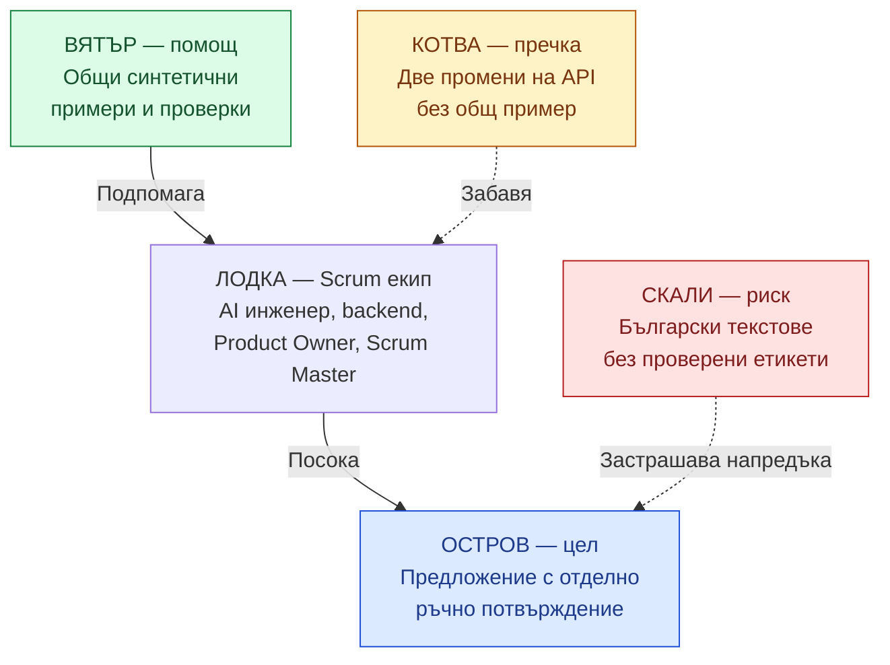

| Зона | Въпрос | Бележка от екипа |
| --- | --- | --- |
| Остров — цел | Накъде пътуваме? | Потребителят получава предложение и запазва контрола чрез отделно потвърждение |
| Вятър — помощ | Какво ни придвижи? | Общите синтетични примери позволиха на AI и backend разработчиците да повторят един и същ сценарий |
| Котва — пречка | Какво ни забави? | При две промени на формата на отговора липсваше актуален общ пример; интеграцията се преработи |
| Скали — риск | Какво може да ни попречи? | Предстоят български текстове, но още няма проверени етикети и критерии за тях |

**Решение:** след обсъждане екипът избира котвата „несъгласуван API договор“. AI инженерът обяснява нужните успешен отговор и отказ, backend разработчикът — проверките в адаптера. Рискът за българските текстове се записва като отделно проучване в Product Backlog и се обсъжда с Product Owner.

| Договорено действие RETRO-01 | Попълнен запис |
| --- | --- |
| Промяна | При промяна на API договора добавяме общи входни и очаквани изходни примери за успешно предложение и UNAVAILABLE и ги преглеждаме преди сливане на кода |
| Отговорник и сътрудничество | AI инженерът координира; backend разработчикът участва в прегледа и интеграционната проверка |
| Срок | Преди първата промяна на договора в следващия спринт |
| Доказателство за изпълнение | Версионирани примери, връзка към прегледа и резултат от проверката на договора |
| Проверка на ефекта | На следващото ретро преброяваме промените с общи примери и повторните интеграции поради несъответствие в договора; изходното наблюдение е две повторни интеграции |

**Проверка на решението:** действието адресира наблюдаваната пречка и има отговорник, срок и наблюдаем резултат. Ако през следващия спринт няма промяна на договора, запишете „няма случай за проверка“, вместо да приемате нулата дефекти за доказателство, че подобрението е сработило.

### Игра 2. „Започни / Спри / Продължи“ (Start / Stop / Continue)

**Проблем:** при подготовката на данни четири от дванадесет синтетични задачи получават различни етикети от двама участници. Част от решенията остават само в чат, но съвместният преглед е помогнал да се изяснят два от спорните случаи. Търсим конкретна промяна в работата по етикетиране.

**Правила:** разделете таблото на три колони: „Започни“ за нова полезна практика, „Спри“ за действие, което пречи, и „Продължи“ за практика, която вече помага. Всеки записва предложение с пример от спринта. Прочетете и групирайте бележките; обсъдете очаквания ефект и изберете една промяна за изпробване. За спряна практика уточнете как ще се извършва необходимата работа занапред.

**Попълнено табло:**

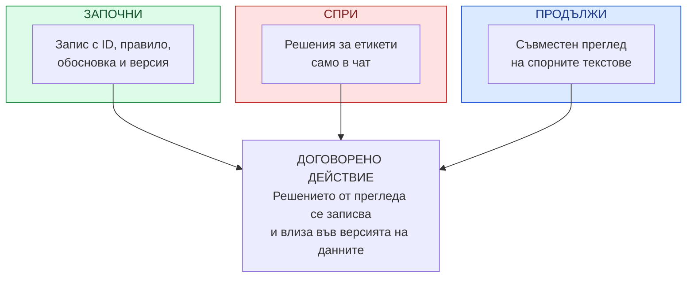

| Започни | Спри | Продължи |
| --- | --- | --- |
| Записване на всяко решение за спорен етикет с ID на примера, правило, обосновка и версия на данните | Оставяне на окончателни решения за етикети само в чат, без актуализация на набора и правилата | Съвместен преглед на спорните текстове с AI инженер и Product Owner; така изяснихме два случая |

Трите бележки водят до една свързана промяна: **решението от съвместния преглед влиза в общ запис и във версията на данните**. Product Owner изяснява смисъла на категориите, а AI инженерът пази проследимостта между правило, етикет и набор.

| Договорено действие RETRO-02 | Попълнен запис |
| --- | --- |
| Промяна | За всеки разгледан спорен текст попълваме `id, previous_label, decided_label, reason, data_version`; нерешените случаи остават означени като отворени |
| Отговорник и сътрудничество | AI инженерът поддържа записа в `docs/label-decisions.csv`; Product Owner участва в изясняването, а втори Developer проверява съответствието с данните |
| Срок | Преди използването на следващата версия на данните в експеримент |
| Доказателство за изпълнение | Записани решения, обновени правила за етикетиране и съответстваща версия на набора |
| Проверка на ефекта | На следващото ретро втори участник възстановява решенията за разгледаните спорни случаи от записите; отчитаме колко са проследими и колко остават отворени |

**Проверка на решението:** „да комуникираме по-добре“ вече има конкретно изпълнение и проверка. Ако от четири случая три са проследими, а един е решен само в чат, действието още не е приложено изцяло: допълнете липсващия запис и обсъдете защо е пропуснат. Проследимият етикет позволява проверка на решението, но сам по себе си не доказва качество на обучения модел.
