# Упражнение 3 — UML моделиране и архитектура на AI компонент

## Теория

### Работа в Scrum: анализ и проектиране на AI прираста

В рамките на целта за предложение с ръчно потвърждение уточнявате AI-01b и намалявате риска от несъвместими компоненти. AI инженерът моделира входовете, изходите, обучението и отказа съвместно с backend разработчика. При Daily Scrum конкретна пречка е „двете реализации използват различни имена на категории“; действието е общ fixture и договор, преди интеграция. Архитектурата се променя при ново доказателство, а завършеният документ подпомага бъдещия работещ прираст.


### 1. Архитектура и отговорности

1. **Софтуерна архитектура.** Описва основните части, договорите и решенията, които определят качествата на системата. Архитектурната диаграма трябва да бъде подкрепена с обосновка.
   - **Пример:** Task Manager запазва задачата независимо от услугата за предложения; така проблем в модела не прекъсва основната работа.
2. **Слоеста архитектура.** Контролерът обработва HTTP, услугата управлява бизнес правилата, repository осигурява достъп до данни. Слоят не означава задължително отделно внедряване.
   - **Пример:** `TaskController → TaskService → TaskRepository` е налична последователност; не добавяме HTTP клиент директно в entity Task.
3. **Модулен монолит и отделна услуга.** При първия модулите се внедряват заедно; при втория имат отделни процеси и мрежов договор.
   - **Пример:** Java приложение с вътрешен категоризатор по правила е лесна начална стъпка; Python услуга позволява независимо обновяване на текстов модел, но изисква timeout и управление на версии.

### 2. Граници на AI компонента

1. **Обучение и предсказване.** Обучението създава артефакт извън потока на потребителските заявки. Предсказването зарежда готов артефакт и не дообучава модела при всеки HTTP request.
2. **Порт и адаптер.** Портът е договор на приложението; адаптерът свързва външната технология с него.
   - **Пример:** `CategorySuggester` приема summary и description; HTTP адаптерът преобразува отговора на Python услугата в `Suggestion`.
3. **Собственост на данните.** Task Manager притежава задачите и потвърдените категории. Услугата за предложения не променя неговата база и не получава пароли, cookies или потребителски роли.

### 3. Компромиси и ADR

ADR (Architecture Decision Record) записва контекст, допускания, разгледани варианти, решение, последствия и условие за преразглеждане. „Микроуслугите са по-добри“ не е достатъчна обосновка.

| Критерий | Вграден категоризатор | Отделна услуга |
| --- | --- | --- |
| Време за отговор | Няма мрежов преход | Има пренос и сериализация |
| Внедряване | Един артефакт | Отделни версии и съвместимост |
| Отказ | Може да засегне основния процес | Изолиране, но и мрежови грешки |
| Език и библиотеки | Ограничени от средата на приложението | Самостоятелна Python среда |
| Експлоатация | По-малко конфигурация | Допълнителни логове, health и timeout |

Използвайте Component и Deployment моделите по-долу. Те са две гледни точки към едно решение; имената, договорите и комуникационните пътища трябва да съвпадат.

### 4. UML — различни гледни точки към една система

Диаграмата отговаря на конкретен въпрос и допълва текстовите изисквания. Нормативен източник: [OMG UML 2.5.1](https://www.omg.org/spec/UML/2.5.1/About-UML). Следващите диаграми моделират Task Manager.

Седемте структурни диаграми описват организацията; трите основни поведенчески — функционалност и поведение; четирите диаграми на взаимодействие са подгрупа на поведенческите.

За диаграмите и решенията на задачите използвайте **Mermaid**, както в ООП 1. Източникът е текстов файл `.mmd` или блок `mermaid` в Markdown; изображението се получава от него. Примерите показват **планираните разширения** на Task Manager.

### 4.1. Работа с Mermaid — от код до диаграма

Mermaid превръща текстово описание в диаграма. В ООП 1 например йерархията на колекциите е описана с `classDiagram`. Тук ще използвате същия инструмент за моделите на Task Manager. Започнете с [Mermaid Live Editor](https://mermaid.live/) и използвайте [официалната документация](https://mermaid.js.org/intro/) за справка.

1. Отворете редактора и заменете примерния код в полето **Code** с кода по-долу. Копирайте само съдържанието, без ограждащите Markdown редове.
2. Прочетете получения модел: Task е клас с поле status и операция changeStatus. Променете името на операцията и вижте как диаграмата се обновява.
3. При грешка проверете първия ред, затварящите скоби и реда, посочен от редактора. Добавяйте по един елемент и проверявайте резултата след всяка промяна.
4. Запазете текста локално като `docs/uml/task-class.mmd` в UTF-8. Файлът съдържа Mermaid синтаксис, без Markdown ограждения. Връзка към редактора или снимка не заменя изходния файл.
5. Експортирайте изображение чрез **Actions → SVG** и го запазете като `docs/uml/task-class.svg`. При промяна на `.mmd` направете нов експорт. Отворете отново запазения източник в редактора и проверете, че възпроизвежда същия модел.

Код за копиране:

```text
classDiagram
    class Task {
        -String status
        +changeStatus(String next) void
    }
```

При включване в `docs/specification.md` оградете този текст така:

````markdown
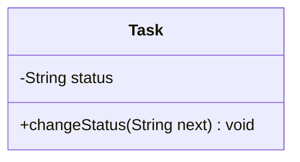
````

Markdown визуализатор без Mermaid поддръжка ще покаже кода като текст. Използвайте Live Editor за преглед и приложете SVG експорт към предаването.

### 4.2. Синтаксис, който ще използвате

| Описание | Mermaid синтаксис | Значение |
| --- | --- | --- |
| Класове | `classDiagram` | Класове, полета, операции и връзки |
| Видимост | `+operation()` / `-field` | Public операция / private поле |
| Асоциация | `Task "1" -- "0..*" Report : reports` | Кратности и име на връзката |
| Наследяване / реализация | `Base <|-- Child` / `Interface <|.. Implementation` | Стрелката сочи общия тип |
| Композиция / зависимост | `Whole *-- Part` / `Service ..> Port` | Собственост / използване |
| Последователност | `sequenceDiagram` | Участници, съобщения и алтернативи |
| Заявка / отговор | `API->>AI: suggest(text)` / `AI-->>API: result` | Извикване / отговор |
| Алтернативи | `alt condition`, `else`, `end` | Взаимно изключващи се потоци |
| Състояния | `stateDiagram-v2` | Състояния и преходи |
| Преход | `OPEN --> IN_PROGRESS: start` | Събитие и следващо състояние |
| Начало | `[*] --> OPEN` | Начално състояние |
| Схеми | `flowchart LR` / `flowchart TD` | Подреждане отляво надясно / отгоре надолу |
| Елементи | `A["Запис"]`, `D{"Валиден?"}` | Действие / решение в условна схема |
| Групиране | `subgraph API["Task API"]` ... `end` | Визуална граница на група |
| Коментар | `%% FR-03: ръчно потвърждение` | Бележка в изходния код |

Използвайте устойчиви идентификатори като `TaskAPI` и поставяйте видимите български надписи в кавички: `TaskAPI["Услуга за задачи"]`. Дръжте участниците и имената на операциите еднакви във всички модели. Декларация за крайно състояние `DONE --> [*]` е неправилна за нашия процес, защото задачата допуска повторно отваряне.

### 4.3. UML и граници на представянето

Примерите използват синтаксис, съвместим с Mermaid **11.17.2** в учебния сайт. Live Editor може да използва по-нова версия; придържайте се към показаните конструкции. Справки: [класове](https://mermaid.js.org/syntax/classDiagram.html), [последователности](https://mermaid.js.org/syntax/sequenceDiagram.html), [състояния](https://mermaid.js.org/syntax/stateDiagram.html) и [flowchart](https://mermaid.js.org/syntax/flowchart.html).

`classDiagram`, `sequenceDiagram` и `stateDiagram-v2` имат собствен синтаксис за съответните модели. За останалите UML видове по-долу използваме **условни Mermaid представяния** с изрична легенда. Те показват съдържанието, но не възпроизвеждат напълно UML нотацията: например `subgraph` не е UML deployment възел, а правоъгълник с име на обект не подчертава автоматично името му. Връзката „Еталон за UML нотацията“ показва формалната форма за сравнение.

При решаване на задача предавайте Mermaid източника, експорт и кратка легенда за условните символи. Записвайте липсващите ограничения и семантика като текст в спецификацията. Не представяйте flowchart схема като напълно формална UML диаграма.

### 5. Структурни диаграми

#### 5.1. Class — диаграма на класовете

Описва типове, атрибути, операции и връзки. Правоъгълникът има отделения; `+` означава public, `-` — private. Асоциациите имат роли и кратности. Празният триъгълник сочи родителски тип; прекъсната линия с такъв триъгълник — реализиран интерфейс. Композицията с плътен ромб означава силна собственост и не следва автоматично от външен ключ.

**Пример:** Task с планирани status и confirmedCategory, свързан с Report. Използвайте за домейн и интерфейси; клас Task не е конкретната задача №42.

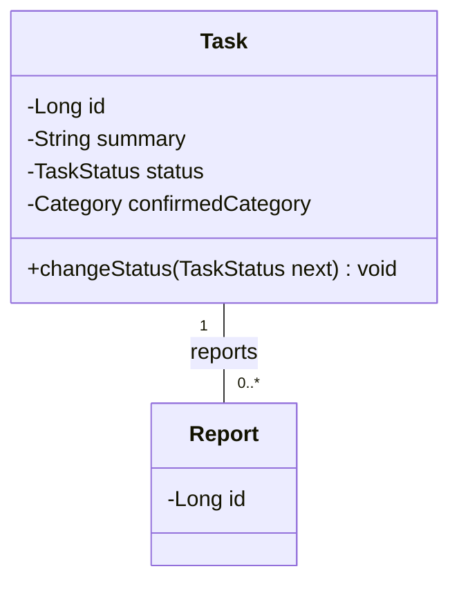

#### 5.2. Object — диаграма на обектите

Показва екземпляри и стойности в определен момент. `task42:Task` е подчертано; слотовете съдържат стойности, а линиите са конкретни връзки.

**Пример:** задача №42 е IN_PROGRESS и има категория BUG. Използвайте за fixtures и проверка дали класовият модел допуска нужните състояния.

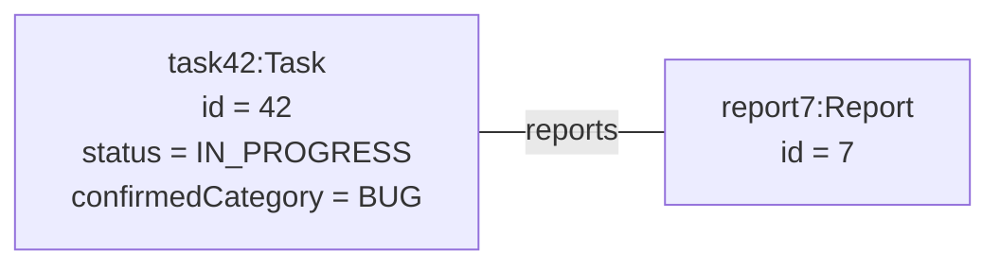

Условно представяне: кутията е екземпляр със слотове; линията е връзка. Името не е подчертано автоматично, както изисква UML Object нотацията.

[Еталон за UML нотацията](/courses/diagrams/task-manager-uml/object.svg)

#### 5.3. Package — диаграма на пакетите

Групира елементи в пространства от имена. Пакетът е папка; прекъсната стрелка сочи пакета, от който има зависимост.

**Пример:** controller зависи от service, service — от domain, а ai.adapter реализира интерфейс от service. Използвайте за зависимостите и цикли; пакетът не означава отделен процес.

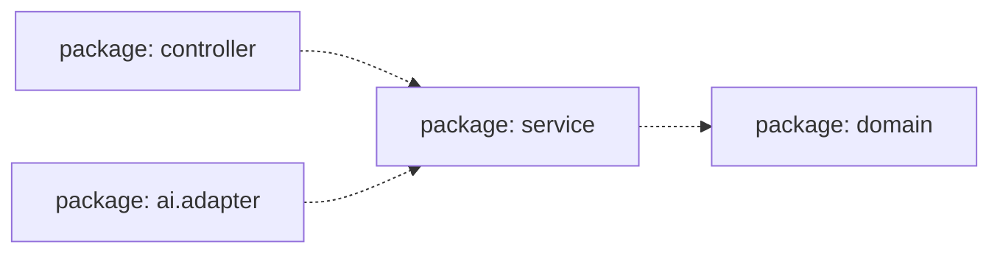

Условно представяне: кутиите са пакети; прекъснатата стрелка сочи зависимостта. Символът на папка не се възпроизвежда.

[Еталон за UML нотацията](/courses/diagrams/task-manager-uml/package.svg)

#### 5.4. Component — диаграма на компонентите

Показва заменяеми части и договори. Компонент може да се означи с `«component»`; предоставен интерфейс — с кръгче, изискван — с полукръг. Зависимост може да се надпише с името на договора.

**Пример:** Task API използва Category Service. Използвайте за архитектурни решения; физическото разполагане изисква отделна гледна точка.

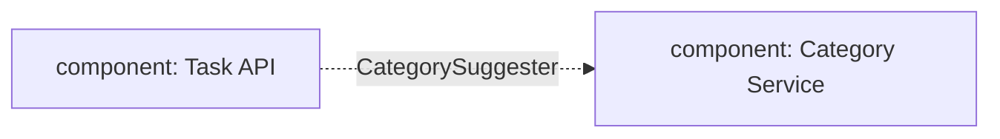

Условно представяне: кутиите са компоненти; надписът на зависимостта обозначава договора. UML портове и предоставени/изисквани интерфейси се описват допълнително.

[Еталон за UML нотацията](/courses/diagrams/task-manager-uml/component.svg)

#### 5.5. Composite Structure — диаграма на съставната структура

Описва вътрешни части `име:Тип`, портове като квадратчета и конектори в един структуриран класификатор.

**Пример:** CategoryFacade съдържа validator и predictor, свързани през входен порт. Използвайте за сътрудничеството на вътрешните части, които реализират външен договор.

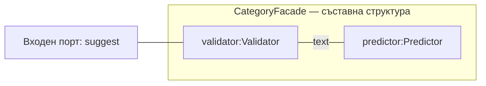

Условно представяне: групата е структурираният класификатор; вътрешните кутии са части, а линиите — конектори. Входният порт е означен с текст вместо UML квадратче.

[Еталон за UML нотацията](/courses/diagrams/task-manager-uml/composite-structure.svg)

#### 5.6. Deployment — диаграма на разполагането

Показва възли, среди, артефакти и комуникационни пътища. Възелът е тримерна кутия; `«artifact»` обозначава внедряван файл. Компонент и артефакт са различни понятия.

**Пример:** JVM със Spring приложение, PostgreSQL и Python услуга с модел. Използвайте за мрежови граници и среда. Python услугата е целеви вариант, който предстои да се реализира.

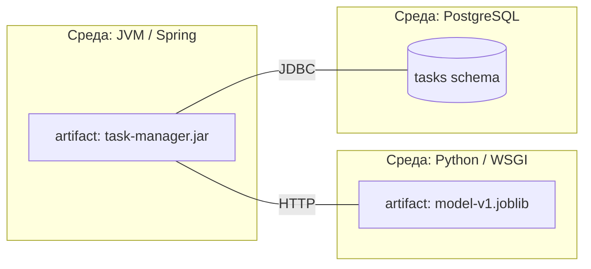

Условно представяне: групите са среди, вътрешните елементи — артефакти, а линиите — комуникационни пътища. Това не е тримерната UML нотация за възел.

[Еталон за UML нотацията](/courses/diagrams/task-manager-uml/deployment.svg)

#### 5.7. Profile — диаграма на профилите

Разширява UML чрез стереотипи, свойства и ограничения. `«stereotype»` дефинира стереотип; extension с плътна триъгълна стрелка сочи разширявания UML метаклас. Прилагането се изписва като `«ModelService»` върху елемент.

**Пример:** ModelService разширява Component със свойство modelVersion и ограничение то да не е празно. Подходящо е при общи правила за много модели; малък проект често няма нужда от собствен профил.

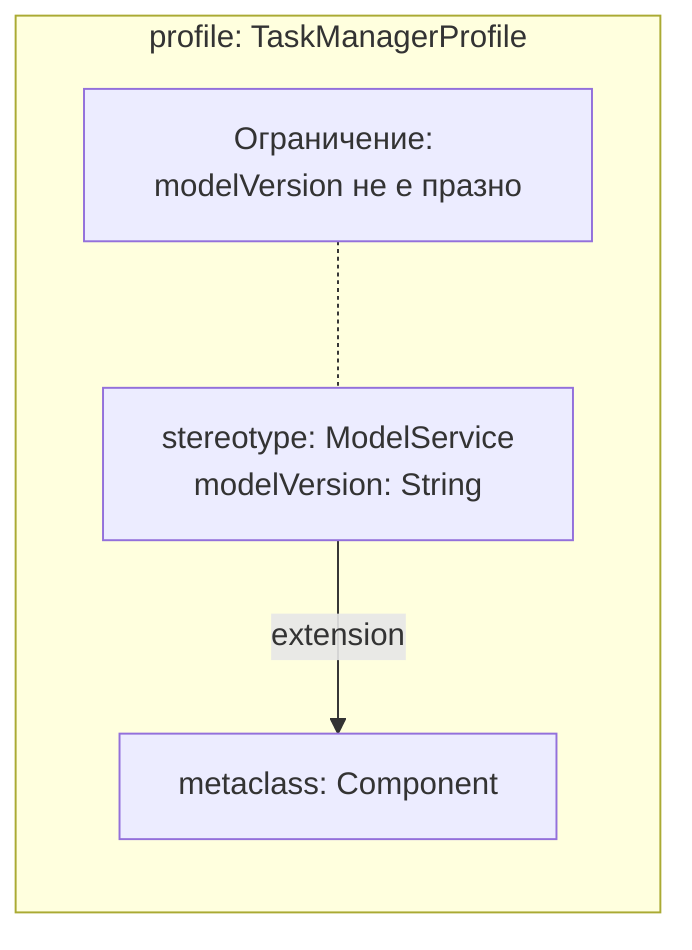

Условно представяне: extension сочи разширявания метаклас. Обикновената стрелка на flowchart не е специалната UML extension стрелка; ограничението е записано изрично.

[Еталон за UML нотацията](/courses/diagrams/task-manager-uml/profile.svg)

### 6. Поведенчески диаграми

#### 6.1. Use Case — диаграма на случаите на употреба

Актьорите са външни роли; елипсите — цели в границата на системата. `«include»` сочи задължително включван случай; `«extend»` сочи разширявания случай при условно поведение. Входът може да е предусловие.

**Пример:** създаване на задача, получаване на предложение и потвърждаване на категория. Използвайте за обхвата; диаграмата не задава реда на действията.

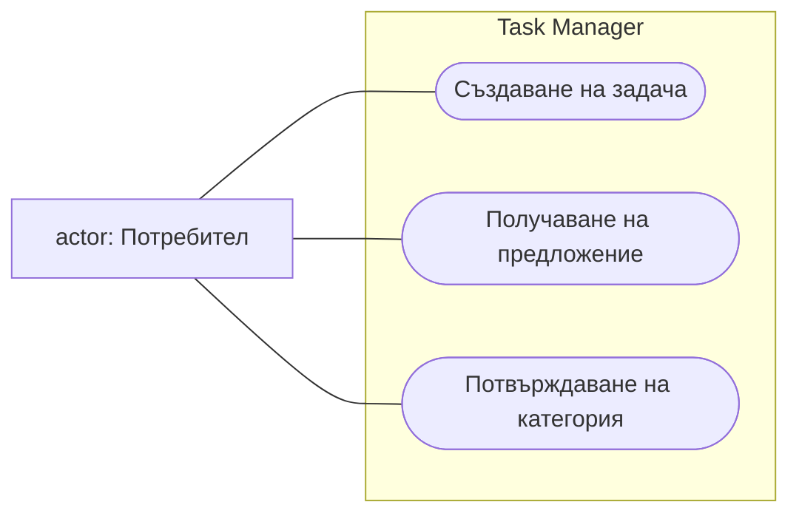

Условно представяне: заоблените възли са цели, външният правоъгълник — актьор, групата — граница на системата. Mermaid flowchart няма семантика на UML include/extend; при нужда я опишете изрично.

[Еталон за UML нотацията](/courses/diagrams/task-manager-uml/use-case.svg)

#### 6.2. Activity — диаграма на дейностите

Показва поток от действия: начало, заоблени действия, решения с условия `[guard]` и край. Fork/join с дебела линия са за паралелност; decision/merge с ромб — за алтернативи.

**Пример:** проверка на формата → запис или грешка. Използвайте за процеси; изходните условия трябва да са непротиворечиви.

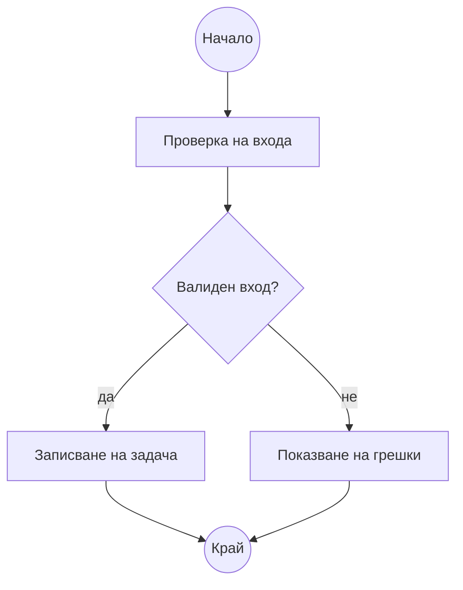

Условно представяне: правоъгълниците са действия, ромбът е решение, а означените кръгове — начало и край. За fork/join добавете изрична легенда; разклонение на flowchart само по себе си не задава UML паралелност.

[Еталон за UML нотацията](/courses/diagrams/task-manager-uml/activity.svg)

#### 6.3. State Machine — диаграма на състоянията

Описва жизнения цикъл на обект. Преходът е `събитие [условие] / ефект`; състоянието е устойчиво положение, а действието — операция.

**Пример:** OPEN → IN_PROGRESS → DONE и изрично повторно отваряне. DONE не е UML краен възел, защото допуска изходящ преход. Използвайте за разрешени и забранени промени на статус.

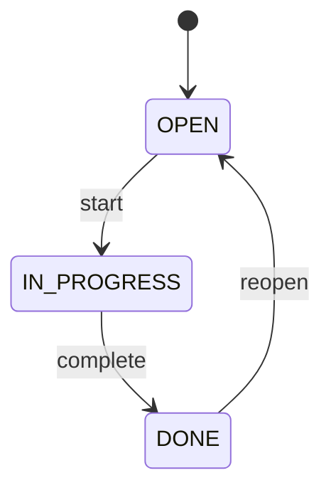

### 7. Диаграми на взаимодействие

#### 7.1. Sequence — диаграма на последователността

Вертикалните линии са lifelines; времето върви надолу. Съобщенията свързват участници, активацията показва изпълнение, прекъснатата обратна стрелка — отговор. Фрагменти `alt`, `opt` и `loop` описват алтернативи, условност и повторение.

**Пример:** клиент → Task API → Category Service → предложение. Използвайте за реда на извикванията и обработката на отказ.

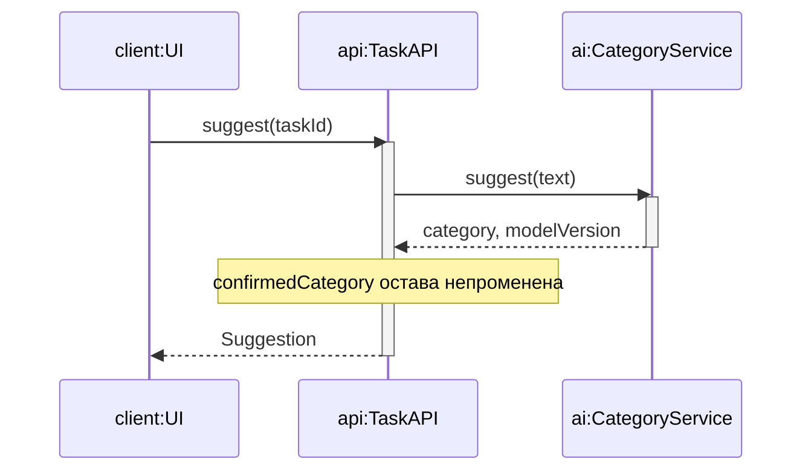

#### 7.2. Communication — диаграма на комуникацията

Акцентира върху връзките между участниците. Номера `1`, `1.1`, `1.2` задават ред и вложеност; стрелките — посока.

**Пример:** същият сценарий за предложение, показан като мрежа от участници. Използвайте за отговорности и свързаност; неномерираните линии не задават последователност.

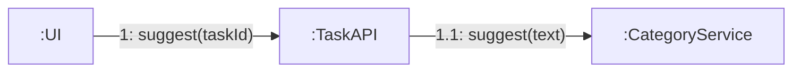

Условно представяне: етикетите 1 и 1.1 задават реда и вложеността. Стрелките показват посоката на съобщенията между участниците.

[Еталон за UML нотацията](/courses/diagrams/task-manager-uml/communication.svg)

#### 7.3. Interaction Overview — обзор на взаимодействията

Организира взаимодействия в поток с начало, край, решения и взаимодействия. Рамка `ref` препраща към отделно описано взаимодействие.

**Пример:** `ref CreateTask` → по желание `ref SuggestCategory` → `ref ConfirmCategory`. Използвайте за общ процес, чиито подробности са отделни Sequence диаграми.

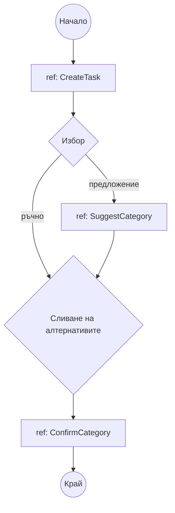

Условно представяне: ref възлите препращат към отделни взаимодействия. Ромбът за сливане събира алтернативни потоци, без да ги синхронизира като join.

[Еталон за UML нотацията](/courses/diagrams/task-manager-uml/interaction-overview.svg)

#### 7.4. Timing — времева диаграма

Показва състояние или стойност по хоризонтална времева ос. Ограниченията задават моменти и интервали с мерни единици.

**Пример:** Idle → Waiting → Fallback при изчерпан бюджет 1500 ms. Използвайте за времеви договори; картината е изискване, а не доказателство за измерена производителност.

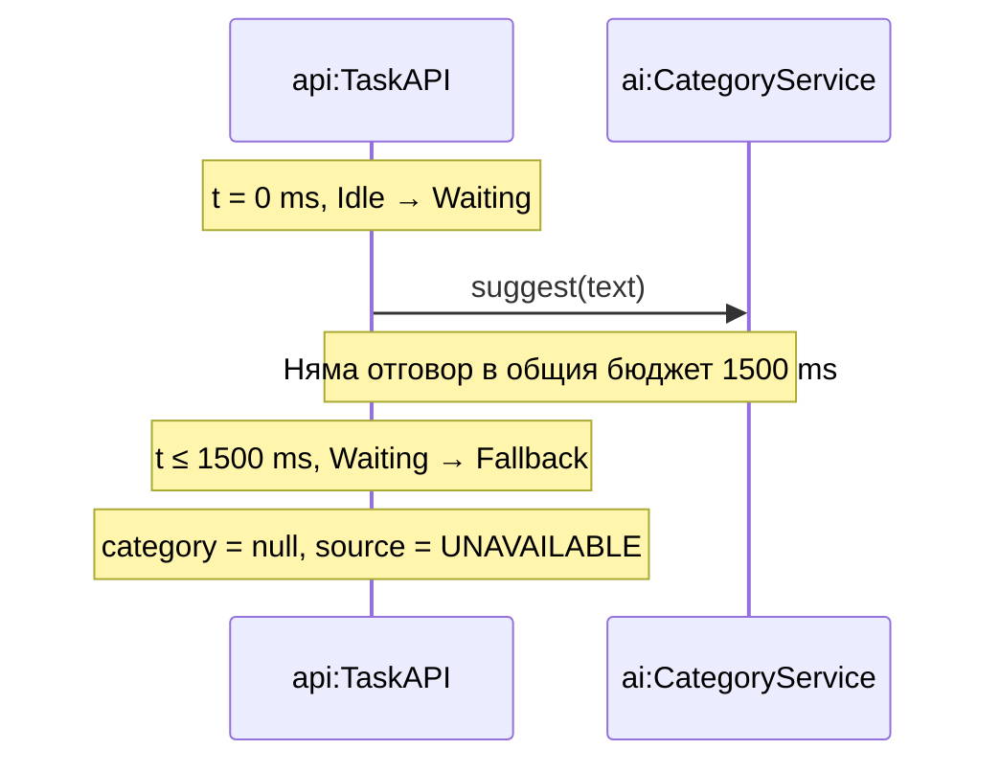

Условно представяне чрез sequenceDiagram с времеви бележки. Вертикалното разстояние не е времева скала и това не е истинска UML Timing диаграма; състоянията, моментите и бюджетът са записани като текст.

[Еталон за UML нотацията](/courses/diagrams/task-manager-uml/timing.svg)


## Примерен проблем

Sprint Backlog съдържа AI-01b: договор за категоризатора. Двама разработчици трябва да работят едновременно по Java приложението и бъдещия Python модел, без да си противоречат за данните и отказите. Използваме SRS от [упражнение 2](/courses/bg/software-engineering-ai/laboratorno-uprazhnenie-2/).

### Стъпка 1. Попълнено архитектурно решение

В `docs/adr/001-categorizer.md` записваме следния завършен модел на решението:

| Поле | Решение |
| --- | --- |
| Контекст | Основният API е Java; обучението ще използва Python; предложението е помощна функция |
| Алтернативи | Вграден категоризатор; отделна услуга с HTTP договор |
| Избор | Java порт CategorySuggester, първо правила, после HTTP адаптер към Python |
| Данни | Task Manager притежава задачите и confirmedCategory; AI получава само summary и description |
| Обучение | Отделна команда създава артефакт; няма fit по време на потребителска заявка |
| Разполагане | category:8000 във вътрешна мрежа; артефакт само за четене; няма достъп до базата на Task Manager |
| Последствия | Независими библиотеки и модели; допълнителна конфигурация, timeout и договорни тестове |
| Преразглеждане | Измереното време за мрежов преход или разходът за поддръжка надхвърля договореното |

### Стъпка 2. Конкретен договор и fixtures

Вътрешният `POST /suggest` приема JSON с непразни низове summary (10–255 знака) и description (10–2500 знака), съгласувани с Task Manager. Успехът връща HTTP 200. Невалиден вход → 400; незареден модел → 503. `/health` връща 200 с версия само при зареден модел, иначе 503. Това са договори за бъдещата AI услуга.

```json
{"summary":"Fix login validation","description":"Show a clear error for invalid input"}
```

Примерен отговор на вътрешната услуга:

```json
{"category":"BUG","modelVersion":"v1"}
```

| Fixture | Вътрешен отговор | Публичен резултат от Task API | Запис в задачата |
| --- | --- | --- | --- |
| success | 200, BUG, v1 | 200, BUG, MODEL, v1 | Няма |
| invalid-label | 200, UNKNOWN, v1 | 200, null, UNAVAILABLE, null | Няма |
| missing-version | 200, BUG, без версия | 200, null, UNAVAILABLE, null | Няма |
| unavailable | 503 | 200, null, UNAVAILABLE, null | Няма |

Стойността v1 в fixture е вход за договорна проверка, не твърдение за вече обучен модел. Потвърждението използва отделен `PATCH /tasks/{id}/category`. OTHER може да се използва само като изрично договорено въздържане.

### Стъпка 3. Модел и проверка на противоречие

Sequence моделът в раздела за взаимодействия показва отделни операции за предложение и потвърждение. Component моделът поставя CategorySuggester между приложението и реализацията; Deployment моделът показва отделната среда. Class моделът държи confirmedCategory в Task, а не в модела за предсказване.

| Изискване | Връзка в модела | Проверка върху модела |
| --- | --- | --- |
| FR-02 | Sequence: suggest → Suggestion | Между заявката и отговора няма запис на confirmedCategory |
| FR-03 | Sequence: confirm → repository | Записът е след отделна потребителска команда |
| NFR-01 | Алтернатива при отказ | UNAVAILABLE не преминава през confirm |
| NFR-02 | Поле modelVersion | Версията идва от артефакта на AI услугата |

Ако първоначалният модел има `suggest → save(category)`, корекцията е премахване на тази връзка и оставяне на `confirm → save(category)`. Проследяваме success и unavailable от таблицата: и двата завършват без запис. Това е проверка на проекта; изпълнението през API се доказва след реализацията. AI инженерът предава договора и fixtures на backend разработчика и записва неяснотите като backlog работа.
