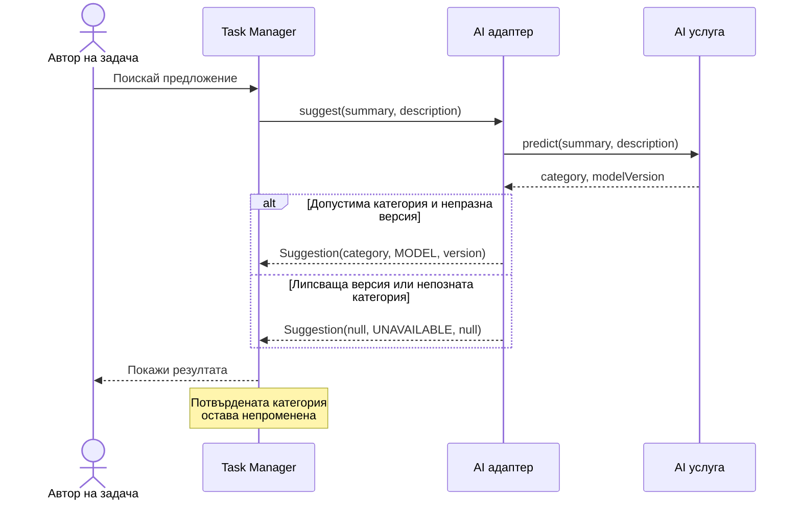

# Упражнение 5 — Контролно 1 — UML и проектиране на AI компонент

## Обхват на контролното

Контролното обхваща материала до [упражнение 4](/courses/bg/software-engineering-ai/laboratorno-uprazhnenie-4/), с акцент върху UML и проектирането на заменяем AI компонент. Ще създадете Use Case, Sequence и Class диаграми за един общ казус, подкрепени с кратки изисквания и Sprint Goal. Използвайте нотацията и Mermaid от [упражнение 3](/courses/bg/software-engineering-ai/laboratorno-uprazhnenie-3/). Предавате модели и обосновка; програмиране, стартиране на Task Manager и обучение на модел не се изискват.

## Примерен проблем за подготовка

Категоризаторът връща отговор без версия. Валидният JSON не е достатъчен: Task Manager не трябва да показва непроверим резултат като MODEL. Ще моделираме проверката на отговора, след което ще я свържем с изпълним пример.

### Решен UML модел



Проверете модела с два входа: `{"category":"BUG","modelVersion":"v1"}` преминава през първия клон, а `{"category":"BUG"}` — през втория. В нито един клон няма операция за запис на категорията. Това е проверка на модела; поведението на реалната система се доказва отделно.

### Решение

Запишете `contract_demo.py`:

```python
def adapt(response):
    unavailable = {"category": None, "source": "UNAVAILABLE", "modelVersion": None}
    if not isinstance(response, dict):
        return unavailable
    category, version = response.get("category"), response.get("modelVersion")
    if category not in ("BUG", "FEATURE", "DOCUMENTATION", "OTHER"):
        return unavailable
    if not isinstance(version, str) or not version.strip():
        return unavailable
    return {"category": category, "source": "MODEL", "modelVersion": version}

assert adapt({"category": "BUG"})["source"] == "UNAVAILABLE"
assert adapt({"category": "BUG", "modelVersion": "v1"})["modelVersion"] == "v1"
assert adapt({"category": "UNKNOWN", "modelVersion": "v1"})["category"] is None
print("PASS: contract validation")
```

### Проверка на резултата

При `python contract_demo.py` очаквайте `PASS: contract validation`. Функцията проверява формата на отговора; не удостоверява произхода на самия модел. В Sequence модела невалидният отговор отива към UNAVAILABLE, а Task остава непроменена. Следващата работа в backlog е интегриране на тази проверка в адаптера.
