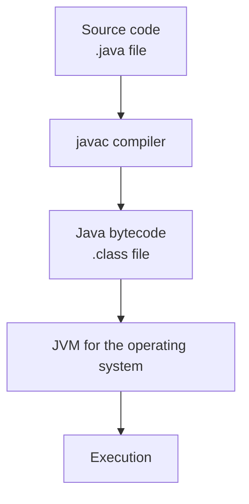
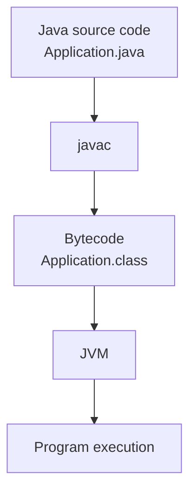
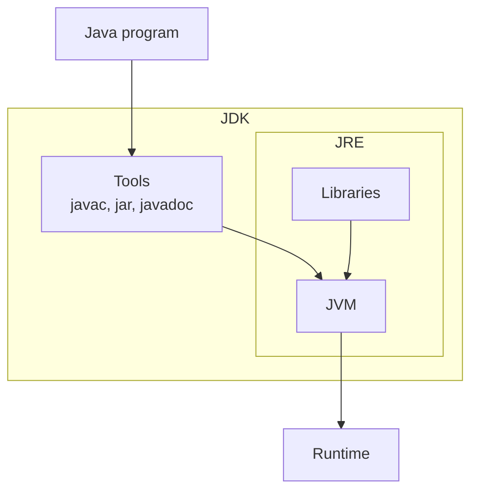

# Key Features of Java

## Java Is Platform-Independent

The `javac` compiler converts source code (`.java`) into **Java bytecode** (`.class`). Bytecode is executed by the Java Virtual Machine (JVM). Because a JVM implementation exists for each operating system, the same bytecode can run without modification on Windows, Linux, macOS, and other operating systems.

## Java Is an Object-Oriented Language

Java is an object-oriented programming language. Object-oriented programming (OOP) is a paradigm in which a program is modeled through interacting classes and objects. Each object is an instance of a particular class.

The main principles of OOP are:

1. Abstraction
2. Encapsulation
3. Inheritance
4. Polymorphism

The principles of object-oriented programming are explored in detail in later lab exercises.

## Java Is Reliable

Java was designed with reliability in mind. The compiler detects many potential errors during compilation, while automatic memory management reduces the risk of memory-related errors.

**Java uses an automatic memory management mechanism called the Garbage Collector (GC)**. It releases dynamically allocated memory when that memory is no longer reachable by the running program. This reduces errors associated with explicitly managing the lifecycle of dynamically allocated memory.

## Java Has a Rich Standard Library

Java provides a rich standard library with ready-to-use classes for collections, files, network applications, multithreaded programming, dates, and more.

## Java Supports Distributed Application Development

Java provides tools for developing applications that exchange data over a network.

## Java Supports Multithreading

Java provides language and library features for running multiple threads within a program.

## Common Java Terms

Before developing Java applications, it is useful to understand several basic concepts related to compilation and program execution. The most important are **Java bytecode**, **JVM**, **JRE (Java Runtime Environment)**, and **JDK (Java Development Kit)**.

## Java Bytecode

**Java bytecode** is an intermediate form of code generated when a Java program is compiled. It is stored in files with the `.class` extension and executed by the Java Virtual Machine.

Bytecode allows the same Java program to run on different operating systems without being recompiled.

## Java Virtual Machine (JVM)

The Java Virtual Machine (JVM) is a virtual machine that provides an environment for executing Java bytecode. It is not a physical device; it is a specification implemented differently for each operating system.

The JVM's main tasks are loading classes, verifying bytecode, executing bytecode, and managing memory at runtime with the Garbage Collector.

## Java Runtime Environment (JRE)

The Java Runtime Environment (JRE) provides the environment needed to run Java applications. It includes the JVM and the standard libraries used while a program is running.

If a computer has only the JRE installed, it can run existing Java applications, but it cannot compile new programs.

## Java Development Kit (JDK)

The Java Development Kit (JDK) is a set of tools for developing Java applications. In addition to the JRE, it includes the `javac` compiler, documentation tools, and other utilities needed to develop and test programs.

*Compilation and execution process*

*Components of the Java platform*

