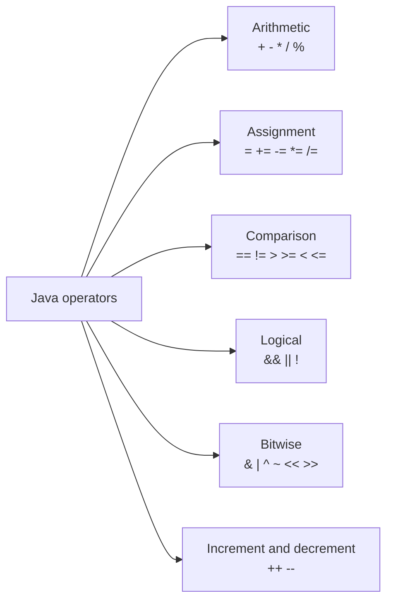

# Operators

Operators perform operations on one or more values. Most Java operators are similar to those used in other programming languages. For complex expressions, use parentheses even when you know the operator precedence. This makes the code easier to read.



## Integer Division

When two integers are divided, the result is also an integer. The fractional part is discarded:

```java
int result = 5/2;
System.out.println(result);          // 2

double secondResult = 5/2;
System.out.println(secondResult);    // 2.0
```

`secondResult` is 2.0 because the division is still integer division, even though the result is stored in a different variable type.

## Remainder

```java
int remainder = 10 % 3;
System.out.println(remainder);       // 1
```

The `%` operator returns the remainder after division.

## Increment and Decrement

```java
int number = 6;
number++;
number--;
```

The `++` and `--` operators increase or decrease a variable's value by one.

## Short-Circuit Evaluation

```java
if (number != 0 && 10/number > 1) {
    System.out.println("Valid");
}
```

With the `&&` operator, if the first condition is `false`, the second is not evaluated. Similarly, with `||`, if the first condition is `true`, the second is not evaluated.

## Logical Operators

Logical operators combine or negate boolean expressions. Their result is always a `boolean` value (`true` or `false`).

| Operator | Meaning | Example | Result |
| -------- | ------- | ------- | ------ |
| `&&` | logical AND | `true && true` | `true` |
| `&&` | logical AND | `true && false` | `false` |
| `&&` | logical AND | `false && true` | `false` |
| `&&` | logical AND | `false && false` | `false` |
| `||` | logical OR | `true || true` | `true` |
| `||` | logical OR | `true || false` | `true` |
| `||` | logical OR | `false || true` | `true` |
| `||` | logical OR | `false || false` | `false` |
| `!` | logical NOT | `!true` | `false` |
| `!` | logical NOT | `!false` | `true` |

## Bitwise Operators

Bitwise operators work with the binary representation of numbers. They are useful when tracing expressions, working with flags, and performing low-level operations.

Bitwise operations follow the same logical principles as logical operators, but apply them to individual bits. A bit with value 1 can be treated as logical true, and a bit with value 0 as logical false. The table shows the results of bitwise AND, OR, and XOR.

| Operator | Meaning | Example | Result |
| -------- | ------- | ------- | ------ |
| `&` | AND | `1 & 1` | `1` |
| `&` | AND | `1 & 0` | `0` |
| `&` | AND | `0 & 1` | `0` |
| `&` | AND | `0 & 0` | `0` |
| `|` | OR | `1 | 1` | `1` |
| `|` | OR | `1 | 0` | `1` |
| `|` | OR | `0 | 1` | `1` |
| `|` | OR | `0 | 0` | `0` |
| `^` | XOR | `1 ^ 1` | `0` |
| `^` | XOR | `1 ^ 0` | `1` |
| `^` | XOR | `0 ^ 1` | `1` |
| `^` | XOR | `0 ^ 0` | `0` |
