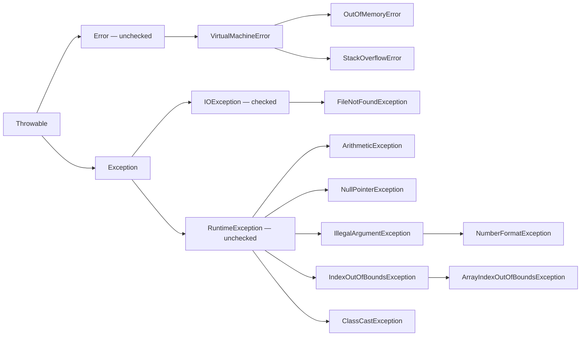

# Exception Handling

An exception is an object that describes an unusual situation while a program is running. When an exception is thrown, the normal flow of the current block is interrupted and Java looks for an appropriate handler. If no calling method handles it, the affected thread ends; in an ordinary single-threaded program, this terminates the program.

```java
int result = 10 / 0;
```

This example causes an `ArithmeticException`, because integer division by zero is not possible.

## `try` and `catch`

A `try` block contains code that might throw an exception. A `catch` block contains code to handle a particular exception type.

```java
try {
    int result = 10 / 0;
    System.out.println(result);
} catch (ArithmeticException exception) {
    System.out.println("Division by zero is not allowed.");
}
```

If an `ArithmeticException` occurs in `try`, execution moves to `catch`. The program runs the planned handling code instead of terminating abruptly.

## Exception Hierarchy

All Java exceptions and errors extend `Throwable`. Its two main subclasses are `Error` and `Exception`.

`Error` describes serious problems in the runtime environment. Application code usually does not handle such problems.

`Exception` describes situations that a program can anticipate and handle.

The diagram shows part of the hierarchy. Arrows point **from a parent to its direct subclass**.



The `RuntimeException` branch and the `Error` branch are unchecked. `Exception` and its subclasses outside the `RuntimeException` branch are checked. See the [Java Language Specification, §11.1.1](https://docs.oracle.com/javase/specs/jls/se21/html/jls-11.html#jls-11.1.1).

## Exceptions and Errors

The everyday meaning of “error” is broader than Java's `Error` class.

| Situation | How it appears | Approach |
| --------- | -------------- | -------- |
| Compilation error | Missing `;`, incompatible type | Fix the source code; `catch` does not handle it |
| Logic error | Incorrect formula, but the program continues | Use known-result checks and a debugger |
| `Exception` | For example, invalid number or unavailable file | Handle it where meaningful action can be taken |
| `Error` | For example, exhausted memory or stack | Usually fix the cause; it is not normal program flow |

`catch (Exception exception)` does not catch `Error`, because the two classes are different subclasses of `Throwable`. Do not use `catch (Throwable ...)` to hide every problem. Catch specific types for which you can provide a useful message, retry the operation, or restore state.

## The `Throwable` Class

`Throwable` is the base class for all objects that can be thrown and handled as runtime problems. Both `Exception` and `Error` extend it.

An exception object contains information about the problem. Some of this information is available through inherited methods.

| Method | Purpose |
| ------ | ------- |
| `getMessage()` | Returns the exception's description |
| `printStackTrace()` | Prints information about the exception and the call stack |
| `getStackTrace()` | Returns the call stack as an array of `StackTraceElement` |

```java
try {
    int number = Integer.parseInt("abc");
} catch (NumberFormatException exception) {
    System.out.println(exception.getMessage());
}
```

`getMessage()` returns the message associated with the specific exception. The call stack shows which methods execution passed through before the problem occurred.

## Checked and Unchecked Exceptions

The compiler checks **checked exceptions**. If a method can cause a checked exception, the compiler requires it to be handled with `try-catch` or declared with `throws` in the method signature.

Unchecked types include `RuntimeException`, `Error`, and their subclasses. The compiler does not require them to be handled or declared. “Checked” does not mean that the problem occurs at compile time: the compiler checks the obligation to handle it, while the exception itself occurs at runtime.

## Array and Type-Cast Exceptions

Accessing an array outside its bounds causes `ArrayIndexOutOfBoundsException`:

```java
int[] numbers = {10, 20};
// System.out.println(numbers[2]); // valid indices are 0 and 1
```

An incompatible explicit reference cast causes `ClassCastException`:

```java
Object value = "Java";
// Integer number = (Integer) value; // the object is a String, not an Integer
```

These are the problems introduced when studying arrays and polymorphism. Correct bounds and compatible types prevent their causes; `try-catch` does not automatically fix an incorrect algorithm.

## `NullPointerException`

`NullPointerException` is an unchecked exception. It occurs when code tries to access a field or method through a reference whose value is `null`.

```java
String text = null;
System.out.println(text.length());
```

The `text` variable does not refer to an actual object, so calling `length()` causes a `NullPointerException`.

Before using the reference, make sure it refers to an object.

```java
if (text != null) {
    System.out.println(text.length());
}
```

## `NumberFormatException`

`NumberFormatException` is an unchecked exception. It occurs when text cannot be converted to a number.

```java
String value = "abc";
int number = Integer.parseInt(value);
```

`Integer.parseInt(value)` expects text containing a valid integer. The text `"abc"` cannot be converted to an `int`, so a `NumberFormatException` occurs.

```java
try {
    int number = Integer.parseInt(value);
    System.out.println(number);
} catch (NumberFormatException exception) {
    System.out.println("Invalid number.");
}
```

This exception is common when working with input, because the value entered is initially text.

## Multiple `catch` Blocks

A `try` block can be followed by several `catch` blocks. Each one handles a different exception type.

```java
try {
    int[] numbers = {1, 2, 3};
    int index = Integer.parseInt("5");
    System.out.println(numbers[index]);
} catch (NumberFormatException exception) {
    System.out.println("Invalid number.");
} catch (ArrayIndexOutOfBoundsException exception) {
    System.out.println("Invalid index.");
}
```

If the text cannot be converted to a number, the first `catch` block runs. If the index is outside the array bounds, the second one runs.

The order of `catch` blocks matters. Put more specific types before more general types.

## Multi-catch

When several exception types need the same handling, use `multi-catch`. Separate the types with `|`.

```java
try {
    int[] numbers = {1, 2, 3};
    int index = Integer.parseInt("5");
    System.out.println(numbers[index]);
} catch (NumberFormatException | ArrayIndexOutOfBoundsException exception) {
    System.out.println("Invalid input.");
}
```

Here, both exception types lead to the same handling. The `exception` variable contains the specific exception object that occurred.

## `finally`

A `finally` block runs **when leaving the `try` block or its selected `catch` block**, whether or not an exception occurred. This includes normal completion, a handled or unhandled exception, `return`, `break`, and `continue`.

```java
try {
    System.out.println("Open resource");
} catch (RuntimeException exception) {
    System.out.println("Handle error");
} finally {
    System.out.println("Close resource");
}
```

Use `finally` to release resources when that is not handled automatically.

```java
static int calculate() {
    try {
        return 42;
    } finally {
        System.out.println("Finally before return");
    }
}
```

Calling `System.out.println(calculate())` first prints the message from `finally`, then `42`.

This guarantee assumes that the JVM continues running. If the JVM exits, for example through `System.exit(...)`, or the process is forcibly stopped, `finally` may not run. If `try` never completes, for example because of an infinite loop, `finally` is not reached yet. See the [official description of finally](https://docs.oracle.com/javase/tutorial/essential/exceptions/finally.html).

Do not put `return` or a new `throw` in `finally`: either can replace the original result or hide the original exception. For `AutoCloseable` resources, prefer `try-with-resources`.

## `throw`

Use the `throw` keyword to explicitly signal an exception by throwing a specific exception object.

```java
public void setAge(int age) {
    if (age < 0) {
        throw new IllegalArgumentException("Age cannot be negative.");
    }
}
```

The method rejects an invalid state. A negative value causes an `IllegalArgumentException`.

`throw` interrupts normal execution of the current block. After the exception is thrown, execution transfers to an appropriate `catch` block. If there is no handler, the exception is passed to the calling code.

## `throw` in a Constructor

A constructor can validate supplied values. If the values cannot create a valid object, it can throw an exception.

```java
class Product {

    String name;
    double price;

    Product(String name, double price) {
        if (price < 0) {
            throw new IllegalArgumentException("Price cannot be negative.");
        }

        this.name = name;
        this.price = price;
    }
}
```

This example does not allow a product with a negative price. An object is created only if its initial state is valid.

## `throw` in a `record`

A `record` can define a compact constructor to validate values before creating an object.

```java
record Product(String name, double price) {

    Product {
        if (price < 0) {
            throw new IllegalArgumentException("Price cannot be negative.");
        }
    }
}
```

A compact constructor does not assign values to fields manually. After the checks, the compiler assigns the parameters to their corresponding components automatically. If an exception is thrown, the record object is not created.

## `throws`

Use `throws` in a method declaration to indicate that the method can pass an exception to its caller.

```java
public static String readFirstLine(String path) throws IOException {
    return Files.readAllLines(Path.of(path)).get(0);
}
```

The code calling this method must handle `IOException` or declare it as well.

## The Difference Between `throw` and `throws`

`throw` and `throws` serve different purposes, although both keywords relate to exceptions.

| Keyword | Where it is used | Purpose |
| ------- | ---------------- | ------- |
| `throw` | In a method, constructor, or block body | Throws a specific exception object |
| `throws` | In a method or constructor declaration | Declares that an exception may be passed to the caller |

```java
public static void validateAge(int age) {
    if (age < 0) {
        throw new IllegalArgumentException("Age cannot be negative.");
    }
}
```

In this example, `new` creates the exception object and `throw` throws it. `throw` can also throw an object that already exists.

```java
public static String readText(String path) throws IOException {
    return Files.readString(Path.of(path));
}
```

Here, `throws IOException` does not throw an exception by itself. It indicates that the method may pass an `IOException` to its caller.

## Custom Exceptions

Define a custom exception with a class that extends `Exception` or `RuntimeException`.

```java
class InvalidGradeException extends RuntimeException {

    public InvalidGradeException(String message) {
        super(message);
    }
}
```

A custom exception describes an error in a particular domain with a more specific type.

## `try-with-resources`

Use `try-with-resources` for resources that must be closed. The resource is closed automatically when the block ends.

```java
class SimpleResource implements AutoCloseable {

    public void use() {
        System.out.println("Resource is used");
    }

    @Override
    public void close() {
        System.out.println("Resource is closed");
    }
}

try (SimpleResource resource = new SimpleResource()) {
    resource.use();
}
```

The resource must implement `AutoCloseable`. After the `try` block ends, `close()` is called automatically. This construct reduces the risk of leaving a resource open.
