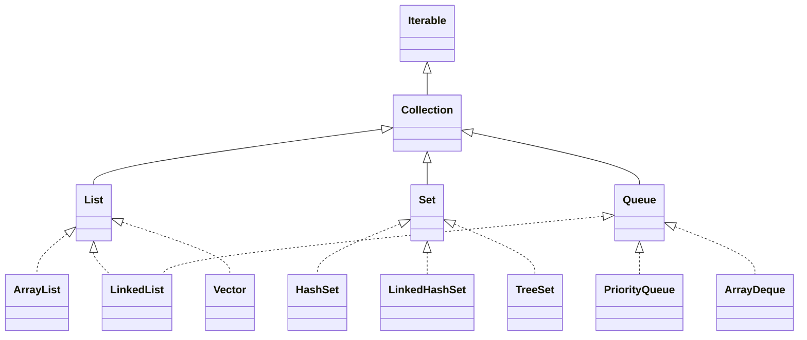

# Collections and the Collection Interface

## Data structures

A data structure organizes and stores information so it can be accessed and processed efficiently. Common examples include arrays, linked lists, hash tables, and trees.

Typical operations include adding, deleting, searching, and traversing elements. Java implements data structures through arrays and the Java Collections Framework (JCF). This lesson covers interfaces that extend `Collection`; `Map` is introduced separately.

## Java Collections Framework

The Java Collections Framework is a set of interfaces and classes for working with groups of objects. It provides ready-made data structures and a common set of operations for adding, removing, searching, traversing, and sorting elements.

Collections are dynamic and flexible, offer extensive functionality, and work with objects (reference types) rather than primitive values.

## Arrays and collections

| Property | Array | Collection |
| --- | --- | --- |
| Size | Fixed | Dynamic |
| Data types | Primitive and reference | Reference types only |
| Duplicates | Allowed | Depends on the collection |
| Access | By index | Depends on the collection |
| Functionality | Limited | Extensive |
| Flexibility | Low | High |

Arrays are suitable when the size is known in advance and fast indexed access is needed. Collections are often preferable when the number of elements changes or elements must be added, removed, searched, or sorted frequently.

## The `Collection` interface



The main interfaces in this hierarchy provide different operations:

| Interface | Main operations |
| --- | --- |
| `Iterable` | `iterator()` |
| `Collection` | `size()`, `add(element)`, `remove(element)`, `contains(element)`, `iterator()` |
| `List` | `get(index)`, `set(index, element)` |
| `Set` | Stores unique elements |
| `Queue` | `offer(element)`, `poll()`, `peek()` |

`Collection` is the base interface in the Java Collections Framework. Common methods include:

```java
int size();                         // number of elements
boolean isEmpty();                  // whether the collection is empty
boolean contains(Object element);   // whether an element is present
boolean add(E element);             // add an element
boolean remove(Object element);     // remove an element
Iterator<E> iterator();             // obtain an iterator
boolean containsAll(Collection<?> c);
boolean addAll(Collection<? extends E> c);
boolean removeAll(Collection<?> c);
boolean retainAll(Collection<?> c); // keep only elements also in c
void clear();
Object[] toArray();
<T> T[] toArray(T[] a);
```

Example:

```java
public class Application {
    public static void main(String[] args) {
        Collection<String> fruits = new ArrayList<>();
        fruits.add("Apple");
        fruits.add("Banana");
        fruits.add("Orange");

        System.out.println(fruits.contains("Banana"));
        System.out.println(fruits.size());
        fruits.remove("Banana");
        System.out.println(fruits);
    }
}
```

Three elements are added, membership and size are checked, one element is removed, and the remaining contents are printed:

```text
true
3
[Apple, Orange]
```

## The `List` interface

`List` is an ordered collection that allows duplicates, preserves insertion order, supports indexed access, and permits access to any element by index.

It is useful for lists, sequences, work queues, and collections where order matters. Common implementations include:

- `ArrayList`: fast indexed access; insertion and deletion in the middle can be slower.
- `LinkedList`: slower searching, but insertion and removal can be efficient.
- `Vector`: an older synchronized implementation, now relatively uncommon.

```java
List<String> names = new ArrayList<>();
names.add("Ivan");
names.add("Maria");
names.add("Georgi");

System.out.println(names.get(1));
names.remove(0);
System.out.println(names);
```

`get()` retrieves an element by index; `remove()` removes an element:

```text
Maria
[Maria, Georgi]
```

## The `Set` interface

`Set` stores unique elements, does not support indexes, and does not allow duplicates. It is useful for removing duplicates, representing mathematical sets, and quickly checking whether a unique element is present.

Common implementations:

- `HashSet`: generally fast, with no guaranteed iteration order.
- `LinkedHashSet`: preserves insertion order.
- `TreeSet`: keeps elements sorted.

```java
Set<String> cities = new HashSet<>();
cities.add("Varna");
cities.add("Sofia");
cities.add("Varna");
System.out.println(cities);
```

The duplicate value appears only once:

```text
[Varna, Sofia]
```

## The `Queue` interface

A `Queue` follows the FIFO (First In, First Out) principle: new elements are added at the end and processing starts with the earliest element. Queues are used for requests, buffers, producer–consumer tasks, and algorithms such as breadth-first search (BFS).

| Operation | Add | Remove | Inspect |
| --- | --- | --- | --- |
| May throw an exception | `add()` | `remove()` | `element()` |
| Returns a special value on failure/empty queue | `offer()` | `poll()` | `peek()` |

Use `add()`, `remove()`, and `element()` when failure is considered a programming error that should be signalled immediately with an exception. If the condition is expected and should be handled normally, prefer `offer()`, `poll()`, and `peek()`.

Common implementations include `LinkedList`, `PriorityQueue`, and `ArrayDeque`.

```java
Queue<String> queue = new LinkedList<>();
queue.offer("Task 1");
queue.offer("Task 2");
queue.offer("Task 3");

System.out.println(queue.peek());
System.out.println(queue.poll());
System.out.println(queue.peek());
```

`peek()` returns the first element without removing it; `poll()` retrieves and removes it:

```text
Task 1
Task 1
Task 2
```

## Iterators

All collections that extend `Collection` implement `Iterable`, which enables the enhanced `for` loop. For more flexible traversal, use an `Iterator`. It provides a standard way to visit elements without knowing the collection's internal implementation; conceptually, it is a cursor moving through the elements.

```java
public interface Iterable<T> {
    Iterator<T> iterator();
}

public interface Iterator<E> {
    boolean hasNext();
    E next();
    void remove();
}
```

The main methods are `hasNext()`, which checks whether another element exists; `next()`, which returns it; and `remove()`, which removes the last returned element.

```java
Iterator<String> iterator = names.iterator();
while (iterator.hasNext()) {
    System.out.println(iterator.next());
}
```

## Sorting collections

Elements in `List` collections can be sorted using `Comparable` and `Comparator`.

## `Comparable`

`Comparable` defines the natural order of objects.

```java
public class Book implements Comparable<Book> {
    private final String title;
    private final String author;
    private final int publishingYear;
    private final double price;

    public Book(String title, String author, int publishingYear, double price) {
        this.title = title;
        this.author = author;
        this.publishingYear = publishingYear;
        this.price = price;
    }

    public String getTitle() { return title; }
    public String getAuthor() { return author; }
    public int getPublishingYear() { return publishingYear; }
    public double getPrice() { return price; }

    @Override
    public int compareTo(Book other) {
        return Integer.compare(publishingYear, other.publishingYear);
    }
}
```

Sort using the natural order:

```java
Collections.sort(books);
```

## `Comparator`

`Comparator` defines an external sorting criterion.

```java
public class AuthorComparator implements Comparator<Book> {
    @Override
    public int compare(Book b1, Book b2) {
        return b1.getAuthor().compareTo(b2.getAuthor());
    }
}
```

```java
Collections.sort(books, new AuthorComparator());
```

## Anonymous `Comparator`

An anonymous class is useful when a sorting rule is needed in only one place, so there is no need for a separate named class.

```java
books.sort(new Comparator<Book>() {
    @Override
    public int compare(Book b1, Book b2) {
        return b1.getTitle().compareTo(b2.getTitle());
    }
});
```

## Lambda expressions

A lambda is concise syntax for implementing a functional interface, an interface with one abstract method. `Comparator` has one main abstract method, `compare`, so it can be expressed as a lambda.

```java
books.sort((b1, b2) -> Double.compare(b1.getPrice(), b2.getPrice()));
```

`b1` and `b2` are the objects being compared. The expression after `->` returns the comparison result.

## Method references

A method reference uses `::`. It describes an operation compatible with a functional interface; it does not call the method immediately.

### Four forms of method reference

| Form | Example | Equivalent lambda |
| --- | --- | --- |
| Static method | `Integer::parseInt` | `text -> Integer.parseInt(text)` |
| Method on a specific object | `System.out::println` | `text -> System.out.println(text)` |
| Instance method of a supplied object | `String::length` | `text -> text.length()` |
| Constructor | `StringBuilder::new` | `() -> new StringBuilder()` |

### Use in sorting

```java
books.sort(Comparator.comparingInt(Book::getPublishingYear));
```

`Book::getPublishingYear` means that `getPublishingYear()` is called on each `Book`. The returned value is used as the sort key.

```java
books.sort(Comparator.comparing(Book::getAuthor)
                     .thenComparing(Book::getTitle));
```

Authors are compared first, then titles when authors are equal. `Book` must provide `getAuthor()` and `getTitle()`, which return non-null strings in this example. `Book::getAuthor` is equivalent to `book -> book.getAuthor()`.

Use a method reference when the operation is exactly a call to an existing method. If additional computation, a condition, or argument transformation is required, a lambda is clearer, for example `book -> book.getTitle().trim()`. See [Method References — Java Tutorials](https://docs.oracle.com/javase/tutorial/java/javaOO/methodreferences.html).

## `Comparable` vs. `Comparator`

| `Comparable` | `Comparator` |
| --- | --- |
| Defines natural order | Defines an external criterion |
| Implemented in the class | Implemented separately or with a lambda |
| One natural criterion | Multiple criteria are possible |
| `compareTo()` | `compare()` |
