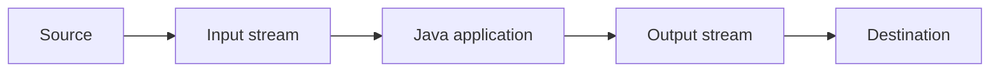

# Input and Output Operations in Java

Java input and output (I/O) are based on streams, meaning sequences of data. A Java application uses an input stream to read data from a source and an output stream to write data to a destination. A source or destination can be a file, console, another application, or a peripheral device.



The following sections examine streams by the data they handle: bytes, text, primitive values, and objects. Some streams read and write data directly; others convert between an external representation and values in the program.

## Using `import` with I/O operations

I/O classes are located in different packages. Add `import` declarations at the beginning of a Java file to use their short names.

```java
import java.io.BufferedReader;
import java.io.FileReader;
import java.io.IOException;
import java.nio.file.Files;
import java.nio.file.Path;
import java.io.InputStream;
```

Without an import, use the fully qualified class name:

```java
java.io.InputStream input = System.in;
```

An `import` does not add functionality; it only makes class names shorter and easier to read.

## Byte streams: ByteStream classes

Byte stream classes read and write data in 8-bit units. They are in `java.io` and extend either the abstract `InputStream` or `OutputStream` class.

`InputStream` is the base class for byte input. Its subclasses specify where bytes come from or how they are processed:

- `BufferedInputStream` reads bytes using a buffer.
- `ByteArrayInputStream` reads bytes from an array.
- `DataInputStream` reads primitive values.
- `FileInputStream` reads bytes from a file.
- `ObjectInputStream` reads objects.

Some `InputStream` methods:

- `public abstract int read()` reads the next byte, or returns `-1` at the end of the stream.
- `public int available()` returns the number of bytes that can be read without blocking.
- `public void close()` closes the input stream.

`OutputStream` is the base class for byte output. Its subclasses specify where bytes are written or how they are processed:

- `BufferedOutputStream` writes bytes using a buffer.
- `ByteArrayOutputStream` writes bytes to an array.
- `DataOutputStream` writes primitive values.
- `FileOutputStream` writes bytes to a file.
- `ObjectOutputStream` writes objects.

Some `OutputStream` methods:

- `public void write(int value)` writes one byte.
- `public void write(byte[] data)` writes a byte array.
- `public void flush()` forces buffered data to be written.
- `public void close()` closes the output stream.

Close streams that use external resources such as files when finished. Application code usually should not close the standard streams `System.in`, `System.out`, and `System.err`. Use `try-with-resources` for file streams.

Byte streams are suitable for binary data. For text, primitive values, or objects, more specialized classes provide a more appropriate representation.

This example writes bytes to a file with `FileOutputStream`:

```java
import java.io.FileOutputStream;
import java.io.IOException;

public class ByteStreamExample {
    public static void main(String[] args) {
        byte[] content =
            "Example of I/O operations using byte streams".getBytes();

        try (FileOutputStream outputStream =
                 new FileOutputStream("C:\\io\\FirstExample")) {
            outputStream.write(content);
        } catch (IOException exception) {
            System.out.println("Cannot write to file.");
        }
    }
}
```

`FileOutputStream` opens the output stream. The `try-with-resources` block closes it automatically when writing is complete.

## Character streams: CharacterStream classes

Byte streams read and write individual bytes. This suits binary files, but is not enough for text because one visible character may be represented by multiple bytes. Character streams handle text, converting between bytes and characters.

Like byte stream classes, character stream classes extend one of two abstract classes: `Reader` or `Writer`.

`Reader` is the base class for character input. Its subclasses determine where characters come from or how input data is converted:

- `BufferedReader` reads text using a buffer.
- `FileReader` reads text from a file.
- `InputStreamReader` converts a byte input stream into a character reader.
- `StringReader` reads text from a string.

`Reader` and its subclasses use methods such as `read()` and `close()`.

`Writer` is the base class for character output. Its subclasses determine where characters are written or how output data is converted:

- `BufferedWriter` writes text using a buffer.
- `FileWriter` writes text to a file.
- `OutputStreamWriter` converts character output to a byte output stream.
- `StringWriter` writes text to a string.

`Writer` and its subclasses use methods such as `write()`, `flush()`, and `close()`.

Character streams can be connected to byte streams using `InputStreamReader` and `OutputStreamWriter`. These classes convert bytes and characters according to the text encoding in use.

Character streams support the line terminators `\r`, `\n`, and `\r\n`, allowing them to work with text files.

This example copies text line by line using `BufferedReader` and `PrintWriter`:

```java
import java.io.BufferedReader;
import java.io.FileReader;
import java.io.FileWriter;
import java.io.IOException;
import java.io.PrintWriter;

public class BufferedStreamsExample {
    public static void main(String[] args) {
        try (
            BufferedReader reader =
                new BufferedReader(new FileReader("C:\\io\\input.txt"));
            PrintWriter writer =
                new PrintWriter(new FileWriter("C:\\io\\output.txt"))
        ) {
            String line;
            while ((line = reader.readLine()) != null) {
                writer.println(line);
            }
        } catch (IOException exception) {
            System.out.println("Cannot copy text file.");
        }
    }
}
```

`BufferedReader` reads the file one line at a time, and `PrintWriter` writes each line to the output file.

## Standard streams

Java provides three standard streams:

- `System.in` is the standard input stream.
- `System.out` is the standard output stream for the program's main results.
- `System.err` is the standard stream for error messages.

They are provided by the `System` class and are not created with `new` by application code. `System.in` is a byte input stream of type `InputStream`. `System.out` and `System.err` are output streams of type `PrintStream`.

The following example reads from standard input and writes to standard output:

```java
import java.io.BufferedReader;
import java.io.IOException;
import java.io.InputStreamReader;

public class StandardStreamExample {
    public static void main(String[] args) {
        BufferedReader reader =
            new BufferedReader(new InputStreamReader(System.in));

        try {
            System.out.print("Enter a name: ");
            String name = reader.readLine();
            System.out.println("Name entered: " + name);
        } catch (IOException exception) {
            System.err.println("Cannot read from standard input.");
        }
    }
}
```

## Structured data streams: `DataInput` and `DataOutput`

Structured data streams read and write primitive values and strings in a machine-readable representation. They are suitable when data must be read back in the same order and with the same types. These streams implement either `DataInput` or `DataOutput`.

Methods in `DataInput` read values in the same order in which they were written through `DataOutput`. Examples include `readBoolean()`, `readByte()`, `readChar()`, `readDouble()`, `readInt()`, and `readUTF()`.

For writing, `DataOutput` provides corresponding methods, for example `writeBoolean(boolean value)`, `writeByte(int value)`, `writeInt(int value)`, `writeDouble(double value)`, and `writeUTF(String value)`.

The main classes implementing these interfaces are `DataInputStream` and `DataOutputStream`. Other classes, such as `RandomAccessFile`, also implement the interfaces but serve more specialized use cases.

The following example writes and reads structured data:

```java
import java.io.DataInputStream;
import java.io.DataOutputStream;
import java.io.FileInputStream;
import java.io.FileOutputStream;
import java.io.IOException;

public class DataStreamExample {
    public static void main(String[] args) {
        String path = "C:\\io\\cat.dat";

        try (DataOutputStream output =
                 new DataOutputStream(new FileOutputStream(path))) {
            output.writeUTF("Tom");
            output.writeDouble(4.5);
            output.writeInt(3);
        } catch (IOException exception) {
            System.out.println("Cannot write structured data.");
        }

        try (DataInputStream input =
                 new DataInputStream(new FileInputStream(path))) {
            String name = input.readUTF();
            double weight = input.readDouble();
            int age = input.readInt();
            System.out.println(name + " " + weight + " " + age);
        } catch (IOException exception) {
            System.out.println("Cannot read structured data.");
        }
    }
}
```

The values are read in the same order in which they were written: text, then a floating-point number, then an integer.

## The `Scanner` class

`Scanner` reads text input and splits it into tokens. Its source can be a string, file, standard input, or another input stream. The class is in `java.util`.

`Scanner` uses a delimiter to split input into tokens. By default, whitespace (spaces, tabs, and line breaks) is the delimiter.

Common methods include `hasNext()`, `hasNextInt()`, `hasNextDouble()`, `hasNextLong()`, and `hasNextLine()` for checking input; `next()` and `nextLine()` for reading text; `nextBoolean()`, `nextInt()`, `nextDouble()`, and `nextLong()` for reading typed values; `useDelimiter(String pattern)` to set a delimiter; and `close()` to close the scanner.

This example reads a string and prints each word on a separate line:

```java
import java.util.Scanner;

public class StringScannerExample {
    public static void main(String[] args) {
        String input = "This is an example of using Scanner";
        try (Scanner scanner = new Scanner(input)) {
            while (scanner.hasNext()) {
                System.out.println(scanner.next());
            }
        }
    }
}
```

`next()` reads the next word, using whitespace as the default delimiter. `hasNext()` checks whether another word is available.

This example reads a file and sums the `double` values that it contains:

```java
import java.io.File;
import java.io.FileNotFoundException;
import java.util.Scanner;

public class MixedDataScannerExample {
    public static void main(String[] args) {
        double sum = 0;
        try (Scanner scanner = new Scanner(new File("C:\\io\\input.txt"))) {
            while (scanner.hasNext()) {
                if (scanner.hasNextDouble()) {
                    sum += scanner.nextDouble();
                } else {
                    scanner.next();
                }
            }
            System.out.println(sum);
        } catch (FileNotFoundException exception) {
            System.out.println("Input file not found.");
        }
    }
}
```

## Mixing `nextInt()` and `nextLine()`

`nextInt()` reads the number but leaves the delimiter after it. A following `nextLine()` returns the rest of the same line, which is often empty.

```java
Scanner scanner = new Scanner(System.in);
System.out.print("Number of books: ");
if (scanner.hasNextInt()) {
    int count = scanner.nextInt();
    scanner.nextLine(); // consume the rest of the line containing the number
    System.out.print("Title: ");
    String title = scanner.nextLine();
    System.out.println(count + " - " + title);
} else {
    System.out.println("Expected an integer: " + scanner.nextLine());
}
```

`hasNextInt()` checks the next token without consuming it. If the check fails, read or skip the invalid input so the same token is not processed repeatedly. Closing a `Scanner` also closes its source; when the source is `System.in`, do not close it until all parts of the application have finished reading console input.
